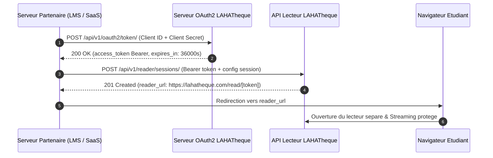

# Documentation Technique Officielle — API LAHATheque (v3.2)

> Guide exhaustif pour l'integration de l'API Lecteur Heberge, de l'authentification OAuth2 Machine-to-Machine, de la distribution multi-sources (Catalogue & BYOD SaaS Tiers), des Webhooks securises HMAC et du moteur DRM.

---

## Sommaire

1. [Presentation Generale & Glossaire](#1-presentation-generale--glossaire)
2. [Authentification & Securite](#2-authentification--securite)
3. [Guide de Demarrage Rapide (Quick Start)](#3-guide-de-demarrage-rapide-quick-start)
4. [Reference Detaillee des Endpoints](#4-reference-detaillee-des-endpoints)
   - [POST /api/v1/oauth2/token/](#41-post-apiv1oauth2token)
   - [POST /api/v1/reader/sessions/](#42-post-apiv1readersessions)
   - [POST /api/v1/reader/sessions/validate-token/](#43-post-apiv1readersessionsvalidate-token)
   - [POST /api/v1/reader/sessions/progress/](#44-post-apiv1readersessionsprogress)
   - [POST /api/v1/reader/sessions/quiz-submit/](#45-post-apiv1readersessionsquiz-submit)
   - [GET /api/v1/reader/sessions/{session_id}/](#46-get-apiv1readersessionssession_id)
   - [DELETE /api/v1/reader/sessions/{session_id}/](#47-delete-apiv1readersessionssession_id)
5. [Webhooks & Evenements en Temps Reel](#5-webhooks--evenements-en-temps-reel)
6. [Limites, Quotas & Idempotence](#6-limites-quotas--idempotence)
7. [Tableau d'Erreurs & Depannage](#7-tableau-derreurs--depannage)
8. [FAQ & Centre d'Assistance](#8-faq--centre-dassistance)

---

## 1. Presentation Generale & Glossaire

### 1.1 Resume Executif
L'API LAHATheque permet a n'importe quelle application tierce (LMS universitaire, plateforme EdTech, SaaS RH, portail d'ecole ou editeur) d'integrer en quelques minutes une liseuse securisee ultra-immersive (Mode 3D FlipBook + Mode Normal vertical), equipee d'une protection DRM anti-fuite (filigrane nominatif grave a la volée avec l'IP et le nom du lecteur), d'un module d'evaluation par quiz interactif et d'une narration audio, le tout sans contrainte d'infrastructure lourde ni iframe complexe.

### 1.2 Cas d'Usage Metiers
* **Universites & Ecoles Superieures :** Offrir un acces direct aux cours, manuels de droit ou de medecine proteges contre les captures d'ecran et le telechargement illegal.
* **SaaS EdTech Tiers (Mode BYOD - Bring Your Own Document) :** Utiliser le moteur de lecture et la securite LAHATheque pour diffuser leurs propres documents PDF internes sans passer par le catalogue LAHATheque.
* **Editeurs & Organismes de Formation :** Evaluer la comprehension des apprenants via un quiz dynamique declenche automatiquement a la fin du manuel, avec transmission instantanee des notes par Webhook signe.

### 1.3 Glossaire des Termes Techniques

| Terme | Definition Vulgarisee |
| :--- | :--- |
| **API (Application Programming Interface)** | Passerelle standardisee permettant a deux serveurs de communiquer et d'echanger des donnees. |
| **BYOD (Bring Your Own Document)** | Mode permettant a un partenaire d'utiliser la liseuse LAHATheque pour afficher ses propres documents PDF distants via une URL securisee. |
| **Client ID & Client Secret** | Couple d'identifiants (equivalent d'un identifiant et d'un mot de passe machine) permettant a votre serveur de s'authentifier aupres de LAHATheque. |
| **DRM (Digital Rights Management)** | Ensemble des verrous logiciels empechant l'impression, la copie de texte, le telechargement direct et la diffusion frauduleuse d'un document. |
| **Endpoint / Route** | Adresse web precise (ex: `/api/v1/reader/sessions/`) sur laquelle une action particuliere est demandee au serveur. |
| **Filigrane Nominatif** | Texte incruste de maniere indelebile sur chaque page affichant le nom, l'email et l'adresse IP du lecteur. |
| **Idempotence** | Garantie technique qu'une meme requete repetee plusieurs fois par erreur (ex: coupure reseau) ne produira l'action qu'une seule fois. |
| **JWT (JSON Web Token)** | Jeton cryptographique ephemere contenant les droits d'acces securises de l'utilisateur final pour sa session de lecture. |
| **Payload** | Contenu utile des donnees transmises au format JSON dans le corps de la requete. |
| **Rate Limit / Quota** | Plafond maximal de requetes autorisees sur une periode donnee pour garantir la stabilite des serveurs. |
| **SSRF (Server-Side Request Forgery)** | Type d'attaque informatique consistant a forcer un serveur a scanner des adresses internes. L'API LAHATheque integre une protection active bloquant ce vecteur. |
| **Webhook** | Notification automatique envoyee par LAHATheque sur votre serveur des qu'un evenement survient (ex: note de quiz validee). |

---

## 2. Authentification & Securite

### 2.1 Modele d'Authentification OAuth2 Machine-to-Machine
L'API LAHATheque repose sur le protocole standard **OAuth2 Client Credentials Grant**. Votre serveur dialogue directement avec le serveur LAHATheque de serveur a serveur.

#### URLs de Base Disponibles :
* **Production Officielle :** `https://lahatheque.com`
* **Deploiement Vercel Cloud :** `https://lahatheque.vercel.app` (et sous-domaines preview `*.vercel.app`)
* **Environnement Local :** `http://localhost:3000`



### 2.2 Entetes HTTP Requises
Toutes les requetes vers l'API d'administration et de gestion doivent comporter les entetes suivants :

```http
Authorization: Bearer <VOTRE_ACCESS_TOKEN>
Content-Type: application/json
Accept: application/json
```

### 2.3 Securite de Redirection (Anti-Open-Redirect)
Pour empecher toute tentative de redirection frauduleuse d'un etudiant vers un site tiers malveillant, le parametre `return_url` est strictement controle. L'URL fournie doit imperativement appartenir aux domaines enregistres dans votre tableau de bord administrateur (`allowed_return_origins`).

---

## 3. Guide de Demarrage Rapide (Quick Start)

Trois etapes suffisent pour generer une session de lecture fonctionnelle :

1. **Obtenir vos identifiants :** Connectez-vous sur votre espace administrateur `/admin/api` pour recuperer votre `Client ID` et votre `Client Secret`.
2. **Generer un jeton d'acces :** Appelez `/api/v1/oauth2/token/`.
3. **Creer la session :** Appelez `POST /api/v1/reader/sessions/` avec les informations du lecteur et l'ouvrage souhaite.

### 3.1 Exemple en cURL

#### Etape A : Recuperer le token d'acces
```bash
curl -X POST https://lahatheque.com/api/v1/oauth2/token/ \
  -H "Content-Type: application/x-www-form-urlencoded" \
  -d "grant_type=client_credentials&client_id=VOTRE_CLIENT_ID&client_secret=VOTRE_CLIENT_SECRET"
```

#### Etape B : Creer une session de lecture
```bash
curl -X POST https://lahatheque.com/api/v1/reader/sessions/ \
  -H "Authorization: Bearer VOTRE_ACCESS_TOKEN" \
  -H "Content-Type: application/json" \
  -d '{
    "book_id": "1",
    "external_user_id": "STU-2026-994",
    "external_user_name": "Koffi Mensah",
    "external_user_email": "koffi.mensah@univ.bj",
    "user_ip": "154.68.24.112",
    "return_url": "https://univ.bj/mes-cours/droit-101",
    "session_duration_minutes": 120
  }'
```

---

### 3.2 Exemple en Python 3 (Requests)

```python
import requests

BASE_URL = "https://lahatheque.com/api/v1"
CLIENT_ID = "laha_client_uac_998877"
CLIENT_SECRET = "sec_live_99a8b7c6d5e4f3a2b1009988"

def create_student_reader_session(book_id: str, student_info: dict) -> str:
    # 1. Recuperation du token OAuth2
    auth_resp = requests.post(
        f"{BASE_URL}/oauth2/token/",
        data={
            "grant_type": "client_credentials",
            "client_id": CLIENT_ID,
            "client_secret": CLIENT_SECRET,
        },
        timeout=10
    )
    auth_resp.raise_for_status()
    access_token = auth_resp.json()["access_token"]

    # 2. Creation de la session de lecture
    headers = {
        "Authorization": f"Bearer {access_token}",
        "Content-Type": "application/json"
    }
    payload = {
        "book_id": book_id,
        "external_user_id": student_info["id"],
        "external_user_name": student_info["name"],
        "external_user_email": student_info["email"],
        "user_ip": student_info["ip"],
        "return_url": "https://uac.bj/cours/droit-constitutionnel",
        "session_duration_minutes": 60,
        "theme": {
            "primary_color": "#1B2A4E",
            "accent_color": "#D4A017"
        }
    }
    
    session_resp = requests.post(
        f"{BASE_URL}/reader/sessions/",
        json=payload,
        headers=headers,
        timeout=10
    )
    session_resp.raise_for_status()
    data = session_resp.json()["data"]
    
    print(f"Session creee avec succes : {data['session_id']}")
    print(f"URL de lecture pour l'etudiant : {data['reader_url']}")
    return data["reader_url"]

if __name__ == "__main__":
    student = {
        "id": "ETU-8841",
        "name": "Amina Traore",
        "email": "amina.traore@uac.bj",
        "ip": "41.203.88.14"
    }
    reader_url = create_student_reader_session("1", student)
```

---

### 3.3 Exemple en JavaScript / Node.js (Axios)

```javascript
const axios = require('axios');

const BASE_URL = 'https://lahatheque.com/api/v1';
const CLIENT_ID = 'laha_client_uac_998877';
const CLIENT_SECRET = 'sec_live_99a8b7c6d5e4f3a2b1009988';

async function generateHostedReaderUrl(studentData) {
  try {
    // 1. Generation du jeton d'acces
    const authResponse = await axios.post(`${BASE_URL}/oauth2/token/`, new URLSearchParams({
      grant_type: 'client_credentials',
      client_id: CLIENT_ID,
      client_secret: CLIENT_SECRET,
    }), {
      headers: { 'Content-Type': 'application/x-www-form-urlencoded' }
    });

    const accessToken = authResponse.data.access_token;

    // 2. Creation de la session avec document externe BYOD
    const sessionResponse = await axios.post(`${BASE_URL}/reader/sessions/`, {
      document_url: 'https://uac.bj/uploads/cours-sciences-politiques.pdf',
      document_title: 'Sciences Politiques & Relations Internationales',
      external_user_id: studentData.id,
      external_user_name: studentData.name,
      external_user_email: studentData.email,
      user_ip: studentData.ip,
      return_url: 'https://uac.bj/lms/dashboard',
      session_duration_minutes: 90,
      quiz: {
        enabled: true,
        show_on_last_page: true,
        passing_score: 80,
        questions: [
          {
            id: 'q1',
            question: 'Quel est le fondement constitutionnel aborde au chapitre 1 ?',
            options: ['La souverainete nationale', 'Le regime presidentiel', 'Le suffrage indirect'],
            correct_index: 0,
            explanation: 'Le chapitre 1 etudie en priorite le principe fondamental de souverainete.'
          }
        ]
      }
    }, {
      headers: {
        Authorization: `Bearer ${accessToken}`,
        'Content-Type': 'application/json',
      }
    });

    return sessionResponse.data.data.reader_url;
  } catch (error) {
    console.error('Erreur creation session reader:', error.response?.data || error.message);
    throw error;
  }
}
```

---

## 4. Reference Detaillee des Endpoints

### 4.1 `POST /api/v1/oauth2/token/`

* **Usage :** Obtention du jeton d'authentification Bearer M2M pour autoriser les requetes suivantes.
* **Methode HTTP :** `POST`
* **Format requis :** `application/x-www-form-urlencoded`

#### Parametres de la Requete

| Parametre | Type | Statut | Description |
| :--- | :--- | :--- | :--- |
| `grant_type` | `string` | **Requis** | Doit imperativement avoir la valeur `"client_credentials"`. |
| `client_id` | `string` | **Requis** | Votre identifiant client public fourni par LAHATheque. |
| `client_secret` | `string` | **Requis** | Votre cle secrete d'application. |

#### Exemple de Reponse (200 OK)
```json
{
  "access_token": "eyJhbGciOiJIUzI1NiIsInR5cCI6IkpXVCJ9...",
  "expires_in": 36000,
  "token_type": "Bearer",
  "scope": "reader:sessions reader:byod catalog:read"
}
```

---

### 4.2 `POST /api/v1/reader/sessions/`

* **Usage :** Point d'entree principal. Genere une session de lecture securisee personnalisee et retourne l'URL `reader_url` vers laquelle rediriger l'etudiant.
* **Methode HTTP :** `POST`
* **Securite :** Entete `Authorization: Bearer <token>` requis.

#### Parametres du Corps de Requete (JSON Body)

| Champ | Type | Statut | Description | Valeur par defaut |
| :--- | :--- | :--- | :--- | :--- |
| `book_id` | `string` | *Optionnel\** | Identifiant de l'ouvrage dans le catalogue LAHATheque. | `null` |
| `document_url` | `string (URL)` | *Optionnel\** | URL HTTPS distante du fichier PDF pour le mode BYOD. | `null` |
| `document_title` | `string` | *Requis si BYOD* | Titre du document externe a afficher dans la barre d'en-tete. | `null` |
| `document_author` | `string` | *Optionnel* | Nom de l'auteur a afficher dans le lecteur. | `"Auteur Externe"` |
| `audio_url` | `string (URL)` | *Optionnel* | URL HTTPS du fichier MP3/AAC de narration audio. | `null` |
| `external_user_id` | `string` | **Requis** | Identifiant immuable de l'etudiant dans votre systeme. | — |
| `external_user_name` | `string` | **Requis** | Nom complet a graver en filigrane dynamique sur le document. | — |
| `external_user_email` | `string` | **Requis** | Email a graver en filigrane dynamique sur le document. | — |
| `user_ip` | `string (IP)` | **Requis** | Adresse IP du lecteur a graver en filigrane anti-capture. | — |
| `return_url` | `string (URL)` | **Requis** | URL vers laquelle rediriger l'utilisateur au clic sur Quitter. | — |
| `session_duration_minutes` | `integer` | *Optionnel* | Duree de validite de la session avant expiration (1 a 1440 min). | `120` |
| `theme` | `object` | *Optionnel* | Personnalisation graphique complete de la liseuse (voir ci-apres). | Theme standard |
| `quiz` | `object` | *Optionnel* | Configuration d'un quiz d'evaluation integre a la liseuse. | `null` |

*\* Remarque : Vous devez obligatoirement fournir soit `book_id` (Catalogue), soit `document_url` + `document_title` (BYOD).*

#### Structure & Proprietes de l'Objet `theme` (Personnalisation Visuelle)

L'objet `theme` est optionnel. S'il est omis, la liseuse adopte le theme standard chic LAHATheque (`#1B2A4E` & `#D4A017`).

| Propriete | Type | Description & Emplacement | Regles & Format |
| :--- | :--- | :--- | :--- |
| `brand_name` | `string` | Titre de votre plateforme affiche en haut a gauche. | 2 a 50 caracteres. |
| `brand_logo_url` | `string (URL)` | URL de votre logo institutionnel (remplace le titre textuel). | Image HTTPS transparente (SVG/PNG, hauteur 28px-36px). |
| `primary_color` | `string (HEX)` | Couleur d'arriere-plan de la barre superieure d'outils. | Code HEX a 6 caracteres (ex: `"#1B2A4E"`). |
| `accent_color` | `string (HEX)` | Couleur des boutons d'action (Quiz, switcher 3D, jauge audio). | Code HEX (ex: `"#D4A017"`). |
| `background_color` | `string (HEX)` | Couleur du fond de page entourant le document. | Code HEX sombre conseille (ex: `"#0F1A33"`). |
| `text_color` | `string (HEX)` | Couleur du texte de la barre superieure et des icones. | Code HEX (ex: `"#FFFFFF"`). |
| `border_color` | `string (HEX)` | Couleur des bordures et separateurs de fenetres. | Code HEX (ex: `"#2E3F66"`). |

```json
{
  "theme": {
    "brand_name": "Universite d'Abomey-Calavi",
    "brand_logo_url": "https://uac.bj/assets/logo.png",
    "primary_color": "#1B2A4E",
    "accent_color": "#D4A017",
    "background_color": "#0F1A33",
    "text_color": "#FFFFFF",
    "border_color": "#2E3F66"
  }
}
```

#### Exemple de Reponse (201 Created)
```json
{
  "success": true,
  "data": {
    "session_id": "rs_a89f3c9e120d",
    "reader_url": "https://lahatheque.com/read/eyJhbGciOiJIUzI1NiIsInR5cCI6IkpXVCJ9.eyJzZXNzaW9uX2lkIjoicnNfYTh...",
    "expires_at": "2026-08-19T14:30:00Z",
    "token": "eyJhbGciOiJIUzI1NiIsInR5cCI6IkpXVCJ9...",
    "source_type": "external_url"
  },
  "error": null
}
```

---

### 4.3 `POST /api/v1/reader/sessions/validate-token/`

* **Usage :** Valide le jeton ephemere lorsque le navigateur charge `/read/[token]` et renvoie les parametres d'affichage.
* **Methode HTTP :** `POST`

#### Corps de Requete
```json
{
  "token": "eyJhbGciOiJIUzI1NiIsInR5cCI6IkpXVCJ9..."
}
```

#### Reponse (200 OK)
```json
{
  "success": true,
  "data": {
    "session_id": "rs_a89f3c9e120d",
    "book": {
      "id": "ext-doc-99",
      "title": "Droit Constitutionnel",
      "author": "Prof. Dossou",
      "file_url": "https://lahatheque.com/api/v1/reader/sessions/rs_a89f3c9e120d/stream/",
      "total_pages": 64,
      "has_audio": false
    },
    "user": {
      "name": "Koffi Mensah",
      "email": "koffi.mensah@univ.bj",
      "ip": "154.68.24.112"
    },
    "theme": {
      "primary_color": "#1B2A4E",
      "accent_color": "#D4A017"
    },
    "return_url": "https://uac.bj/cours/101",
    "last_page": 1,
    "quiz_completed": false
  },
  "error": null
}
```

---

### 4.4 `POST /api/v1/reader/sessions/progress/`

* **Usage :** Synchronise regulierement la progression de lecture de l'apprenant (page courante et temps cumule).
* **Methode HTTP :** `POST`

#### Corps de Requete
```json
{
  "token": "eyJhbGciOiJIUzI1NiIsInR5cCI6IkpXVCJ9...",
  "current_page": 42,
  "reading_time_seconds": 15
}
```

#### Reponse (200 OK)
```json
{
  "success": true,
  "data": {
    "progress_percent": 65,
    "current_page": 42,
    "total_reading_time_seconds": 640
  },
  "error": null
}
```

---

### 4.5 `POST /api/v1/reader/sessions/quiz-submit/`

* **Usage :** Soumet les reponses du quiz interactif, calcule le score et emet le webhook `reader.quiz.completed`.
* **Methode HTTP :** `POST`

#### Corps de Requete
```json
{
  "token": "eyJhbGciOiJIUzI1NiIsInR5cCI6IkpXVCJ9...",
  "answers": {
    "q1": 0,
    "q2": 2
  }
}
```

#### Reponse (200 OK)
```json
{
  "success": true,
  "data": {
    "score_percent": 100,
    "is_validated": true,
    "passing_score": 80,
    "total_questions": 2,
    "correct_answers": 2,
    "review": [
      { "question_id": "q1", "correct": true, "explanation": "Explication pedagogique..." },
      { "question_id": "q2", "correct": true, "explanation": "Explication pedagogique..." }
    ]
  },
  "error": null
}
```

---

### 4.6 `GET /api/v1/reader/sessions/{session_id}/`

* **Usage :** Consultation d'etat, progression et score en polling cote serveur partenaire.
* **Methode HTTP :** `GET`
* **Securite :** Entete `Authorization: Bearer <token>` requis.

#### Reponse (200 OK)
```json
{
  "success": true,
  "data": {
    "id": "rs_a89f3c9e120d",
    "status": "in_progress",
    "current_page": 42,
    "total_pages": 64,
    "progress_percent": 68,
    "reading_time_seconds": 1440,
    "quiz_completed": true,
    "quiz_score": 100,
    "created_at": "2026-08-19T02:00:00Z",
    "expires_at": "2026-08-19T04:00:00Z"
  },
  "error": null
}
```

---

### 4.7 `DELETE /api/v1/reader/sessions/{session_id}/`

* **Usage :** Revocation immediate d'une session de lecture. Le lecteur en cours est immediatement coupe.
* **Methode HTTP :** `DELETE`
* **Securite :** Entete `Authorization: Bearer <token>` requis.

#### Reponse (200 OK)
```json
{
  "success": true,
  "data": {
    "session_id": "rs_a89f3c9e120d",
    "status": "revoked",
    "revoked_at": "2026-08-19T02:15:00Z"
  },
  "error": null
}
```

---

## 5. Webhooks & Evenements en Temps Reel

LAHATheque emet des requetes HTTP `POST` sur l'URL de webhook configuree dans votre tableau de bord des que l'activite de lecture evolue.

### 5.1 Entetes de Securite des Webhooks
Chaque payload envoye a votre serveur comporte les entetes suivants :

```http
X-Lahatheque-Event: reader.quiz.completed
X-Lahatheque-Delivery: 7c9e6679-7425-40de-944b-e07fc1f90ae7
X-Lahatheque-Signature: t=1787038100,v1=a5c8987d6e4b9...
Content-Type: application/json
```

### 5.2 Verification de Signature HMAC-SHA256 (Node.js)

```javascript
const crypto = require('crypto');

function verifyLahathequeWebhook(rawBody, signatureHeader, webhookSecret) {
  const parts = signatureHeader.split(',');
  const timestamp = parts.find(p => p.startsWith('t='))?.replace('t=', '');
  const signature = parts.find(p => p.startsWith('v1='))?.replace('v1=', '');

  if (!timestamp || !signature) return false;

  const signedPayload = `${timestamp}.${rawBody}`;
  const expectedSignature = crypto
    .createHmac('sha256', webhookSecret)
    .update(signedPayload)
    .digest('hex');

  return crypto.timingSafeEqual(Buffer.from(signature), Buffer.from(expectedSignature));
}
```

### 5.3 Liste des Evenements Disponibles

* `reader.session.opened` : Ouverture de la liseuse par l'apprenant.
* `reader.progress.updated` : Mise a jour de la page lue (toutes les 30s ou a chaque changement de page).
* `reader.quiz.completed` : Soumission et notation d'un quiz.
* `reader.session.finished` : Fin de consultation ou clic sur le bouton Quitter.

---

## 6. Limites, Quotas & Idempotence

### 6.1 Paliers de Quotas

| Palier | Requetes / Jour | Sessions Simultanees | Taille Max Fichier BYOD |
| :--- | :--- | :--- | :--- |
| **Standard** | 10 000 req / 24h | 200 sessions | 50 Mo |
| **Entreprise / Universite** | 50 000 req / 24h | 1 000 sessions | 200 Mo |
| **VIP Illimite** | **Illimite (Sans quota)** | **Illimite** | 500 Mo |

### 6.2 Comportement en Cas de Depassement (HTTP 429)
En cas de saturation de votre quota journalier, l'API renvoie le code HTTP `429 Too Many Requests` accompagne de l'entete :

```http
Retry-After: 3600
```
*Indique le nombre de secondes a attendre avant de pouvoir reemettre une requete.*

### 6.3 Gestion de l'Idempotence
Pour eviter la creation de sessions en double en cas d'instabilite reseau, transmettez un UUID unique dans l'entete `Idempotency-Key` :

```http
Idempotency-Key: 9b1deb4d-3b7d-4bad-9bdd-2b0d7b3dcb6d
```

---

## 7. Tableau d'Erreurs & Depannage

L'API retourne systematiquement des reponses JSON structurees selon le format unifie :
```json
{
  "success": false,
  "data": null,
  "error": "Message explicatif precis de l'erreur survenue"
}
```

### 7.1 Matrice de Depannage des Codes d'Erreur

| Code HTTP | Probleme Constate | Cause Probable | Action Exacte de Correction |
| :--- | :--- | :--- | :--- |
| **400 Bad Request** | `L'URL de redirection n'est pas autorisee` | L'URL `return_url` ne fait pas partie de vos domaines approuves. | Ajoutez le domaine dans la liste `allowed_return_origins` de votre espace `/admin/api`. |
| **400 Bad Request** | `Type de source de document manquant` | Ni `book_id` ni `document_url` n'ont ete renseignes dans la requete. | Renseignez soit un `book_id` valide, soit une `document_url` avec son `document_title`. |
| **401 Unauthorized** | `Jeton d'authentification invalide ou expire` | Le token Bearer est absent, expire ou mal forme. | Re-generez un token Bearer via `POST /api/v1/oauth2/token/`. |
| **403 Forbidden** | `Acces aux adresses privees interdit (Anti-SSRF)` | L'URL `document_url` pointe vers `localhost`, `127.0.0.1` ou une IP locale. | Utilisez une URL HTTPS publique hebergee sur un serveur web ou bucket S3 accessible. |
| **404 Not Found** | `Ouvrage introuvable dans le catalogue` | Le `book_id` transmis ne correspond a aucun livre actif du catalogue. | Verifiez l'identifiant de l'ouvrage dans le catalogue LAHATheque. |
| **422 Unprocessable**| `Fichier distant trop volumineux` | Le PDF distant depasse le plafond configure (ex: 200 Mo). | Compressez le fichier PDF ou contactez l'administrateur pour passer en palier VIP 500 Mo. |
| **429 Too Many Req** | `Quota journalier atteint` | Votre application a depasse le nombre maximal d'appels autorises par 24h. | Patientez jusqu'a la reinitialisation du quota ou demandez une extension de palier. |

---

## 8. FAQ & Centre d'Assistance

### 8.1 Foire Aux Questions

**Q : Les etudiants doivent-ils posseder un compte sur LAHATheque ?**  
*R : Non.* Le systeme fonctionne en mode utilisateur fantome (*Shadow User*). L'authentification est deleguee a votre serveur via `external_user_id`. L'etudiant accede directement a sa lecture sans creation de mot de passe supplementaire.

**Q : Est-il possible d'utiliser la liseuse pour des documents confidentiels d'entreprise ?**  
*R : Oui.* Grace au mode BYOD, vous conservez la propriete et le stockage de vos fichiers. LAHATheque agit uniquement comme moteur de securisation et de rendu a la volee sans conserver vos fichiers sources.

**Q : Que se passe-t-il si un etudiant tente une capture d'ecran ?**  
*R : Le document est integralement protege.* Le clic droit, l'impression, le copier-coller et les raccourcis d'enregistrement sont bloques. De plus, son nom, son adresse email et son adresse IP sont graves en filigrane diagonal semi-transparent sur chaque page pour une imputabilite juridique totale.

---

### 8.2 Contact & Support Technique
* **Support Developpeurs :** `api-support@lahatheque.com`
* **Supervision en direct des API :** `https://lahatheque.com/admin/api`
* **Statut des services :** `https://status.lahatheque.com`
