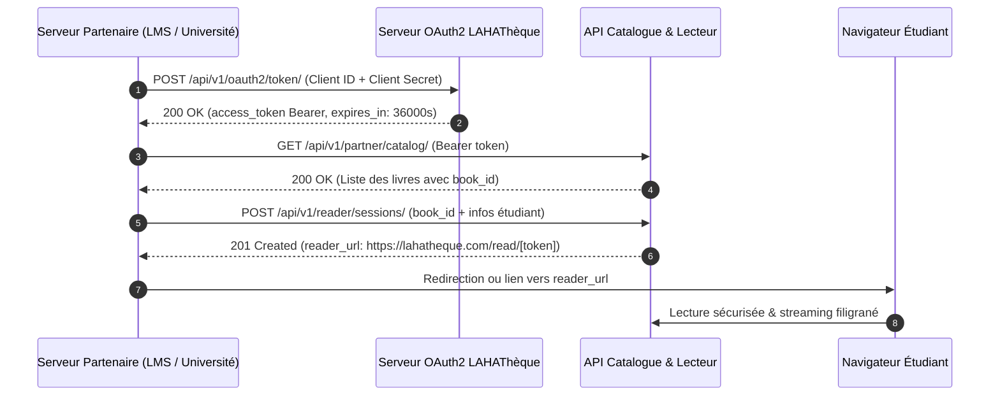

# Documentation Technique Officielle — API LAHAThèque (v3.2)

> Guide exhaustif pour l'intégration de l'API Partenaire (Catalogue & Bouquets), de la Liseuse Sécurisée Hébergée, de l'authentification OAuth2 Machine-to-Machine, de la distribution multi-sources (Catalogue & BYOD SaaS Tiers), des Webhooks sécurisés HMAC et du moteur DRM.

---

## Sommaire

1. [Présentation Générale & Glossaire](#1-présentation-générale--glossaire)
2. [Authentification & Sécurité OAuth 2.0](#2-authentification--sécurité-oauth-20)
   - [2.1 Flux Client Credentials Grant](#21-modèle-dauthentification-oauth2-machine-to-machine)
   - [2.2 Révocation de Jetons (RFC 7009)](#22-révocation-de-jetons-rfc-7009)
   - [2.3 SSO & Fédération Universitaire](#23-sso--fédération-universitaire-saml-20--oidc)
3. [Guide de Démarrage Rapide (Quick Start)](#3-guide-de-démarrage-rapide-quick-start)
   - [Workflow Complet : Du Catalogue à la Liseuse](#31-workflow-complet--du-catalogue-à-la-liseuse)
   - [Exemples cURL, Python & Node.js](#32-exemples-dimplémentation)
4. [Référence Détaillée des Endpoints Partenaires](#4-référence-détaillée-des-endpoints-partenaires)
   - **Authentification OAuth2**
     - `POST /api/v1/oauth2/token/` (Obtention du Bearer token)
     - `POST /api/v1/oauth2/token/revoke/` (Révocation de jeton)
   - **Catalogue & Bouquets (CDC Section 9.1)**
     - `GET /api/v1/partner/catalog/` (Liste et recherche catalogue)
     - `GET /api/v1/partner/catalog/{id}/` (Détail d'un ouvrage)
     - `GET /api/v1/partner/bouquets/` (Bouquets disponibles)
     - `GET /api/v1/partner/bouquets/{offering_id}/check-access/` (Vérification de licence)
     - `GET /api/v1/partner/stats/usage/` (Statistiques de consultation)
   - **Moteur Liseuse & Sessions Hébergées**
     - `POST /api/v1/reader/sessions/` (Création de session de lecture)
     - `GET /api/v1/reader/sessions/stream/` (Streaming sécurisé filigrané)
     - `POST /api/v1/reader/sessions/validate-token/` (Validation de session)
     - `POST /api/v1/reader/sessions/progress/` (Synchronisation de lecture)
     - `POST /api/v1/reader/sessions/quiz-submit/` (Soumission de quiz)
     - `GET /api/v1/reader/sessions/{session_id}/` (Consultation état de session)
     - `DELETE /api/v1/reader/sessions/{session_id}/` (Révocation de session)
5. [Webhooks & Événements en Temps Réel](#5-webhooks--événements-en-temps-réel)
6. [Limites, Quotas & Idempotence](#6-limites-quotas--idempotence)
7. [Tableau d'Erreurs & Dépannage](#7-tableau-derreurs--dépannage)
8. [FAQ & Support Développeurs](#8-faq--centre-dassistance)

---

## 1. Présentation Générale & Glossaire

### 1.1 Résumé Exécutif

L'API LAHAThèque permet aux plateformes tierces (LMS universitaires, EdTech, portails d'écoles, éditeurs et bibliothèques numériques) d'exploiter le catalogue académique LAHAThèque et d'embarquer une liseuse ultra-sécurisée (Mode 3D FlipBook + Mode Normal).

L'intégration assure :
- **L'accès complet au catalogue académique** et la vérification des licences bouquets d'institution.
- **La lecture sans friction** : Génération d'une URL de lecture sécurisée (`/read/[token]`) pour les étudiants partenaires sans création de compte supplémentaire.
- **La protection DRM anti-fuite** : Filigrane dynamique (nom, email, IP du lecteur) gravé à la volée sur chaque page du PDF, blocage des captures d'écran, du clic droit et du téléchargement direct.
- **L'évaluation pédagogique** : Quiz interactif optionnel avec transmission instantanée des scores par Webhooks signés HMAC.

### 1.2 Glossaire des Termes

| Terme | Définition |
| :--- | :--- |
| **Client ID & Secret** | Clés d'API Machine-to-Machine délivrées dans l'espace `/admin/api` ou `/publisher/api`. |
| **OAuth 2.0 M2M** | Protocole standardisé Client Credentials Grant (RFC 6749) pour sécuriser les échanges serveur à serveur. |
| **Liseuse Hébergée** | Lecteur web bimodal (3D FlipBook / Scroll vertical) hébergé sur LAHAThèque et accessible par jeton éphémère. |
| **BYOD** | *Bring Your Own Document* — Mode permettant au partenaire de diffuser ses propres documents PDF via la liseuse sécurisée LAHAThèque. |
| **DRM & Watermark** | Verrous logiciels et marquage nominatif empêchant l'extraction frauduleuse des contenus. |
| **Denylist / Révocation** | Registre d'invalidation immédiate des jetons d'accès ou des sessions de lecture avant leur expiration. |

---

## 2. Authentification & Sécurité OAuth 2.0

### 2.1 Modèle d'Authentification OAuth2 Machine-to-Machine

L'authentification repose sur **OAuth 2.0 Client Credentials Grant** (RFC 6749). Le serveur partenaire s'authentifie auprès de LAHAThèque pour obtenir un jeton `Bearer` JWT signé.



### 2.2 Révocation de Jetons (RFC 7009)

L'API fournit l'endpoint `POST /api/v1/oauth2/token/revoke/`. Tout jeton révoqué est instantanément inscrit dans la liste noire `RevokedPartnerToken` et invalidé pour l'ensemble des requêtes subséquentes.

### 2.3 SSO & Fédération Universitaire (SAML 2.0 / OIDC)

Pour les universités disposant d'un annuaire fédéré (Shibboleth, EduGAIN, Entra ID / Microsoft 365, Google Workspace), l'infrastructure `/api/v1/sso/` permet la délégation d'authentification pour les étudiants du campus.

---

## 3. Guide de Démarrage Rapide (Quick Start)

### 3.1 Workflow Complet : Du Catalogue à la Liseuse

1. **Obtention du token** : `POST /api/v1/oauth2/token/`
2. **Consultation du catalogue** : `GET /api/v1/partner/catalog/?q=droit`
3. **Ouverture de la liseuse** : `POST /api/v1/reader/sessions/` avec le `book_id` choisi
4. **Redirection du lecteur** : Ouvrir l'URL `reader_url` renvoyée.

---

### 3.2 Exemples d'Implémentation

#### Python 3 (Requests)

```python
import requests

BASE_URL = "https://lahatheque.com/api/v1"
CLIENT_ID = "laha_client_uac_998877"
CLIENT_SECRET = "sec_live_99a8b7c6d5e4f3a2b1009988"

# 1. Obtenir le token Bearer
token_res = requests.post(f"{BASE_URL}/oauth2/token/", data={
    "grant_type": "client_credentials",
    "client_id": CLIENT_ID,
    "client_secret": CLIENT_SECRET,
})
token_res.raise_for_status()
access_token = token_res.json()["access_token"]

headers = {"Authorization": f"Bearer {access_token}"}

# 2. Consulter les ouvrages du catalogue
catalog_res = requests.get(f"{BASE_URL}/partner/catalog/?discipline=droit", headers=headers)
books = catalog_res.json()["data"]
selected_book_id = books[0]["id"]
print(f"Livre sélectionné : {books[0]['title']} (ID: {selected_book_id})")

# 3. Créer une session de lecture pour un étudiant
session_res = requests.post(f"{BASE_URL}/reader/sessions/", headers=headers, json={
    "book_id": selected_book_id,
    "external_user_id": "ETU-2026-904",
    "external_user_name": "Amina Traoré",
    "external_user_email": "amina.traore@uac.bj",
    "user_ip": "41.203.88.14",
    "return_url": "https://uac.bj/mon-espace-cours",
    "session_duration_minutes": 120
})
reader_url = session_res.json()["data"]["reader_url"]
print(f"URL de lecture sécurisée : {reader_url}")
```

#### Node.js / JavaScript (Axios)

```javascript
const axios = require('axios');

const BASE_URL = 'https://lahatheque.com/api/v1';
const CLIENT_ID = 'laha_client_uac_998877';
const CLIENT_SECRET = 'sec_live_99a8b7c6d5e4f3a2b1009988';

async function openBookForStudent(studentData) {
  // 1. Authentification
  const authRes = await axios.post(`${BASE_URL}/oauth2/token/`, new URLSearchParams({
    grant_type: 'client_credentials',
    client_id: CLIENT_ID,
    client_secret: CLIENT_SECRET,
  }));
  const token = authRes.data.access_token;
  const config = { headers: { Authorization: `Bearer ${token}` } };

  // 2. Recherche d'ouvrage
  const catalogRes = await axios.get(`${BASE_URL}/partner/catalog/?q=sciences`, config);
  const book = catalogRes.data.data[0];

  // 3. Création de session liseuse
  const sessionRes = await axios.post(`${BASE_URL}/reader/sessions/`, {
    book_id: book.id,
    external_user_id: studentData.id,
    external_user_name: studentData.name,
    external_user_email: studentData.email,
    user_ip: studentData.ip,
    return_url: 'https://uac.bj/dashboard',
  }, config);

  return sessionRes.data.data.reader_url;
}
```

---

## 4. Référence Détaillée des Endpoints Partenaires

### 4.1 Authentification & Révocation OAuth 2.0

#### `POST /api/v1/oauth2/token/`
Échange les identifiants contre un jeton Bearer JWT.

* **Format** : `application/x-www-form-urlencoded` ou `application/json`
* **Paramètres** :
  - `grant_type` (string, requis) : `"client_credentials"`
  - `client_id` (string, requis) : Votre identifiant client
  - `client_secret` (string, requis) : Votre clé secrète

* **Réponse (200 OK)** :
```json
{
  "access_token": "eyJhbGciOiJIUzI1NiIsInR5cCI6IkpXVCJ9...",
  "token_type": "Bearer",
  "expires_in": 36000,
  "scope": "reader:sessions reader:byod catalog:read"
}
```

#### `POST /api/v1/oauth2/token/revoke/`
Révoque immédiatement un jeton d'accès avant son expiration.

* **Corps JSON** :
```json
{
  "token": "eyJhbGciOiJIUzI1NiIsInR5cCI6IkpXVCJ9..."
}
```
* **Réponse (200 OK)** :
```json
{
  "status": "revoked"
}
```

---

### 4.2 Catalogue & Bouquets (CDC Section 9.1)

#### `GET /api/v1/partner/catalog/`
Recherche et consultation des ouvrages publiés du catalogue académique.

> **Cache Redis** : Les réponses sont mises en cache côté serveur LAHAThèque avec un TTL de 15 minutes. Aucune configuration Redis n'est requise sur l'infrastructure du partenaire. Les temps de réponse sont de l'ordre de quelques millisecondes.

* **Sécurité** : `Authorization: Bearer <token>`
* **Paramètres URL** :
  - `q` (optionnel) : Recherche textuelle sur les titres
  - `discipline` (optionnel) : Filtrage par matière (ex: `Droit`, `Médecine`, `Économie`)
  - `language` (optionnel) : Filtrage par langue disponible (ex: `fr`, `en`)
  - `page` (optionnel) : Numéro de page pour la pagination (défaut : 1)
  - `page_size` (optionnel) : Nombre d'ouvrages par page (défaut : tous)
* **Réponse (200 OK)** :
```json
{
  "success": true,
  "count": 42,
  "data": [
    {
      "id": "e4a2c5b0-7d12-4e9a-9e11-8a9d12345678",
      "isbn": "978-2-919999-01-2",
      "title": "Droit Constitutionnel des États d'Afrique Francophone",
      "subtitle": "Théorie générale et régimes politiques comparés",
      "author_name": "Prof. Jean-Marc Agossou",
      "author": "Prof. Jean-Marc Agossou",
      "authors": [
        {
          "id": "uuid-auteur-1",
          "first_name": "Jean-Marc",
          "last_name": "Agossou",
          "full_name": "Jean-Marc Agossou"
        }
      ],
      "discipline_name": "Droit & Sciences Politiques",
      "publisher_name": "Éditions LAHA",
      "institution_name": "Université d'Abomey-Calavi",
      "country": "BJ",
      "format_type": "pdf",
      "page_count": 348,
      "sample_pages_count": 15,
      "publication_date": "2026-01-15",
      "language": "fr",
      "is_original": true,
      "available_languages": ["fr", "en"],
      "languages": [
        {
          "id": "e1f1c5b0-7d12-4e9a-9e11-8a9d12345601",
          "language_code": "fr",
          "language_name": "Français",
          "is_original": true,
          "page_count": 348,
          "has_pdf": true,
          "has_sample": true,
          "stock": 100
        },
        {
          "id": "e1f1c5b0-7d12-4e9a-9e11-8a9d12345602",
          "language_code": "en",
          "language_name": "Anglais",
          "is_original": false,
          "page_count": 342,
          "has_pdf": true,
          "has_sample": true,
          "stock": 50
        }
      ],
      "summary": "Analyse comparative des régimes constitutionnels africains...",
      "status": "published",
      "price_digital": 5000.0,
      "price_paper": 8500.0,
      "price_audio": 3000.0,
      "has_audio": true,
      "has_audio_version": true,
      "is_paper_available": true,
      "is_owned": false,
      "has_digital_access": false,
      "cover_url": "https://lahatheque.com/api/bff/catalog/books/e4a2c5b0-7d12-4e9a-9e11-8a9d12345678/cover/"
    }
  ]
}
```

> **Note M2M** : En contexte Machine-to-Machine partenaire (aucun utilisateur Django authentifié), les champs `is_owned` et `has_digital_access` sont toujours `false`. Ils ne reflètent pas les droits d'un lecteur réel et ne déclenchent aucune vérification d'accès.
```

#### `GET /api/v1/partner/catalog/{id}/`
Consultation de la fiche détaillée d'un ouvrage du catalogue.

* **Réponse (200 OK)** :
```json
{
  "success": true,
  "data": {
    "id": "e4a2c5b0-7d12-4e9a-9e11-8a9d12345678",
    "isbn": "978-2-919999-01-2",
    "title": "Droit Constitutionnel des États d'Afrique Francophone",
    "subtitle": "Théorie générale et régimes politiques comparés",
    "author_name": "Prof. Jean-Marc Agossou",
    "author": "Prof. Jean-Marc Agossou",
    "authors": [
      {
        "id": "uuid-auteur-1",
        "first_name": "Jean-Marc",
        "last_name": "Agossou",
        "full_name": "Jean-Marc Agossou"
      }
    ],
    "discipline_name": "Droit & Sciences Politiques",
    "publisher_name": "Éditions LAHA",
    "institution_name": "Université d'Abomey-Calavi",
    "country": "BJ",
    "format_type": "pdf",
    "page_count": 348,
    "sample_pages_count": 15,
    "publication_date": "2026-01-15",
    "language": "fr",
    "is_original": true,
    "available_languages": ["fr", "en"],
    "languages": [
      {
        "id": "e1f1c5b0-7d12-4e9a-9e11-8a9d12345601",
        "language_code": "fr",
        "language_name": "Français",
        "is_original": true,
        "page_count": 348,
        "has_pdf": true,
        "has_sample": true,
        "stock": 100
      },
      {
        "id": "e1f1c5b0-7d12-4e9a-9e11-8a9d12345602",
        "language_code": "en",
        "language_name": "Anglais",
        "is_original": false,
        "page_count": 342,
        "has_pdf": true,
        "has_sample": true,
        "stock": 50
      }
    ],
    "summary": "Analyse comparative des régimes constitutionnels africains...",
    "status": "published",
    "price_digital": 5000.0,
    "price_paper": 8500.0,
    "is_paper_available": true,
    "cover_url": "https://lahatheque.com/api/bff/catalog/books/e4a2c5b0-7d12-4e9a-9e11-8a9d12345678/cover/"
  }
}
```

#### `GET /api/v1/partner/bouquets/`
Liste des bouquets thématiques disponibles pour les institutions.

* **Réponse (200 OK)** :
```json
{
  "success": true,
  "data": [
    {
      "id": "bq-droit-2026",
      "title": "Bouquet Droit & Sciences Juridiques",
      "bouquet_type": "faculty",
      "discipline": "Droit & Sciences Politiques",
      "books_count": 48,
      "annual_price": 450000.0,
      "currency": "XOF"
    }
  ]
}
```

#### `GET /api/v1/partner/bouquets/{offering_id}/check-access/?book_id={id}`
Vérifie si l'institution partenaire dispose d'un abonnement actif donnant accès à cet ouvrage.

* **Réponse (200 OK)** :
```json
{
  "success": true,
  "data": {
    "has_access": true
  }
}
```

#### `GET /api/v1/partner/stats/usage/`
Statistiques réelles de consultation pour l'institution rattachée au partenaire.

* **Réponse (200 OK)** :
```json
{
  "success": true,
  "data": {
    "total_consultations": 1420,
    "top_books": [
      { "ouvrage__title": "Droit Constitutionnel", "consultations": 312 },
      { "ouvrage__title": "Microéconomie Appliquée", "consultations": 210 }
    ]
  }
}
```

---

### 4.3 Moteur Liseuse & Sessions de Lecture Hébergées

> **EPUB transparent** : Les ouvrages déposés en format EPUB sont automatiquement convertis en PDF vectoriel haute fidélité côté backend LAHAThèque et servis de manière identique aux PDF natifs. Aucune différence de comportement pour le partenaire.

#### `POST /api/v1/reader/sessions/`
Point d'entrée pour générer une session de lecture sécurisée. Supporte la sélection de langue initiale. Tout accès numérique confère automatiquement l'accès à l'ensemble des déclinaisons linguistiques disponibles de l'ouvrage sans surcoût.

* **Corps JSON** :
```json
{
  "book_id": "e4a2c5b0-7d12-4e9a-9e11-8a9d12345678",
  "external_user_id": "STU-2026-994",
  "external_user_name": "Koffi Mensah",
  "external_user_email": "koffi.mensah@univ.bj",
  "language": "en",
  "user_ip": "154.68.24.112",
  "return_url": "https://univ.bj/cours/droit",
  "session_duration_minutes": 120,
  "theme": {
    "primary_color": "#1B2A4E",
    "accent_color": "#B08D42"
  }
}
```

* **Réponse (201 Created)** :
```json
{
  "success": true,
  "data": {
    "session_id": "rs_a89f3c9e120d",
    "reader_url": "https://lahatheque.com/read/eyJhbGciOiJIUzI1NiIsInR5cCI6IkpXVCJ9...?lang=en",
    "expires_at": "2026-09-01T16:00:00Z",
    "token": "eyJhbGciOiJIUzI1NiIsInR5cCI6IkpXVCJ9...",
    "available_languages": ["fr", "en"],
    "selected_language": "en"
  },
  "error": null
}
```

#### `POST /api/v1/reader/sessions/validate-token/`
Validation d'un token de session et récupération des données complètes de configuration de la liseuse. Appelé automatiquement par la page `/read/[token]`. Renvoie désormais les langues disponibles pour activer le sélecteur de langue multilingue dans la liseuse hébergée.

* **Corps JSON** : `{ "token": "eyJ..." }`
* **Réponse (200 OK)** :
```json
{
  "success": true,
  "data": {
    "session_id": "...",
    "partner_name": "LahaAcademia",
    "source_type": "catalog_book",
    "book": {
      "id": "e4a2c5b0-...",
      "title": "Characterization and Encapsulation of Natural Antioxidants",
      "author": "Smith J., Doe A.",
      "total_pages": 258,
      "has_audio": false,
      "language": "en",
      "available_languages": ["en", "fr"]
    },
    "theme": {},
    "permissions": {},
    "last_page": 3,
    "user": { "name": "...", "email": "...", "ip": "..." }
  }
}
```

> Le champ `available_languages` permet à la liseuse d'afficher le sélecteur `[FR] [EN]` dès l'ouverture, sans appel supplémentaire.

#### `GET /api/v1/reader/sessions/stream/?lang={language_code}`
Flux PDF binaire filigrané dynamiquement à la volée. Supporte le streaming HTTP Range (206 Partial Content).

* **Résolution de langue en cascade** : `?lang=` (priorité) → `session.metadata['language']` → langue originale de l'ouvrage. Aucune erreur 400/404 si la langue demandée est indisponible : repli gracieux sur la version originale.
* **Paramètres URL** :
  - `token` (obligatoire, via `X-Reader-Token`) : Jeton de session de lecture
  - `lang` (optionnel) : Code ISO de la langue désirée (ex: `fr`, `en`). Si omis, le flux renvoie la langue de session ou la langue originale.

#### `POST /api/v1/reader/sessions/progress/`
Synchronisation périodique de la progression de lecture.

* **Corps JSON** :
```json
{
  "token": "eyJhbGciOiJIUzI1NiIsInR5cCI6IkpXVCJ9...",
  "current_page": 42,
  "reading_time_seconds": 30
}
```

#### `POST /api/v1/reader/sessions/quiz-submit/`
Soumission des réponses au quiz interactif avec notation instantanée.

---

### 4.4 Commandes d'Ouvrages Papiers & Stocks par Langue (CDC Section 9.2)

Lors de la passation d'une commande d'exemplaire papier (`POST /api/bff/orders/`), la sélection de la langue est strictement obligatoire si l'ouvrage est disponible en plusieurs versions.

* **Gestion des stocks** : Chaque version linguistique (`OuvrageLanguageVersion`) dispose de son propre stock physique dédié. La validation d'une commande décrémente spécifiquement le stock de la version linguistique choisie.
* **Bordereau logistique** : Le bordereau de préparation expédition affiche obligatoirement la pastille de langue (ex: `[Édition Papier - ANGLAIS]` ou `[Édition Papier - FRANÇAIS]`) pour prévenir toute erreur de préparation en entrepôt.

* **Exemple de payload de commande** :
```json
{
  "items": [
    {
      "book_id": "e4a2c5b0-7d12-4e9a-9e11-8a9d12345678",
      "format": "paper",
      "selected_language": "en",
      "quantity": 2
    }
  ],
  "shipping_address": {
    "full_name": "Amina Traoré",
    "address_line1": "Boulevard Saint-Michel, Immeuble Laha",
    "city": "Cotonou",
    "country": "BJ"
  }
}
```

---

## 5. Webhooks & Événements en Temps Réel

LAHAThèque émet des requêtes HTTP `POST` sécurisées par signature HMAC-SHA256 dès qu'une activité survient sur une session de lecture.

### 5.1 En-têtes de Sécurité

```http
X-Lahatheque-Event: reader.progress.updated
X-Lahatheque-Delivery: 7c9e6679-7425-40de-944b-e07fc1f90ae7
X-Lahatheque-Signature: t=1787038100,v1=a5c8987d6e4b9...
Content-Type: application/json
```

### 5.2 Événements Émis

- `reader.session.opened` : Ouverture de la liseuse par l'étudiant.
- `reader.progress.updated` : Progression de lecture actualisée.
- `reader.quiz.completed` : Note et validation d'un quiz interactif.
- `reader.session.finished` : Fermeture de session ou clic sur Quitter.

### 5.3 Payload `reader.session.opened`

```json
{
  "event": "reader.session.opened",
  "session_id": "rs_a89f3c9e120d",
  "external_user_ref": "STU-2026-994",
  "book_id": "e4a2c5b0-7d12-4e9a-9e11-8a9d12345678",
  "document_title": "Characterization and Encapsulation of Natural Antioxidants",
  "language": "en",
  "expires_at": "2026-09-09T20:00:00Z"
}
```

> Le champ `language` indique la langue initiale de la session (celle passée à `POST /sessions/` ou la langue originale de l'ouvrage par défaut).

---

## 6. Limites, Quotas & Idempotence

| Palier | Requêtes / 24h | Sessions Simultanées | Taille Max Fichier BYOD |
| :--- | :--- | :--- | :--- |
| **Standard** | 10 000 req / 24h | 200 sessions | 50 Mo |
| **Entreprise / Université** | 50 000 req / 24h | 1 000 sessions | 200 Mo |
| **VIP Campus Illimité** | **Illimité** | **Illimité** | 500 Mo |

En cas de dépassement, l'API renvoie `HTTP 429 Too Many Requests` avec l'en-tête `Retry-After: <secondes>`.

---

## 7. Tableau d'Erreurs & Dépannage

| Code HTTP | Cause Probable | Solution |
| :--- | :--- | :--- |
| **400 Bad Request** | `return_url` non autorisée | Ajoutez le domaine dans `allowed_return_origins` de l'espace API. |
| **401 Unauthorized** | Token Bearer invalide, expiré ou révoqué | Renouvelez le token via `POST /api/v1/oauth2/token/`. |
| **403 Forbidden** | Accès restreint ou URL privée (Anti-SSRF) | Vérifiez les scopes du token et utilisez une URL HTTPS publique. |
| **404 Not Found** | `book_id` introuvable | Vérifiez que l'ouvrage est bien au statut `published`. |
| **429 Too Many Req** | Quota journalier atteint | Patientez ou contactez le support pour augmenter le palier. |

---

## 8. FAQ & Centre d'Assistance

- **Support Technique & Développeurs** : `api-support@lahatheque.com`
- **Supervision en direct** : `https://lahatheque.com/admin/api`
- **Statut des services** : `https://status.lahatheque.com`
