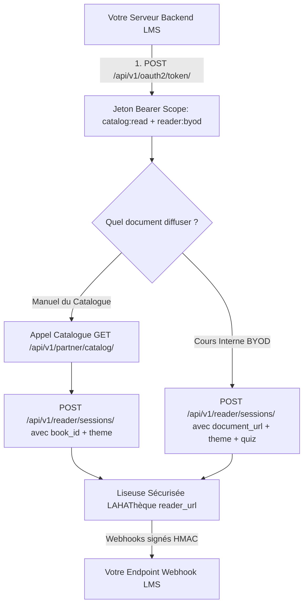

# Guide d'Intégration Partenaire — Mode « Accès Mixte » (Catalogue LAHAThèque + Vos Propres Documents)

> **Public cible :** Développeurs et intégrateurs de plateformes complètes (LMS universitaires d'envergure, grandes écoles, écosystèmes EdTech) combinant l'accès aux manuels du catalogue officiel LAHAThèque et la diffusion sécurisée de leurs propres polycopiés et cours internes.

---

## 1. Vue d'Ensemble du Mode Mixte

Le mode d'accès **Mixte** est le niveau d'intégration le plus complet. Votre clé API bénéficie de l'ensemble des scopes :
`scope: "reader:sessions reader:byod catalog:read"`

### Deux sources de lecture unifiées :
1. **Source Catalogue (`book_id`) :** L'apprenant lit un manuel officiel publié sur LAHAThèque.
2. **Source Propre Fichier BYOD (`document_url` + `document_title`) :** L'apprenant lit un support de cours PDF interne hébergé sur vos propres serveurs (ou cloud S3).

L'interface de liseuse, la protection DRM (filigrane dynamique, blocage anti-capture), les thèmes de marque, les quiz et les Webhooks fonctionnent **de façon 100% identique** quel que soit le type de source.

---

## 2. Diagramme d'Architecture Unifié



---

## 3. Personnalisation Visuelle de la Liseuse (Objet `theme`)

Quel que soit le type de document (Catalogue officiel ou fichier BYOD interne), vous pouvez injecter l'objet `theme` pour personnaliser l'interface :

### Propriétés de l'objet `theme` :

| Propriété | Type | Format / Contrainte | Rôle & Emplacement |
| :--- | :--- | :--- | :--- |
| `brand_name` | String | 2 à 50 caractères | Nom de votre établissement ou marque en haut à gauche. |
| `brand_logo_url` | String (URL HTTPS) | PNG transparent ou SVG (hauteur 28-36px) | Logo officiel remplaçant le nom textuel. |
| `primary_color` | String (HEX) | Code HEX 6 car. (ex: `"#1B2A4E"`) | Couleur de fond de la barre d'outils supérieure. |
| `accent_color` | String (HEX) | Code HEX 6 car. (ex: `"#B08D42"`) | Couleur des boutons actifs, switch 3D/Scroll, jauge et quiz. |
| `background_color` | String (HEX) | Code HEX sombre conseillé (ex: `"#0F1A33"`) | Couleur du fond entourant le document. |
| `text_color` | String (HEX) | Code HEX (ex: `"#FFFFFF"`) | Couleur du texte et des icônes de la barre d'outils. |
| `border_color` | String (HEX) | Code HEX (ex: `"#2E3F66"`) | Couleur des séparateurs de fenêtres et tiroirs. |

```json
{
  "theme": {
    "brand_name": "Université d'Abomey-Calavi",
    "brand_logo_url": "https://uac.bj/assets/logo.png",
    "primary_color": "#1B2A4E",
    "accent_color": "#B08D42",
    "background_color": "#0F1A33",
    "text_color": "#FFFFFF",
    "border_color": "#2E3F66"
  }
}
```

---

## 4. Matrice des Paramètres pour la Création de Session

Pour créer une session de lecture (`POST /api/v1/reader/sessions/`), vous transmettez :

| Champ | Type | Source Catalogue | Source Propre Fichier (BYOD) |
| :--- | :--- | :--- | :--- |
| `book_id` | String (UUID) | **Requis** | *Omettre ou `null`* |
| `document_url` | String (URL HTTPS) | *Omettre ou `null`* | **Requis** |
| `document_title` | String | *Rempli automatiquement* | **Requis** |
| `document_author` | String | *Rempli automatiquement* | Optionnel |
| `external_user_id` | String | **Requis** (Matricule étudiant) | **Requis** (Matricule étudiant) |
| `external_user_name` | String | **Requis** (Nom complet) | **Requis** (Nom complet) |
| `external_user_email` | String | **Requis** (Email) | **Requis** (Email) |
| `user_ip` | String (IP) | **Requis** (IP du lecteur) | **Requis** (IP du lecteur) |
| `return_url` | String (URL) | **Requis** | **Requis** |
| `theme` | Objet | Optionnel | Optionnel |
| `quiz` | Objet | Optionnel | Optionnel |

---

## 5. Endpoints de l'API Partenaire Mixte

### 5.1 Authentification OAuth2
* `POST /api/v1/oauth2/token/` : Obtention du jeton Bearer.
* `POST /api/v1/oauth2/token/revoke/` : Révocation immédiate d'un jeton compromis.

### 5.2 Catalogue & Abonnements
* `GET /api/v1/partner/catalog/` : Recherche documentaire (filtres `q` et `discipline`). Chaque livre inclut une `cover_url` absolue directement affichable dans vos balises ``.
* `GET /api/v1/partner/catalog/{id}/` : Fiche détaillée d'un livre.
* `GET /api/v1/partner/bouquets/` : Liste des bouquets d'institution disponibles.
* `GET /api/v1/partner/bouquets/{offering_id}/check-access/?book_id={id}` : Contrôle des droits bouquet.
* `GET /api/v1/partner/stats/usage/` : Statistiques de consultation campus.

### 5.3 Moteur Liseuse & Sessions
* `POST /api/v1/reader/sessions/` : Création de session (soit `book_id`, soit `document_url`).
* `GET /api/v1/reader/sessions/{id}/` : État, progression et note d'un lecteur en temps réel.
* `DELETE /api/v1/reader/sessions/{id}/` : Interruption / révocation instantanée d'une session.

---

## 6. Exemple d'Intégration Complète Unifiée (Multi-Langages)

### 6.1 Python (3.10+)

```python
import time
import requests

class LahathequeUnifiedClient:
    def __init__(self, client_id: str, client_secret: str, base_url: str = "https://lahatheque.com/api/v1"):
        self.client_id = client_id
        self.client_secret = client_secret
        self.base_url = base_url
        self.token = None
        self.token_expiry = 0

    def _get_token(self) -> str:
        if not self.token or time.time() >= (self.token_expiry - 60):
            res = requests.post(f"{self.base_url}/oauth2/token/", data={
                "grant_type": "client_credentials",
                "client_id": self.client_id,
                "client_secret": self.client_secret,
            }, timeout=10)
            res.raise_for_status()
            data = res.json()
            self.token = data["access_token"]
            self.token_expiry = time.time() + data.get("expires_in", 36000)
        return self.token

    def _headers(self):
        return {
            "Authorization": f"Bearer {self._get_token()}",
            "Content-Type": "application/json"
        }

    # 1. Recherche Catalogue
    def search_books(self, query: str = "", discipline: str = "") -> list:
        params = {}
        if query: params["q"] = query
        if discipline: params["discipline"] = discipline
        res = requests.get(f"{self.base_url}/partner/catalog/", headers=self._headers(), params=params, timeout=10)
        res.raise_for_status()
        return res.json()["data"]

    # 2. Ouvrir un livre du Catalogue LAHAThèque
    def open_catalog_book(self, book_id: str, student: dict, return_url: str, theme: dict = None) -> str:
        payload = {
            "book_id": book_id,
            "external_user_id": student["id"],
            "external_user_name": student["name"],
            "external_user_email": student["email"],
            "user_ip": student["ip"],
            "return_url": return_url,
        }
        if theme: payload["theme"] = theme
        res = requests.post(f"{self.base_url}/reader/sessions/", json=payload, headers=self._headers(), timeout=10)
        res.raise_for_status()
        return res.json()["data"]["reader_url"]

    # 3. Ouvrir votre propre document interne (BYOD)
    def open_custom_document(self, doc_url: str, doc_title: str, student: dict, return_url: str, theme: dict = None, quiz: dict = None) -> str:
        payload = {
            "document_url": doc_url,
            "document_title": doc_title,
            "external_user_id": student["id"],
            "external_user_name": student["name"],
            "external_user_email": student["email"],
            "user_ip": student["ip"],
            "return_url": return_url,
        }
        if theme: payload["theme"] = theme
        if quiz: payload["quiz"] = quiz
            
        res = requests.post(f"{self.base_url}/reader/sessions/", json=payload, headers=self._headers(), timeout=10)
        res.raise_for_status()
        return res.json()["data"]["reader_url"]
```

---

### 6.2 TypeScript / Node.js

```typescript
import axios, { AxiosInstance } from 'axios';

export interface StudentPayload {
  id: string;
  name: string;
  email: string;
  ip: string;
}

export interface ReaderTheme {
  brand_name?: string;
  brand_logo_url?: string;
  primary_color?: string;
  accent_color?: string;
  background_color?: string;
}

export class LahathequeUnifiedSDK {
  private api: AxiosInstance;
  private token: string | null = null;
  private tokenExpiresAt: number = 0;

  constructor(
    private clientId: string,
    private clientSecret: string,
    private baseUrl: string = 'https://lahatheque.com/api/v1'
  ) {
    this.api = axios.create({ baseURL: this.baseUrl });
  }

  private async getAccessToken(): Promise<string> {
    const now = Date.now() / 1000;
    if (!this.token || now >= this.tokenExpiresAt - 60) {
      const res = await this.api.post('/oauth2/token/', new URLSearchParams({
        grant_type: 'client_credentials',
        client_id: this.clientId,
        client_secret: this.clientSecret,
      }));
      this.token = res.data.access_token;
      this.tokenExpiresAt = now + (res.data.expires_in || 36000);
    }
    return this.token;
  }

  private async getAuthHeaders() {
    const token = await this.getAccessToken();
    return { Authorization: `Bearer ${token}` };
  }

  // Catalogue
  async searchCatalog(query = '', discipline = '') {
    const headers = await this.getAuthHeaders();
    const res = await this.api.get('/partner/catalog/', { headers, params: { q: query, discipline } });
    return res.data.data;
  }

  // Ouvrir un livre du Catalogue
  async openCatalogBook(bookId: string, student: StudentPayload, returnUrl: string, theme?: ReaderTheme): Promise<string> {
    const headers = await this.getAuthHeaders();
    const res = await this.api.post('/reader/sessions/', {
      book_id: bookId,
      external_user_id: student.id,
      external_user_name: student.name,
      external_user_email: student.email,
      user_ip: student.ip,
      return_url: returnUrl,
      theme,
    }, { headers });
    return res.data.data.reader_url;
  }

  // Ouvrir un fichier propre (BYOD)
  async openCustomPdf(docUrl: string, docTitle: string, student: StudentPayload, returnUrl: string, theme?: ReaderTheme, quizConfig?: any): Promise<string> {
    const headers = await this.getAuthHeaders();
    const res = await this.api.post('/reader/sessions/', {
      document_url: docUrl,
      document_title: docTitle,
      external_user_id: student.id,
      external_user_name: student.name,
      external_user_email: student.email,
      user_ip: student.ip,
      return_url: returnUrl,
      theme,
      quiz: quizConfig,
    }, { headers });
    return res.data.data.reader_url;
  }
}
```

---

### 6.3 PHP / Laravel

```php
<?php

namespace App\Services;

use Illuminate\Support\Facades\Http;
use Illuminate\Support\Facades\Cache;

class LahathequeUnifiedService
{
    public function __construct(
        protected string $clientId,
        protected string $clientSecret,
        protected string $baseUrl = 'https://lahatheque.com/api/v1'
    ) {}

    protected function token(): string
    {
        return Cache::remember('laha_m2m_token', 35000, function () {
            return Http::asForm()->post("{$this->baseUrl}/oauth2/token/", [
                'grant_type' => 'client_credentials',
                'client_id' => $this->clientId,
                'client_secret' => $this->clientSecret,
            ])->throw()->json('access_token');
        });
    }

    public function searchCatalog(array $params = []): array
    {
        return Http::withToken($this->token())
            ->get("{$this->baseUrl}/partner/catalog/", $params)
            ->throw()
            ->json('data');
    }

    public function openCatalogBook(string $bookId, array $student, string $returnUrl, array $theme = []): string
    {
        $payload = [
            'book_id' => $bookId,
            'external_user_id' => $student['id'],
            'external_user_name' => $student['name'],
            'external_user_email' => $student['email'],
            'user_ip' => $student['ip'],
            'return_url' => $returnUrl,
        ];
        if (!empty($theme)) $payload['theme'] = $theme;

        return Http::withToken($this->token())
            ->post("{$this->baseUrl}/reader/sessions/", $payload)
            ->throw()
            ->json('data.reader_url');
    }

    public function openCustomPdf(string $docUrl, string $docTitle, array $student, string $returnUrl, array $theme = [], ?array $quiz = null): string
    {
        $payload = [
            'document_url' => $docUrl,
            'document_title' => $docTitle,
            'external_user_id' => $student['id'],
            'external_user_name' => $student['name'],
            'external_user_email' => $student['email'],
            'user_ip' => $student['ip'],
            'return_url' => $returnUrl,
        ];
        if (!empty($theme)) $payload['theme'] = $theme;
        if ($quiz) $payload['quiz'] = $quiz;

        return Http::withToken($this->token())
            ->post("{$this->baseUrl}/reader/sessions/", $payload)
            ->throw()
            ->json('data.reader_url');
    }
}
```

---

## 7. Matrice Complète des Erreurs & Dépannage Pas-à-Pas

| Code HTTP | Message d'erreur | Pourquoi cette erreur survient | Que vérifier exactement ? | Action Corrective Immédiate |
| :--- | :--- | :--- | :--- | :--- |
| **400** | `L'URL de redirection n'est pas autorisée` | Le domaine passé dans `return_url` ne figure pas dans votre liste d'origines approuvées. | Vérifiez le protocole (`https://`), le nom de domaine exact et les sous-domaines. | Ajoutez votre domaine (ex: `https://mon-lms.com` ou `*` pour tous vos tests) dans `/admin/api`. |
| **400** | `Type de source de document manquant` | Vous n'avez envoyé ni `book_id`, ni le couple `document_url` + `document_title`. | Vérifiez les clés JSON de votre requête. | Fournissez soit un `book_id` (Catalogue), soit `document_url` + `document_title` (BYOD). |
| **400** | `unsupported_grant_type` | Le paramètre `grant_type` n'est pas `client_credentials`. | Vérifiez votre appel d'authentification POST OAuth2. | Transmettez `grant_type=client_credentials`. |
| **401** | `invalid_client` ou `Identifiants client invalides` | Le `client_id` ou le `client_secret` est erroné ou révoqué. | Vérifiez que vous n'avez pas copié le secret masqué (`sec_live_••••`). | Utilisez le bouton **Régénérer le Secret** sur votre console `/admin/api` pour copier la nouvelle clé en clair. |
| **401** | `Jeton d'authentification invalide ou expiré` | Le token Bearer a expiré (validité 10h) ou est manquant. | Vérifiez votre en-tête HTTP `Authorization: Bearer <votre_token>`. | Ré-exécutez un appel vers `/api/v1/oauth2/token/` pour renouveler votre token. |
| **403** | `Accès aux adresses privées interdit (Anti-SSRF)` | L'URL `document_url` pointe vers `localhost`, `127.0.0.1` ou une IP locale privée non routable. | Vérifiez l'URL de votre fichier PDF en mode BYOD. | Utilisez une URL HTTPS publique accessible par nos serveurs (ex: Bucket S3, Cloudflare R2, GCP Storage). |
| **404** | `Ouvrage introuvable dans le catalogue` | Le `book_id` transmis ne correspond à aucun livre publié du catalogue. | Vérifiez l'ID avec `GET /api/v1/partner/catalog/`. | Utilisez un UUID valide d'ouvrage au statut `published`. |
| **422** | `Fichier distant inaccessible ou corrompu` | En mode BYOD, le fichier distant ne peut pas être téléchargé (404, 403 S3, ou fichier non PDF). | Testez l'URL dans une fenêtre privée de votre navigateur sans cookies. | Rendez le bucket accessible en lecture ou utilisez une URL pré-signée HTTPS (presigned URL) valide au moins 2h. |
| **422** | `Fichier distant trop volumineux` | Le PDF dépasse le plafond maximal configuré pour votre compte (ex: 200 Mo). | Vérifiez la taille de votre document PDF. | Compressez votre PDF ou contactez le support pour activer le palier **VIP Illimité (500 Mo)**. |
| **429** | `Quota journalier atteint` ou `Sessions simultanées dépassées` | Votre plateforme a dépassé son quota de requêtes par 24h ou le nombre maximal d'apprenants connectés en même temps. | Lisez l'en-tête de réponse `Retry-After: <secondes>`. | Demandez à l'administrateur d'activer l'option **Accès VIP Illimité**. |
| **504** | `Gateway Timeout` | Le serveur distant hébergeant votre PDF BYOD a mis plus de 20 secondes à répondre. | Vérifiez la bande passante de votre serveur de fichiers. | Utilisez un CDN ou un stockage d'objets haute performance (Cloudflare R2, AWS S3). |

---

## 8. Webhooks & Rapprochement Automatique

Tous les événements envoyés par Webhook précisent le `source_type` (`catalog_book` ou `external_url`), ce qui vous permet de router l'enregistrement des notes ou des progressions dans la bonne table de votre base de données :

```json
{
  "event": "reader.quiz.completed",
  "session_id": "rs_c712e4b0",
  "source_type": "external_url",
  "timestamp": 1788250000,
  "data": {
    "quiz_title": "Évaluation Module 1",
    "score_percent": 85.0,
    "passing_score_percent": 70.0,
    "is_passed": true,
    "external_user_ref": "ETU-8841",
    "answers": [
      {
        "question_id": "q1",
        "question": "Question...",
        "is_correct": true
      }
    ]
  }
}
```
