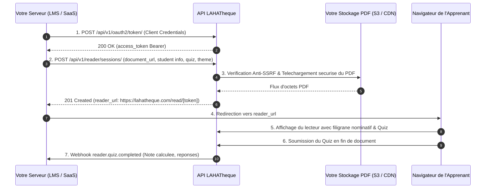

# Guide d'Integration BYOD — Reader-as-a-Service LAHATheque (v3.2)

> Guide pas-a-pas destine aux developpeurs et editeurs de plateformes tierces (LMS, SaaS EdTech, Universites, Entreprises) souhaitant utiliser le moteur de lecture securise et interactif de LAHATheque pour diffuser **leurs propres documents PDF**.

---

## Sommaire

1. [Concept & Fonctionnement du Mode BYOD](#1-concept--fonctionnement-du-mode-byod)
2. [Prerequis & Preparation de votre Serveur de Fichiers](#2-prerequis--preparation-de-votre-serveur-de-fichiers)
3. [Architecture du Flux de Lecture BYOD](#3-architecture-du-flux-de-lecture-byod)
4. [Tutoriel d'Integration Pas-a-Pas](#4-tutoriel-dintegration-pas-a-pas)
   - [Etape 1 : Authentification OAuth2 Machine-to-Machine](#etape-1--authentification-oauth2-machine-to-machine)
   - [Etape 2 : Creation de la Session de Lecture BYOD](#etape-2--creation-de-la-session-de-lecture-byod)
   - [Etape 3 : Redirection du Lecteur](#etape-3--redirection-du-lecteur)
   - [Etape 4 : Reception des Evenements & Notes de Quiz par Webhooks](#etape-4--reception-des-evenements--notes-de-quiz-par-webhooks)
5. [Personnalisation du Design aux Couleurs de votre Marque](#5-personnalisation-du-design-aux-couleurs-de-votre-marque)
6. [Module d'Evaluation & Quiz Dynamique sur Document Externe](#6-module-devaluation--quiz-dynamique-sur-document-externe)
7. [Protection DRM & Filigrane Nominatif Automatique](#7-protection-drm--filigrane-nominatif-automatique)
8. [Exemples d'Integration Complets par Langage](#8-exemples-dintegration-complets-par-langage)
   - [PHP / Laravel](#81-php--laravel)
   - [Node.js / Express](#82-nodejs--express)
   - [Python / Django / FastAPI](#83-python--django--fastapi)
9. [FAQ & Bonnes Pratiques](#9-faq--bonnes-pratiques)

---

## 1. Concept & Fonctionnement du Mode BYOD

### 1.1 Qu'est-ce que le BYOD (*Bring Your Own Document*) ?
Le mode **BYOD** transforme LAHATheque en un service de **Reader-as-a-Service**. Vous n'avez pas besoin de publier vos documents dans le catalogue public de LAHATheque : vous transmettez simplement l'URL HTTPS de votre fichier PDF lors de la creation de la session de lecture.

LAHATheque telecharge le document en flux continu, lui applique automatiquement l'ensemble des protections DRM (filigrane nominatif indelebile avec le nom et l'IP du lecteur, anti-copie, anti-impression, anti-telechargement) et l'affiche dans un lecteur bimodal moderne (FlipBook 3D immersif ou liseuse verticale).

### 1.2 Avantages Cles pour votre Plateforme
* **Zero developpement front-end :** Pas de liseuse PDF complexe a maintenir, pas de probleme de compatibilite mobile.
* **Securite juridique maximale :** Si un etudiant capture son ecran, son identite complete (Nom, Email, Adresse IP) apparait directement en surimpression sur le document.
* **Propriete totale de vos donnees :** Vos fichiers PDF restent heberges sur vos serveurs ou votre bucket cloud (AWS S3, Google Cloud, Cloudflare R2).
* **Interactivite cle en main :** Injection de quiz QCM notes avec transmission des resultats a votre base de donnees par Webhook.

---

## 2. Prerequis & Preparation de votre Serveur de Fichiers

### 2.0 URLs de Base LAHATheque (Production & Vercel)
Selon votre environnement de deploiement, les requetes API et l'ouverture du lecteur s'effectuent sur l'une des adresses suivantes :
* **Domaine Officiel :** `https://lahatheque.com`
* **Domaine Vercel Cloud :** `https://lahatheque.vercel.app`
* **Developpements Locaux :** `http://localhost:3000`

Les tokens de session sont valables et interchangeables sur l'ensemble de ces domaines.

Pour que LAHATheque puisse recuperer et securiser vos documents distants, trois elements sont indispensables :

### 2.1 Accessibilite HTTPS du Fichier PDF
Votre fichier doit etre accessible via une URL securisee `https://` (ex: `https://mon-lms.com/uploads/cours-droit.pdf` ou `https://s3.eu-west-3.amazonaws.com/mon-bucket/document.pdf`).
* Les adresses non securisees (`http://`) et les adresses locales (`localhost`, `127.0.0.1`, adresses IP privees `192.168.x`, `10.x`) sont strictement rejetees par notre pare-feu Anti-SSRF.

### 2.2 Enregistrement de votre Domaine dans la Whitelist
Pour des raisons de securite, l'administrateur LAHATheque doit renseigner le domaine de votre serveur de stockage (ex: `mon-lms.com` ou `s3.eu-west-3.amazonaws.com/mon-bucket/`) dans la liste blanche de votre cle d'API.
* **Prise en compte des sous-domaines :** Si vous declarez `mon-lms.com`, tous les sous-domaines (`storage.mon-lms.com`, `cdn.mon-lms.com`, `cours.mon-lms.com`) sont automatiquement autorises.

### 2.3 Formats et Plafonds de Taille
* **Formats supportes :** PDF (rendu natif direct), DOCX / PPTX (convertis automatiquement), MP3 / AAC (narration audio d'accompagnement).
* **Taille maximale :** 200 Mo par document par defaut (extensible jusqu'a 500 Mo en palier VIP Illimite).

---

## 3. Architecture du Flux de Lecture BYOD

Le cycle de vie complet d'une consultation BYOD se deroule en 4 temps :



---

## 4. Tutoriel d'Integration Pas-a-Pas

### Etape 1 : Authentification OAuth2 Machine-to-Machine
Votre serveur genere un jeton d'acces Bearer a l'aide de votre `client_id` et `client_secret`.

#### Requete HTTP
```http
POST /api/v1/oauth2/token/ HTTP/1.1
Host: lahatheque.com
Content-Type: application/x-www-form-urlencoded

grant_type=client_credentials&client_id=VOTRE_CLIENT_ID&client_secret=VOTRE_CLIENT_SECRET
```

#### Reponse JSON
```json
{
  "access_token": "eyJhbGciOiJIUzI1NiIsInR5cCI6IkpXVCJ9...",
  "expires_in": 36000,
  "token_type": "Bearer",
  "scope": "reader:sessions reader:byod"
}
```

---

### Etape 2 : Creation de la Session de Lecture BYOD
Vous transmettez l'URL de votre document (`document_url`), le titre a afficher (`document_title`), l'identite du lecteur a incruster en filigrane, ainsi que l'URL de retour (`return_url`).

#### Requete HTTP
```http
POST /api/v1/reader/sessions/ HTTP/1.1
Host: lahatheque.com
Authorization: Bearer VOTRE_ACCESS_TOKEN
Content-Type: application/json

{
  "document_url": "https://mon-lms.com/storage/cours-finance-internationale.pdf",
  "document_title": "Finance Internationale & Marches Emergents",
  "document_author": "Dr. Roch Hounkpe",
  "external_user_id": "USER-4412",
  "external_user_name": "Koffi Mensah",
  "external_user_email": "koffi.mensah@univ.bj",
  "user_ip": "154.68.24.112",
  "return_url": "https://mon-lms.com/cours/finance",
  "session_duration_minutes": 120,
  "theme": {
    "brand_name": "Universite d'Abomey-Calavi",
    "primary_color": "#1B2A4E",
    "accent_color": "#D4A017"
  }
}
```

#### Reponse JSON (201 Created)
```json
{
  "success": true,
  "data": {
    "session_id": "rs_f81a9902bc34",
    "reader_url": "https://lahatheque.com/read/eyJhbGciOiJIUzI1NiIsInR5cCI6IkpXVCJ9.eyJzZXNzaW9uX2lkIjoicnNfZjgx...",
    "expires_at": "2026-08-19T14:30:00Z",
    "source_type": "external_url"
  },
  "error": null
}
```

---

### Etape 3 : Redirection du Lecteur
Dans votre controleur web, effectuez une simple redirection HTTP (Code 302 / 303) vers la valeur reçue dans `reader_url`.

L'etudiant arrive instantanement sur la liseuse dediee. Aucun menu LAHATheque n'est visible : seuls votre logo, votre titre et votre bouton de retour vers `return_url` sont affiches.

---

### Etape 4 : Reception des Evenements & Notes de Quiz par Webhooks
Lorsque l'etudiant termine sa lecture ou valide son quiz, LAHATheque envoie une requete `POST` securisee a votre URL de webhook.

#### Exemple de Payload Recu (`reader.quiz.completed`)
```json
{
  "event": "reader.quiz.completed",
  "session_id": "rs_f81a9902bc34",
  "external_user_id": "USER-4412",
  "data": {
    "score_percent": 100,
    "is_validated": true,
    "passing_score": 80,
    "correct_answers": 3,
    "total_questions": 3,
    "completed_at": "2026-08-19T12:45:00Z"
  }
}
```

---

## 5. Personnalisation du Design aux Couleurs de votre Marque

L'API vous permet d'adapter integralement l'habillage visuel du lecteur heberge pour qu'il s'integre parfaitement a l'identite graphique de votre etablissement ou de votre SaaS.

### 5.1 Ou placer l'objet `theme` dans votre requete ?
L'objet `theme` est un sous-objet JSON optionnel a inclure dans le corps de votre requete `POST /api/v1/reader/sessions/` :

```json
{
  "document_url": "https://mon-lms.com/uploads/cours-droit.pdf",
  "document_title": "Droit Constitutionnel",
  "external_user_id": "ETU-101",
  "external_user_name": "Koffi Mensah",
  "external_user_email": "koffi.mensah@univ.bj",
  "user_ip": "154.68.24.112",
  "return_url": "https://mon-lms.com/cours",
  "theme": {
    "brand_name": "Universite d'Abomey-Calavi",
    "brand_logo_url": "https://mon-lms.com/images/logo-uac.png",
    "primary_color": "#1B2A4E",
    "accent_color": "#D4A017",
    "background_color": "#0F1A33",
    "text_color": "#FFFFFF",
    "border_color": "#2E3F66"
  }
}
```

*Remarque : Si vous ne transmettez pas l'objet `theme`, la liseuse utilisera automatiquement le theme officiel chic LAHATheque (Navy `#1B2A4E` & Or `#D4A017`).*

---

### 5.2 Description Detaillee des 7 Proprietes de Theme

| Propriete | Type | Role & Emplacement Visuel Exact | Format & Contraintes |
| :--- | :--- | :--- | :--- |
| `brand_name` | `string` | **Nom de votre etablissement** affiche en haut a gauche de la barre superieure si aucun logo n'est fourni. | Texte brut de 2 a 50 caracteres (ex: `"Portail BU Parakou"`). |
| `brand_logo_url` | `string (URL)` | **Logo de votre marque** incruste en haut a gauche a la place du logo par defaut. | URL HTTPS publique directe vers une image PNG transparente ou SVG (Hauteur ideale : 28px a 36px). |
| `primary_color` | `string (HEX)` | **Couleur de l'en-tete superieure** et de la barre d'outils de navigation. | Code hexadecimal valide a 6 caracteres (ex: `"#1B2A4E"`). |
| `accent_color` | `string (HEX)` | **Couleur des elements d'emphase** : bouton Quiz, jauge de progression audio, commutateur bimodal actif. | Code hexadecimal valide (ex: `"#D4A017"` ou `"#2563EB"`). |
| `background_color` | `string (HEX)` | **Fond de la zone de lecture** entourant le livre numerique. | Code hexadecimal (sombre recommande pour le confort visuel, ex: `"#0F1A33"`). |
| `text_color` | `string (HEX)` | **Couleur du texte de l'en-tete** et des libelles de boutons. | Code hexadecimal (ex: `"#FFFFFF"` pour contraste maximal). |
| `border_color` | `string (HEX)` | **Couleur des separateurs** et des bordures de boites de dialogue. | Code hexadecimal (ex: `"#2E3F66"`). |

---

### 5.3 Regles d'Or & Erreurs Frequentes (Do's & Don'ts)

#### A FAIRE (DO)
* **Utilisez toujours le format Hexadecimal avec le symbole `#` :** Ecrivez `"#1E40AF"` et non `"1E40AF"` ou `"rgb(30,64,175)"`.
* **Assurez un contraste suffisant :** Si votre `primary_color` est foncee (ex: `"#0F172A"`), utilisez imperativement un `text_color` clair (ex: `"#FFFFFF"`).
* **Hebergez votre logo sur une URL HTTPS permanente :** Utilisez un logo sur fond transparent (format SVG ou PNG 32-bit).
* **Testez le rendu :** Utilisez l'URL `reader_url` generee dans un navigateur pour verifier que les couleurs rendent le texte parfaitement lisible.

#### A NE PAS FAIRE (DON'T)
* **Ne pas utiliser de noms de couleurs textuels :** N'ecrivez pas `"blue"`, `"red"`, `"transparent"`, cela declenchera une erreur HTTP 400.
* **Ne pas utiliser d'adresses HTTP non securisees pour le logo :** Les URLs `http://` pour `brand_logo_url` seront bloquees par les navigateurs modernes (erreur de contenu mixte).
* **Ne pas utiliser d'images de logo geantes non compressees :** Evitez les fichiers de 5 Mo pour le logo, cela ralentirait l'ouverture du lecteur. Visez une image inferieure a 150 Ko.
* **Ne pas choisir une couleur de texte identique au fond :** Ne mettez pas `primary_color: "#000000"` avec `text_color: "#111111"`.

---

### 5.4 Palettes de Couleurs Recommandees (Pretes a Copier-Coller)

#### Palette 1 : Universitaire & Institutionnelle (Bleu Royal & Dore)
```json
"theme": {
  "brand_name": "Universite d'Abomey-Calavi",
  "primary_color": "#1B2A4E",
  "accent_color": "#D4A017",
  "background_color": "#0F1A33",
  "text_color": "#FFFFFF",
  "border_color": "#2E3F66"
}
```

#### Palette 2 : Sante, Agronomie & Ecologie (Vert Emeraude & Menthe)
```json
"theme": {
  "brand_name": "Faculte des Sciences de la Sante",
  "primary_color": "#064E3B",
  "accent_color": "#10B981",
  "background_color": "#022C22",
  "text_color": "#ECFDF5",
  "border_color": "#047857"
}
```

#### Palette 3 : EdTech & Sciences Technologiques (Violet & Indigo Moderne)
```json
"theme": {
  "brand_name": "Plateforme EdTech Innovation",
  "primary_color": "#312E81",
  "accent_color": "#6366F1",
  "background_color": "#1E1B4B",
  "text_color": "#EEF2FF",
  "border_color": "#4338CA"
}
```

#### Palette 4 : Minimaliste Moderne (Gris Anthracite & Ambre)
```json
"theme": {
  "brand_name": "Institut Superieur de Management",
  "primary_color": "#18181B",
  "accent_color": "#F59E0B",
  "background_color": "#09090B",
  "text_color": "#FAFAFA",
  "border_color": "#27272A"
}
```

---

## 6. Module d'Evaluation & Quiz Dynamique sur Document Externe

Vous pouvez injecter des questions d'auto-evaluation directement dans la liseuse. Le quiz peut etre declenche a tout moment via le bouton Quiz ou apparaitre automatiquement des que l'apprenant atteint la derniere page.

### Exemple de Configuration du Quiz dans la Requete
```json
{
  "quiz": {
    "enabled": true,
    "show_on_last_page": true,
    "passing_score": 75,
    "questions": [
      {
        "id": "q1",
        "question": "Quelle est la principale caracteristique d'un marche de capitaux efficient ?",
        "options": [
          "L'absence totale de regulation etatique",
          "L'integration instantanee de toute information disponible dans les prix",
          "La fixite obligatoire des taux de change"
        ],
        "correct_index": 1,
        "explanation": "L'efficience informationnelle stipule que les prix des actifs refletent a tout instant l'ensemble des informations disponibles."
      }
    ]
  }
}
```

---

## 7. Protection DRM & Filigrane Nominatif Automatique

Des que votre document BYOD est charge dans la liseuse :
1. **Gravure Nominative Inaltérable :** Le texte suivant est automatiquement incruste en diagonale sur chaque page :
   `Document confie a Koffi Mensah (koffi.mensah@univ.bj) • IP: 154.68.24.112`
2. **Desactivation des Fonctions de Copie :**
   * Clic droit et menu contextuel desactives.
   * Raccourcis clavier `Ctrl+P` (Impression), `Ctrl+S` (Sauvegarde), `Ctrl+C` (Copie) et capture d'ecran interceptes.
   * Regles CSS `@media print` masquant le document en cas de tentative d'impression via les options du navigateur.

---

## 8. Exemples d'Integration Complets par Langage

### 8.1 PHP / Laravel

```php
<?php

namespace App\Services;

use Illuminate\Support\Facades\Http;
use Exception;

class LahathequeByodService
{
    protected string $baseUrl = 'https://lahatheque.com/api/v1';
    protected string $clientId;
    protected string $clientSecret;

    public function __construct()
    {
        $this->clientId = config('services.lahatheque.client_id');
        $this->clientSecret = config('services.lahatheque.client_secret');
    }

    public function openStudentDocument(string $documentUrl, string $documentTitle, array $student): string
    {
        // 1. Generation du jeton Bearer
        $authResponse = Http::asForm()->post("{$this->baseUrl}/oauth2/token/", [
            'grant_type' => 'client_credentials',
            'client_id' => $this->clientId,
            'client_secret' => $this->clientSecret,
        ]);

        if (!$authResponse->successful()) {
            throw new Exception("Echec authentification LAHATheque : " . $authResponse->body());
        }

        $accessToken = $authResponse->json('access_token');

        // 2. Creation de la session BYOD
        $sessionResponse = Http::withToken($accessToken)->post("{$this->baseUrl}/reader/sessions/", [
            'document_url' => $documentUrl,
            'document_title' => $documentTitle,
            'external_user_id' => (string) $student['id'],
            'external_user_name' => $student['name'],
            'external_user_email' => $student['email'],
            'user_ip' => request()->ip(),
            'return_url' => route('lms.course.show', ['id' => $student['course_id']]),
            'session_duration_minutes' => 90,
            'theme' => [
                'brand_name' => 'Mon Universite',
                'primary_color' => '#1B2A4E',
                'accent_color' => '#D4A017'
            ]
        ]);

        if (!$sessionResponse->successful()) {
            throw new Exception("Erreur creation session reader : " . $sessionResponse->body());
        }

        return $sessionResponse->json('data.reader_url');
    }
}
```

---

### 8.2 Node.js / Express

```javascript
const express = require('express');
const axios = require('axios');
const app = express();

const LAHA_BASE = 'https://lahatheque.com/api/v1';
const CLIENT_ID = process.env.LAHA_CLIENT_ID;
const CLIENT_SECRET = process.env.LAHA_CLIENT_SECRET;

app.get('/cours/:id/lire', async (req, res) => {
  try {
    // 1. Jeton OAuth2
    const tokenRes = await axios.post(`${LAHA_BASE}/oauth2/token/`, new URLSearchParams({
      grant_type: 'client_credentials',
      client_id: CLIENT_ID,
      client_secret: CLIENT_SECRET
    }));

    const token = tokenRes.data.access_token;

    // 2. Creation session BYOD
    const sessionRes = await axios.post(`${LAHA_BASE}/reader/sessions/`, {
      document_url: 'https://mon-saas.com/files/manuel-gestion.pdf',
      document_title: 'Manuel de Gestion Financiere',
      external_user_id: req.user.id,
      external_user_name: req.user.fullName,
      external_user_email: req.user.email,
      user_ip: req.ip || req.connection.remoteAddress,
      return_url: 'https://mon-saas.com/dashboard',
      session_duration_minutes: 120
    }, {
      headers: { Authorization: `Bearer ${token}` }
    });

    // 3. Redirection de l'utilisateur
    res.redirect(sessionRes.data.data.reader_url);
  } catch (err) {
    res.status(500).json({ error: 'Impossible de generer le lecteur', details: err.message });
  }
});
```

---

### 8.3 Python / Django / FastAPI

```python
import httpx
from fastapi import FastAPI, Request, HTTPException
from fastapi.responses import RedirectResponse

app = FastAPI()

LAHA_API = "https://lahatheque.com/api/v1"
CLIENT_ID = "laha_client_uac_998877"
CLIENT_SECRET = "sec_live_99a8b7c6d5e4f3a2b1009988"

@app.get("/etudiant/cours/{course_id}/lecture")
async def launch_byod_reader(course_id: str, request: Request):
    client_ip = request.client.host if request.client else "127.0.0.1"

    async with httpx.AsyncClient(timeout=10.0) as client:
        # 1. OAuth2 Token
        auth_resp = await client.post(
            f"{LAHA_API}/oauth2/token/",
            data={
                "grant_type": "client_credentials",
                "client_id": CLIENT_ID,
                "client_secret": CLIENT_SECRET,
            }
        )
        if auth_resp.status_code != 200:
            raise HTTPException(status_code=500, detail="Erreur authentification LAHATheque")

        access_token = auth_resp.json()["access_token"]

        # 2. Session BYOD
        session_payload = {
            "document_url": f"https://mon-universite.bj/storage/cours-{course_id}.pdf",
            "document_title": "Introduction au Droit Civil",
            "external_user_id": "ETU-9901",
            "external_user_name": "Amina Traore",
            "external_user_email": "amina.traore@univ.bj",
            "user_ip": client_ip,
            "return_url": f"https://mon-universite.bj/cours/{course_id}",
            "session_duration_minutes": 90
        }

        reader_resp = await client.post(
            f"{LAHA_API}/reader/sessions/",
            json=session_payload,
            headers={"Authorization": f"Bearer {access_token}"}
        )

        if reader_resp.status_code != 201:
            raise HTTPException(status_code=500, detail="Erreur creation session de lecture")

        reader_url = reader_resp.json()["data"]["reader_url"]

    # 3. Redirection automatique
    return RedirectResponse(url=reader_url, status_code=303)
```

---

## 9. FAQ & Bonnes Pratiques

### 9.1 Foire Aux Questions

**Q : Mes fichiers sources sont-ils conserves sur les serveurs de LAHATheque ?**  
*R : Non.* Les fichiers distants BYOD sont traites a la volee en memoire vive et en cache chiffre temporaire uniquement pour la duree de la session. LAHATheque ne stocke pas de copie definitive de vos fichiers proprietaires.

**Q : Comment mettre a jour un document distant sans casser les sessions ?**  
*R :* Si vous modifiez votre fichier PDF sur votre serveur, les nouvelles sessions telechargeront automatiquement la derniere version mise a jour.

**Q : Mon serveur de stockage utilise un jeton d'autorisation prive (Authorization Bearer), comment l'integrer ?**  
*R :* Vous pouvez transmettre un en-tete d'authentification personnalise dans le payload via le champ optionnel `storage_auth_header`. Notre serveur transmettra cet en-tete lors du telechargement du PDF.

**Q : Puis-je tester l'API en local sur mon poste de developpement ?**  
*R :* Oui. Pour l'URL `document_url`, utilisez un fichier heberge sur un serveur accessible publiquement ou utilisez un tunnel securise HTTPS (type ngrok ou Cloudflare Tunnel) pointant vers votre fichier local.

---

### 9.2 Coordonnees du Support Developpeur
* **Email Support Integrateurs :** `api-support@lahatheque.com`
* **Tableau de bord de gestion des cles :** `https://lahatheque.com/admin/api`
* **Documentation OpenAPI / Swagger :** `https://lahatheque.com/api/v1/schema/swagger/`
