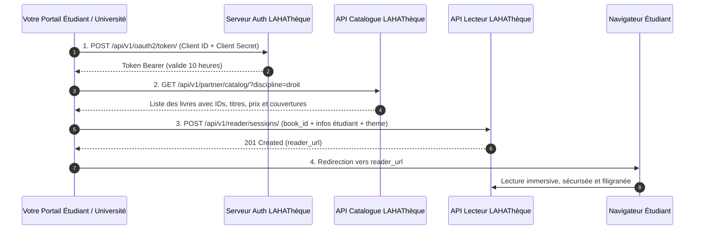

# Guide d'Intégration Partenaire — Mode « Catalogue LAHAThèque Seul »

> **Public cible :** Développeurs et directeurs techniques de portails universitaires, bibliothèques académiques, applications étudiantes et plateformes partenaires souhaitant donner accès au catalogue officiel d'ouvrages universitaires LAHAThèque et ouvrir les livres dans la liseuse sécurisée.

---

## 1. Principes & Fonctionnement

Dans ce mode d'accès, votre portail se connecte à la base de données académique de LAHAThèque pour :
1. **Explorer et rechercher dans le catalogue :** Récupérer la liste des livres publiés, leurs métadonnées (titres, auteurs, résumés, disciplines, prix, nombre de pages, couvertures).
2. **Vérifier les abonnements & bouquets de votre campus :** Contrôler si votre établissement a souscrit un bouquet donnant accès à l'ouvrage.
3. **Lancer la lecture pour vos étudiants :** Instancier une session de lecture sécurisée (`/read/[token]`) d'un livre en un clic, sans que l'étudiant ait besoin de créer un compte supplémentaire sur LAHAThèque.
4. **Personnaliser la liseuse aux couleurs de votre université :** Intégrer votre logo, votre nom d'établissement et vos couleurs d'interface.
5. **Consulter vos statistiques d'usage :** Suivre le volume de consultations et les ouvrages les plus lus sur votre campus.

---

## 2. Le Flux d'Intégration Complet



---

## 3. Pré-requis & Identifiants

* `CLIENT_ID` : Votre identifiant client (ex: `laha_client_univ_445566`)
* `CLIENT_SECRET` : Votre clé secrète (ex: `sec_live_abcdef1234567890`)
* `BASE_URL` : `https://lahatheque.com/api/v1`

---

## 4. Personnalisation Visuelle de la Liseuse (Objet `theme`)

Même en consultant un livre officiel du catalogue LAHAThèque, vous pouvez habiller la liseuse aux couleurs officielles de votre université.

### Propriétés de l'objet `theme` :

| Propriété | Type | Format / Contrainte | Rôle & Emplacement |
| :--- | :--- | :--- | :--- |
| `brand_name` | String | 2 à 50 caractères | Nom de votre établissement affiché en haut à gauche. |
| `brand_logo_url` | String (URL HTTPS) | Image PNG transparente ou SVG (hauteur 28-36px) | Logo officiel de l'université remplaçant le nom textuel. |
| `primary_color` | String (HEX) | Code HEX 6 car. (ex: `"#1B2A4E"`) | Couleur de fond de la barre d'outils supérieure. |
| `accent_color` | String (HEX) | Code HEX 6 car. (ex: `"#B08D42"`) | Couleur dorée/accent des boutons actifs, pagination et sommaire. |
| `background_color` | String (HEX) | Code HEX sombre conseillé (ex: `"#0F1A33"`) | Couleur de l'arrière-plan entourant les pages du livre. |
| `text_color` | String (HEX) | Code HEX (ex: `"#FFFFFF"`) | Couleur du texte et des icônes du lecteur. |
| `border_color` | String (HEX) | Code HEX (ex: `"#2E3F66"`) | Couleur des séparateurs de fenêtres et tiroirs de table des matières. |

```json
{
  "theme": {
    "brand_name": "Université de Parakou",
    "brand_logo_url": "https://up.bj/assets/logo.png",
    "primary_color": "#1B2A4E",
    "accent_color": "#B08D42",
    "background_color": "#0F1A33",
    "text_color": "#FFFFFF"
  }
}
```

---

## 5. Référence Détaillée des Endpoints

### 5.1 Étape 1 : Obtenir un jeton d'accès OAuth 2.0
* **Route :** `POST /api/v1/oauth2/token/`
* **Format :** `application/x-www-form-urlencoded` ou `application/json`

**Paramètres :**
```json
{
  "grant_type": "client_credentials",
  "client_id": "VOTRE_CLIENT_ID",
  "client_secret": "VOTRE_CLIENT_SECRET"
}
```

**Réponse (200 OK) :**
```json
{
  "access_token": "eyJhbGciOiJIUzI1NiIsInR5cCI6IkpXVCJ9...",
  "token_type": "Bearer",
  "expires_in": 36000,
  "scope": "reader:sessions catalog:read"
}
```

---

### 5.2 Étape 2 : Explorer le Catalogue et Rechercher un Ouvrage
* **Route :** `GET /api/v1/partner/catalog/`
* **En-tête :** `Authorization: Bearer <access_token>`

**Paramètres d'URL (Query Params) :**
* `q` (optionnel) : Recherche textuelle dans les titres (ex: `?q=constitutionnel`).
* `discipline` (optionnel) : Filtrage par matière (ex: `?discipline=Droit`).

**Exemple de Réponse Complète (200 OK) :**
```json
{
  "success": true,
  "count": 1,
  "data": [
    {
      "id": "e4a2c5b0-7d12-4e9a-9e11-8a9d12345678",
      "isbn": "978-2-919999-01-2",
      "title": "Droit Constitutionnel des États d'Afrique Francophone",
      "subtitle": "Théorie générale et régimes politiques comparés",
      "author_name": "Prof. Jean-Marc Agossou",
      "author": "Prof. Jean-Marc Agossou",
      "authors": [
        {
          "id": "uuid-auteur-1",
          "first_name": "Jean-Marc",
          "last_name": "Agossou",
          "full_name": "Jean-Marc Agossou"
        }
      ],
      "discipline_name": "Droit & Sciences Politiques",
      "publisher_name": "Éditions LAHA",
      "institution_name": "Université d'Abomey-Calavi",
      "country": "BJ",
      "format_type": "pdf",
      "page_count": 348,
      "sample_pages_count": 15,
      "publication_date": "2026-01-15",
      "language": "fr",
      "summary": "Ouvrage de référence sur les institutions républicaines et l'évolution constitutionnelle en Afrique francophone.",
      "status": "published",
      "price_digital": 5000.0,
      "price_paper": 8500.0,
      "is_paper_available": true,
      "cover_url": "https://lahatheque.com/api/bff/catalog/books/e4a2c5b0-7d12-4e9a-9e11-8a9d12345678/cover/"
    }
  ]
}
```

> **À propos des métadonnées & couvertures (`cover_url`) :**
> - **Auteurs :** Les champs `author_name` et `author` fournissent directement la chaîne textuelle prête à l'affichage (ex: `"Prof. Jean-Marc Agossou"`). Le tableau `authors` fournit la liste détaillée des co-auteurs.
> - **Couverture :** `cover_url` est une URL absolue complète utilisable directement dans ``. Si un visuel dédié a été importé par l'éditeur, il est délivré. Sinon, le moteur extrait automatiquement la première page du PDF pour générer la couverture.

#### Détail d'un livre spécifique :
* **Route :** `GET /api/v1/partner/catalog/{book_id}/`

---

### 5.3 Étape 3 : Lancer la lecture pour un étudiant
* **Route :** `POST /api/v1/reader/sessions/`
* **En-tête :** `Authorization: Bearer <access_token>`

**Corps de requête (JSON) :**

| Champ | Type | Obligatoire | Description |
| :--- | :--- | :--- | :--- |
| `book_id` | String (UUID) | **Oui** | L'identifiant de l'ouvrage obtenu via l'API catalogue. |
| `external_user_id` | String | **Oui** | Identifiant unique de l'étudiant (ex: numéro matricule / carte étudiante). |
| `external_user_name` | String | **Oui** | Nom complet gravé en filigrane anti-capture sur le livre. |
| `external_user_email` | String | **Oui** | Email institutionnel de l'étudiant. |
| `user_ip` | String (IP) | **Oui** | Adresse IP du lecteur. |
| `return_url` | String (URL HTTPS) | **Oui** | Page où rediriger l'étudiant à la fermeture du livre. |
| `session_duration_minutes` | Entier | Non | Durée de validité de la session (Défaut : `120`). |
| `theme` | Objet | Non | Personnalisation graphique (voir section 4). |

**Exemple de Requête :**
```json
{
  "book_id": "e4a2c5b0-7d12-4e9a-9e11-8a9d12345678",
  "external_user_id": "STU-2026-904",
  "external_user_name": "Amina Traoré",
  "external_user_email": "amina.traore@uac.bj",
  "user_ip": "41.203.88.14",
  "return_url": "https://uac.bj/bibliotheque/mes-manuels",
  "session_duration_minutes": 180,
  "theme": {
    "brand_name": "Université d'Abomey-Calavi",
    "primary_color": "#1B2A4E",
    "accent_color": "#B08D42"
  }
}
```

**Réponse (201 Created) :**
```json
{
  "success": true,
  "data": {
    "session_id": "rs_c712e4b0",
    "reader_url": "https://lahatheque.com/read/eyJhbGciOiJIUzI1NiIsInR5cCI6IkpXVCJ9...",
    "expires_at": "2026-09-02T19:00:00Z"
  }
}
```

---

### 5.4 Bouquets & Vérification de Licences Campus
* **Lister les bouquets disponibles :** `GET /api/v1/partner/bouquets/`
* **Vérifier l'accès d'un livre pour un bouquet :** `GET /api/v1/partner/bouquets/{offering_id}/check-access/?book_id={book_id}`

---

### 5.5 Statistiques d'Usage Campus
* **Route :** `GET /api/v1/partner/stats/usage/`
* **Réponse :**
```json
{
  "success": true,
  "data": {
    "total_consultations": 2840,
    "top_books": [
      { "ouvrage__title": "Droit Constitutionnel", "consultations": 412 },
      { "ouvrage__title": "Économie du Développement", "consultations": 290 }
    ]
  }
}
```

---

## 6. Exemples d'Intégration Multi-Langages

### 6.1 Python (3.10+)

```python
import requests

BASE_URL = "https://lahatheque.com/api/v1"
CLIENT_ID = "VOTRE_CLIENT_ID"
CLIENT_SECRET = "VOTRE_CLIENT_SECRET"

class LahathequeCatalogClient:
    def __init__(self):
        self.token = None

    def authenticate(self):
        res = requests.post(f"{BASE_URL}/oauth2/token/", data={
            "grant_type": "client_credentials",
            "client_id": CLIENT_ID,
            "client_secret": CLIENT_SECRET,
        }, timeout=10)
        res.raise_for_status()
        self.token = res.json()["access_token"]

    def _headers(self):
        if not self.token:
            self.authenticate()
        return {"Authorization": f"Bearer {self.token}"}

    def search_catalog(self, query: str = "", discipline: str = "") -> list:
        params = {}
        if query: params["q"] = query
        if discipline: params["discipline"] = discipline
        res = requests.get(f"{BASE_URL}/partner/catalog/", headers=self._headers(), params=params, timeout=10)
        res.raise_for_status()
        return res.json()["data"]

    def open_book_for_student(self, book_id: str, student: dict) -> str:
        payload = {
            "book_id": book_id,
            "external_user_id": student["id"],
            "external_user_name": student["name"],
            "external_user_email": student["email"],
            "user_ip": student["ip"],
            "return_url": "https://univ.bj/bibliotheque",
            "session_duration_minutes": 120,
            "theme": {
                "brand_name": "Université d'Abomey-Calavi",
                "primary_color": "#1B2A4E",
                "accent_color": "#B08D42"
            }
        }
        res = requests.post(f"{BASE_URL}/reader/sessions/", json=payload, headers=self._headers(), timeout=10)
        res.raise_for_status()
        return res.json()["data"]["reader_url"]
```

---

### 6.2 TypeScript / Node.js (Axios)

```typescript
import axios, { AxiosInstance } from 'axios';

export class LahathequeCatalogService {
  private api: AxiosInstance;
  private token: string | null = null;

  constructor(
    private clientId: string,
    private clientSecret: string,
    private baseUrl: string = 'https://lahatheque.com/api/v1'
  ) {
    this.api = axios.create({ baseURL: this.baseUrl });
  }

  private async getToken(): Promise<string> {
    if (!this.token) {
      const res = await this.api.post('/oauth2/token/', new URLSearchParams({
        grant_type: 'client_credentials',
        client_id: this.clientId,
        client_secret: this.clientSecret,
      }));
      this.token = res.data.access_token;
    }
    return this.token;
  }

  async searchBooks(query: string = '', discipline: string = '') {
    const token = await this.getToken();
    const res = await this.api.get('/partner/catalog/', {
      headers: { Authorization: `Bearer ${token}` },
      params: { q: query, discipline },
    });
    return res.data.data;
  }

  async getStudentReaderUrl(bookId: string, student: { id: string; name: string; email: string; ip: string }) {
    const token = await this.getToken();
    const res = await this.api.post(
      '/reader/sessions/',
      {
        book_id: bookId,
        external_user_id: student.id,
        external_user_name: student.name,
        external_user_email: student.email,
        user_ip: student.ip,
        return_url: 'https://univ.bj/portail-etudiant',
        theme: {
          brand_name: 'Université d\'Abomey-Calavi',
          primary_color: '#1B2A4E',
          accent_color: '#B08D42'
        }
      },
      { headers: { Authorization: `Bearer ${token}` } }
    );
    return res.data.data.reader_url;
  }
}
```

---

### 6.3 PHP / Laravel

```php
<?php

namespace App\Services;

use Illuminate\Support\Facades\Http;

class LahathequeCatalogService
{
    protected string $baseUrl = 'https://lahatheque.com/api/v1';

    public function __construct(
        protected string $clientId,
        protected string $clientSecret
    ) {}

    protected function getAccessToken(): string
    {
        return cache()->remember('lahatheque_partner_token', 35000, function () {
            $response = Http::asForm()->post("{$this->baseUrl}/oauth2/token/", [
                'grant_type' => 'client_credentials',
                'client_id' => $this->clientId,
                'client_secret' => $this->clientSecret,
            ])->throw();

            return $response->json('access_token');
        });
    }

    public function getCatalog(array $filters = []): array
    {
        $token = $this->getAccessToken();
        return Http::withToken($token)
            ->get("{$this->baseUrl}/partner/catalog/", $filters)
            ->throw()
            ->json('data');
    }

    public function openBook(string $bookId, array $student): string
    {
        $token = $this->getAccessToken();
        $response = Http::withToken($token)->post("{$this->baseUrl}/reader/sessions/", [
            'book_id' => $bookId,
            'external_user_id' => $student['id'],
            'external_user_name' => $student['name'],
            'external_user_email' => $student['email'],
            'user_ip' => $student['ip'],
            'return_url' => 'https://univ.bj/cours',
            'theme' => [
                'brand_name' => 'Mon Université',
                'primary_color' => '#1B2A4E',
                'accent_color' => '#B08D42',
            ]
        ])->throw();

        return $response->json('data.reader_url');
    }
}
```

---

### 6.4 Java / Spring Boot

```java
package com.univ.services;

import org.springframework.http.MediaType;
import org.springframework.stereotype.Service;
import org.springframework.web.client.RestClient;
import java.util.List;
import java.util.Map;

@Service
public class LahathequeCatalogService {

    private final RestClient restClient = RestClient.create("https://lahatheque.com/api/v1");
    private final String clientId = "VOTRE_CLIENT_ID";
    private final String clientSecret = "VOTRE_CLIENT_SECRET";
    private String cachedToken = null;

    private String getToken() {
        if (cachedToken == null) {
            Map res = restClient.post().uri("/oauth2/token/")
                .contentType(MediaType.APPLICATION_JSON)
                .body(Map.of("grant_type", "client_credentials", "client_id", clientId, "client_secret", clientSecret))
                .retrieve().body(Map.class);
            cachedToken = (String) res.get("access_token");
        }
        return cachedToken;
    }

    public List<Map> searchCatalog(String query, String discipline) {
        Map res = restClient.get()
            .uri(uriBuilder -> uriBuilder.path("/partner/catalog/")
                .queryParam("q", query)
                .queryParam("discipline", discipline)
                .build())
            .header("Authorization", "Bearer " + getToken())
            .retrieve().body(Map.class);

        return (List<Map>) res.get("data");
    }

    public String openBook(String bookId, Map<String, String> student) {
        Map payload = Map.of(
            "book_id", bookId,
            "external_user_id", student.get("id"),
            "external_user_name", student.get("name"),
            "external_user_email", student.get("email"),
            "user_ip", student.get("ip"),
            "return_url", "https://univ.bj/bibliotheque",
            "theme", Map.of("brand_name", "Mon Université", "primary_color", "#1B2A4E", "accent_color", "#B08D42")
        );

        Map res = restClient.post().uri("/reader/sessions/")
            .header("Authorization", "Bearer " + getToken())
            .contentType(MediaType.APPLICATION_JSON)
            .body(payload)
            .retrieve().body(Map.class);

        Map data = (Map) res.get("data");
        return (String) data.get("reader_url");
    }
}
```

---

### 6.5 C# / .NET

```csharp
using System;
using System.Net.Http;
using System.Net.Http.Json;
using System.Text.Json;
using System.Threading.Tasks;

public class LahathequeCatalogClient
{
    private readonly HttpClient _http = new HttpClient { BaseAddress = new Uri("https://lahatheque.com/api/v1/") };
    private readonly string _clientId = "VOTRE_CLIENT_ID";
    private readonly string _clientSecret = "VOTRE_CLIENT_SECRET";
    private string _token;

    private async Task<string> GetTokenAsync()
    {
        if (string.IsNullOrEmpty(_token))
        {
            var res = await _http.PostAsJsonAsync("oauth2/token/", new {
                grant_type = "client_credentials",
                client_id = _clientId,
                client_secret = _clientSecret
            });
            var data = await res.Content.ReadFromJsonAsync<JsonElement>();
            _token = data.GetProperty("access_token").GetString();
        }
        return _token;
    }

    public async Task<JsonElement> SearchCatalogAsync(string query = "", string discipline = "")
    {
        var token = await GetTokenAsync();
        var request = new HttpRequestMessage(HttpMethod.Get, $"partner/catalog/?q={Uri.EscapeDataString(query)}&discipline={Uri.EscapeDataString(discipline)}");
        request.Headers.Authorization = new System.Net.Http.Headers.AuthenticationHeaderValue("Bearer", token);
        var res = await _http.SendAsync(request);
        var json = await res.Content.ReadFromJsonAsync<JsonElement>();
        return json.GetProperty("data");
    }

    public async Task<string> OpenBookAsync(string bookId, string userId, string userName, string userEmail, string userIp)
    {
        var token = await GetTokenAsync();
        var request = new HttpRequestMessage(HttpMethod.Post, "reader/sessions/")
        {
            Content = JsonContent.Create(new
            {
                book_id = bookId,
                external_user_id = userId,
                external_user_name = userName,
                external_user_email = userEmail,
                user_ip = userIp,
                return_url = "https://univ.bj/espace-etudiant",
                theme = new {
                    brand_name = "Université d'Abomey-Calavi",
                    primary_color = "#1B2A4E",
                    accent_color = "#B08D42"
                }
            })
        };
        request.Headers.Authorization = new System.Net.Http.Headers.AuthenticationHeaderValue("Bearer", token);
        var res = await _http.SendAsync(request);
        var json = await res.Content.ReadFromJsonAsync<JsonElement>();
        return json.GetProperty("data").GetProperty("reader_url").GetString();
    }
}
---

### 6.6 Exemples d'Affichage des Couvertures (Front-End & Mobile)

Pour garantir une expérience visuelle irréprochable sur tous vos supports, voici comment afficher les couvertures avec repli automatique (fallback) selon votre technologie :

#### A. React / Next.js / TypeScript
```tsx
import React, { useState } from 'react';

export function BookCoverCard({ book }: { book: any }) {
  const [error, setError] = useState(false);
  const author = book.author_name || book.author || 'Éditions LAHA';

  return (
    <div className="w-32 h-48 rounded-r-lg bg-[#0F1A33] border border-slate-700 relative overflow-hidden shadow-md flex flex-col justify-between">
      <div className="absolute top-0 bottom-0 left-0 w-2 bg-[#0A1122] border-r border-slate-700/60 z-20" />
      {book.cover_url && !error ? (
         setError(true)}
          className="w-full h-full object-cover absolute inset-0 z-10"
          loading="lazy"
        />
      ) : (
        <div className="flex flex-col justify-between h-full p-2.5 z-10 bg-[#1B2A4E] text-white">
          <span className="text-[7px] text-[#B08D42] font-bold uppercase tracking-wider pl-1.5">{book.discipline_name || 'ACADÉMIQUE'}</span>
          <h4 className="font-serif font-bold text-xs leading-tight line-clamp-3 pl-1.5">{book.title}</h4>
          <p className="text-[8px] text-slate-300 truncate pl-1.5">{author}</p>
        </div>
      )}
    </div>
  );
}
```

#### B. Vue.js 3 / Nuxt
```vue
<template>
  <div class="book-cover-card">
    <div class="book-spine"></div>
    
    <div v-else class="cover-fallback">
      <span class="discipline">{{ book.discipline_name || 'ACADÉMIQUE' }}</span>
      <h4 class="title">{{ book.title }}</h4>
      <span class="author">{{ book.author_name || book.author || 'Éditions LAHA' }}</span>
    </div>
  </div>
</template>

<script setup>
import { ref } from 'vue';
const props = defineProps({ book: Object });
const hasError = ref(false);
</script>
```

#### C. Flutter / Dart (Mobile)
```dart
import 'package:flutter/material.dart';

class BookCoverWidget extends StatelessWidget {
  final Map<String, dynamic> book;
  const BookCoverWidget({Key? key, required this.book}) : super(key: key);

  @override
  Widget build(BuildContext context) {
    final coverUrl = book['cover_url'] as String? ?? '';
    final title = book['title'] as String? ?? 'Ouvrage';
    final author = book['author_name'] ?? book['author'] ?? 'Éditions LAHA';

    return ClipRRect(
      borderRadius: const BorderRadius.only(topRight: Radius.circular(8), bottomRight: Radius.circular(8)),
      child: Container(
        width: 120,
        height: 180,
        color: const Color(0xFF1B2A4E),
        child: coverUrl.isNotEmpty
            ? Image.network(
                coverUrl,
                fit: BoxFit.cover,
                errorBuilder: (context, error, stackTrace) => _buildFallback(title, author),
              )
            : _buildFallback(title, author),
      ),
    );
  }

  Widget _buildFallback(String title, String author) {
    return Padding(
      padding: const EdgeInsets.all(8.0),
      child: Column(
        crossAxisAlignment: CrossAxisAlignment.start,
        mainAxisAlignment: MainAxisAlignment.spaceBetween,
        children: [
          const Text("ACADÉMIQUE", style: TextStyle(color: Color(0xFFB08D42), fontSize: 8, fontWeight: FontWeight.bold)),
          Text(title, maxLines: 3, overflow: TextOverflow.ellipsis, style: const TextStyle(color: Colors.white, fontSize: 11, fontWeight: FontWeight.bold)),
          Text(author, maxLines: 1, overflow: TextOverflow.ellipsis, style: const TextStyle(color: Colors.white70, fontSize: 9)),
        ],
      ),
    );
  }
}
```

#### D. PHP / Blade (Laravel)
```html
<div class="relative w-32 h-48 rounded-r-lg bg-[#0F1A33] border border-slate-700 overflow-hidden shadow">
    <div class="absolute top-0 bottom-0 left-0 w-2 bg-[#0A1122] border-r border-slate-700/60 z-20"></div>
    
    <div class="hidden flex-col justify-between h-full p-2.5 bg-[#1B2A4E] text-white z-10">
        <span class="text-[7px] text-[#B08D42] font-bold uppercase">{{ $book['discipline_name'] ?? 'ACADÉMIQUE' }}</span>
        <h4 class="font-serif font-bold text-xs leading-tight line-clamp-3">{{ $book['title'] }}</h4>
        <p class="text-[8px] text-slate-300 truncate">{{ $book['author_name'] ?? $book['author'] ?? 'Éditions LAHA' }}</p>
    </div>
</div>
```

---

## 7. Matrice Complète des Erreurs & Dépannage Pas-à-Pas

| Code HTTP | Message d'erreur | Pourquoi cette erreur survient | Que vérifier exactement ? | Action Corrective Immédiate |
| :--- | :--- | :--- | :--- | :--- |
| **400** | `L'URL de redirection n'est pas autorisée` | Le domaine passé dans `return_url` ne figure pas dans votre liste d'origines approuvées. | Vérifiez le protocole (`https://`), le nom de domaine exact et les sous-domaines. | Ajoutez votre domaine (ex: `https://univ.bj` ou `*` pour vos tests) dans l'onglet **Clés API** de `/admin/api`. |
| **400** | `book_id ou type de source requis` | Le payload JSON ne contient pas la clé `book_id` ou est vide. | Vérifiez que le champ s'appelle bien `book_id` et contient un UUID valide. | Renseignez le `book_id` issu de l'appel `/partner/catalog/`. |
| **401** | `invalid_client` ou `Identifiants client invalides` | Le `client_id` ou le `client_secret` est erroné ou révoqué. | Vérifiez que vous n'avez pas copié le secret masqué (`sec_live_••••`). | Utilisez le bouton **Régénérer le Secret** sur votre console `/admin/api` pour copier la nouvelle clé en clair. |
| **401** | `Jeton d'authentification invalide ou expiré` | Le token Bearer a expiré (validité 10h) ou n'a pas été envoyé. | Vérifiez que votre en-tête contient bien `Authorization: Bearer <votre_token>`. | Ré-exécutez un appel vers `/api/v1/oauth2/token/` pour renouveler votre token. |
| **403** | `Périmètre non autorisé pour ce document` | Votre clé API est configurée sur un mode d'accès restreint sans scope `catalog:read`. | Vérifiez le mode d'accès de votre application dans `/admin/api`. | Demandez le passage en mode **Catalogue Seul** ou **Accès Mixte**. |
| **404** | `Ouvrage introuvable dans le catalogue` | L'identifiant `book_id` ne correspond à aucun livre publié ou a été dépublié. | Vérifiez l'ID avec un appel `GET /api/v1/partner/catalog/`. | Utilisez un `id` valide d'ouvrage au statut `published`. |
| **429** | `Quota journalier atteint` ou `Sessions simultanées dépassées` | Votre campus a dépassé son plafond d'appels ou d'étudiants en simultané. | Lisez l'en-tête de réponse `Retry-After: <secondes>`. | Demandez l'activation de l'option **Accès VIP Campus Illimité** auprès de l'administrateur. |
