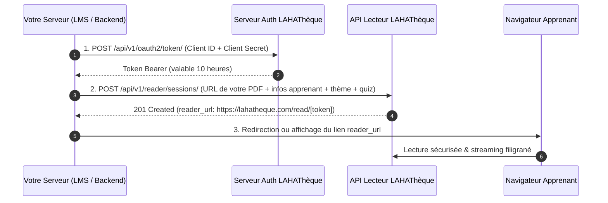

# Guide d'Intégration Partenaire — Mode « Vos Propres Documents » (BYOD)

> **Public cible :** Développeurs et architectes de plateformes tierces (LMS universitaires, SaaS EdTech, SIRH, Organismes de formation) diffusant leurs propres fichiers PDF distants via la liseuse sécurisée LAHAThèque.

---

## 1. Principes & Fonctionnement

Dans ce mode d'accès, vous conservez l'hébergement et la propriété de vos fichiers PDF. L'API LAHAThèque agit comme un **moteur de sécurisation, de rendu haute performance (Mode FlipBook 3D & Mode Scroll) et d'évaluation pédagogique (Quiz)**.

### Ce que LAHAThèque prend en charge pour vous :
* **Protection DRM & Anti-Capture :** Blocage du clic droit, de l'impression, du copier-coller et des outils de capture d'écran.
* **Filigrane Dynamique Nominatif :** Incrustation indélébile à la volée sur chaque page du nom, de l'email et de l'adresse IP de votre apprenant.
* **Personnalisation Graphique Complète (White-Label) :** Intégration de votre logo institutionnel, de votre nom de marque et de vos couleurs d'interface.
* **Évaluation & Quiz interactif :** Déclenchement automatique d'un quiz configuré par vos soins en fin de document.
* **Webhooks en Temps Réel :** Transmission automatique des événements (ouverture, progression, notes de quiz, clôture) signés par clé HMAC.

---

## 2. Le Flux d'Intégration en 3 Étapes



---

## 3. Pré-requis & Identifiants

Pour appeler l'API, vous devez disposer de :
* `CLIENT_ID` : Votre identifiant client (ex: `laha_client_uac_123456`)
* `CLIENT_SECRET` : Votre clé secrète (ex: `sec_live_99a8b7c6d5e4f3a2b1009988`)
* `BASE_URL` : `https://lahatheque.com/api/v1`

---

## 4. Personnalisation Visuelle de la Liseuse (Objet `theme`)

Vous pouvez personnaliser intégralement l'apparence de la liseuse pour refléter la charte graphique de votre établissement ou entreprise.

### Spécification des champs de l'objet `theme` :

| Propriété | Type | Format / Contrainte | Description & Emplacement |
| :--- | :--- | :--- | :--- |
| `brand_name` | String | 2 à 50 caractères | Nom de votre portail ou université affiché en haut à gauche. |
| `brand_logo_url` | String (URL HTTPS) | Image PNG transparente ou SVG (hauteur idéale 28px-36px) | Logo de votre marque remplaçant le nom textuel. |
| `primary_color` | String (HEX) | Code HEX 6 car. (ex: `"#1B2A4E"`) | Couleur de fond de la barre d'outils supérieure. |
| `accent_color` | String (HEX) | Code HEX 6 car. (ex: `"#B08D42"`) | Couleur des boutons d'action (Bouton Quiz, basculeur 3D/Scroll, jauge). |
| `background_color` | String (HEX) | Code HEX sombre conseillé (ex: `"#0F1A33"`) | Couleur de l'arrière-plan entourant le document. |
| `text_color` | String (HEX) | Code HEX (ex: `"#FFFFFF"`) | Couleur des textes et icônes de la barre supérieure. |
| `border_color` | String (HEX) | Code HEX (ex: `"#2E3F66"`) | Couleur des bordures et séparateurs de volets. |

```json
{
  "theme": {
    "brand_name": "Université d'Abomey-Calavi",
    "brand_logo_url": "https://uac.bj/assets/logo-blanc.svg",
    "primary_color": "#1B2A4E",
    "accent_color": "#B08D42",
    "background_color": "#0F1A33",
    "text_color": "#FFFFFF",
    "border_color": "#2E3F66"
  }
}
```

---

## 5. Référence des Endpoints Utiles

### 5.1 Étape 1 : Obtenir un jeton d'accès
* **Route :** `POST /api/v1/oauth2/token/`
* **Format :** `application/x-www-form-urlencoded` ou `application/json`

**Paramètres :**
```json
{
  "grant_type": "client_credentials",
  "client_id": "VOTRE_CLIENT_ID",
  "client_secret": "VOTRE_CLIENT_SECRET"
}
```

**Réponse (200 OK) :**
```json
{
  "access_token": "eyJhbGciOiJIUzI1NiIsInR5cCI6IkpXVCJ9...",
  "token_type": "Bearer",
  "expires_in": 36000,
  "scope": "reader:sessions reader:byod"
}
```

---

### 5.2 Étape 2 : Créer la session de lecture sécurisée
* **Route :** `POST /api/v1/reader/sessions/`
* **En-tête :** `Authorization: Bearer <access_token>`
* **Format :** `application/json`

**Corps de requête (Paramètres BYOD) :**

| Champ | Type | Obligatoire | Description |
| :--- | :--- | :--- | :--- |
| `document_url` | String (URL HTTPS) | **Oui** | URL publique ou signée (S3 / Cloud Storage / Cloudflare R2) de votre fichier PDF. |
| `document_title` | String | **Oui** | Titre affiché dans l'en-tête de la liseuse. |
| `document_author` | String | Non | Nom de l'enseignant ou formateur (Défaut : `"Auteur Externe"`). |
| `external_user_id` | String | **Oui** | Identifiant unique et immuable de l'étudiant dans votre système. |
| `external_user_name` | String | **Oui** | Nom complet gravé en filigrane diagonal. |
| `external_user_email` | String | **Oui** | Email gravé en filigrane diagonal. |
| `user_ip` | String (IP) | **Oui** | IP publique du lecteur pour l'imputabilité anti-capture. |
| `return_url` | String (URL HTTPS) | **Oui** | Page de retour lors du clic sur « Quitter la lecture ». |
| `session_duration_minutes` | Entier | Non | Durée de validité du lien avant expiration (1 à 1440 min, défaut : `120`). |
| `theme` | Objet | Non | Personnalisation graphique (voir section 4). |
| `quiz` | Objet | Non | Configuration d'un quiz interactif de fin de lecture. |

**Exemple de Requête Complète (Theme + Quiz + BYOD) :**
```json
{
  "document_url": "https://storage.mon-lms.com/cours/droit-constitutionnel-2026.pdf",
  "document_title": "Droit Constitutionnel — Semestre 1",
  "document_author": "Prof. Jean Dossou",
  "external_user_id": "ETU-8841",
  "external_user_name": "Amina Traoré",
  "external_user_email": "amina.traore@univ.bj",
  "user_ip": "41.203.88.14",
  "return_url": "https://mon-lms.com/etudiant/cours/101",
  "session_duration_minutes": 180,
  "theme": {
    "brand_name": "Université d'Abomey-Calavi",
    "brand_logo_url": "https://uac.bj/assets/logo.png",
    "primary_color": "#1B2A4E",
    "accent_color": "#B08D42",
    "background_color": "#0F1A33"
  },
  "quiz": {
    "enabled": true,
    "title": "Quiz de Validation du Chapitre 1",
    "show_on_last_page": true,
    "passing_score": 75,
    "questions": [
      {
        "id": "q1",
        "question": "Quel principe régit la hiérarchie des normes ?",
        "options": ["La pyramide de Kelsen", "Le code de Hammourabi", "Le décret d'application"],
        "correct_index": 0,
        "explanation": "La théorie pure du droit de Hans Kelsen établit la hiérarchie des normes juridiques."
      }
    ]
  }
}
```

**Réponse (201 Created) :**
```json
{
  "success": true,
  "data": {
    "session_id": "rs_a89f3c9e120d",
    "reader_url": "https://lahatheque.com/read/eyJhbGciOiJIUzI1NiIsInR5cCI6IkpXVCJ9.eyJzZXNzaW9uX2lkIjoicnNfYTh...",
    "expires_at": "2026-09-02T18:00:00Z",
    "token": "eyJhbGciOiJIUzI1NiIsInR5cCI6IkpXVCJ9..."
  },
  "error": null
}
```

---

## 6. Exemples d'Intégration Multi-Langages

### 6.1 Python (3.10+)

```python
import requests

BASE_URL = "https://lahatheque.com/api/v1"
CLIENT_ID = "VOTRE_CLIENT_ID"
CLIENT_SECRET = "VOTRE_CLIENT_SECRET"

def generate_secure_reader_url(pdf_url: str, title: str, student: dict) -> str:
    # 1. Authentification OAuth2
    auth_resp = requests.post(f"{BASE_URL}/oauth2/token/", data={
        "grant_type": "client_credentials",
        "client_id": CLIENT_ID,
        "client_secret": CLIENT_SECRET,
    }, timeout=10)
    auth_resp.raise_for_status()
    token = auth_resp.json()["access_token"]

    # 2. Création de session avec thème personnalisé
    headers = {"Authorization": f"Bearer {token}"}
    payload = {
        "document_url": pdf_url,
        "document_title": title,
        "external_user_id": student["id"],
        "external_user_name": student["name"],
        "external_user_email": student["email"],
        "user_ip": student["ip"],
        "return_url": "https://mon-lms.com/tableau-de-bord",
        "session_duration_minutes": 120,
        "theme": {
            "brand_name": "Mon Académie",
            "primary_color": "#1B2A4E",
            "accent_color": "#B08D42"
        }
    }

    session_resp = requests.post(f"{BASE_URL}/reader/sessions/", json=payload, headers=headers, timeout=10)
    session_resp.raise_for_status()
    return session_resp.json()["data"]["reader_url"]
```

---

### 6.2 TypeScript / Node.js (Axios)

```typescript
import axios from 'axios';

const BASE_URL = 'https://lahatheque.com/api/v1';
const CLIENT_ID = 'VOTRE_CLIENT_ID';
const CLIENT_SECRET = 'VOTRE_CLIENT_SECRET';

export async function createHostedReaderUrl(pdfUrl: string, title: string, student: { id: string; name: string; email: string; ip: string }): Promise<string> {
  const authRes = await axios.post(`${BASE_URL}/oauth2/token/`, new URLSearchParams({
    grant_type: 'client_credentials',
    client_id: CLIENT_ID,
    client_secret: CLIENT_SECRET,
  }));
  const accessToken = authRes.data.access_token;

  const sessionRes = await axios.post(
    `${BASE_URL}/reader/sessions/`,
    {
      document_url: pdfUrl,
      document_title: title,
      external_user_id: student.id,
      external_user_name: student.name,
      external_user_email: student.email,
      user_ip: student.ip,
      return_url: 'https://mon-lms.com/espace-apprenant',
      session_duration_minutes: 120,
      theme: {
        brand_name: 'Mon Académie',
        primary_color: '#1B2A4E',
        accent_color: '#B08D42'
      }
    },
    { headers: { Authorization: `Bearer ${accessToken}` } }
  );

  return sessionRes.data.data.reader_url;
}
```

---

### 6.3 PHP / Laravel

```php
<?php

namespace App\Services;

use Illuminate\Support\Facades\Http;

class LahathequeReaderService
{
    protected string $baseUrl = 'https://lahatheque.com/api/v1';
    protected string $clientId = 'VOTRE_CLIENT_ID';
    protected string $clientSecret = 'VOTRE_CLIENT_SECRET';

    public function getReaderUrl(string $pdfUrl, string $title, array $student): string
    {
        $token = Http::asForm()->post("{$this->baseUrl}/oauth2/token/", [
            'grant_type' => 'client_credentials',
            'client_id' => $this->clientId,
            'client_secret' => $this->clientSecret,
        ])->throw()->json('access_token');

        $sessionResponse = Http::withToken($token)->post("{$this->baseUrl}/reader/sessions/", [
            'document_url' => $pdfUrl,
            'document_title' => $title,
            'external_user_id' => $student['id'],
            'external_user_name' => $student['name'],
            'external_user_email' => $student['email'],
            'user_ip' => $student['ip'],
            'return_url' => 'https://mon-lms.com/mes-cours',
            'session_duration_minutes' => 120,
            'theme' => [
                'brand_name' => 'Mon Université',
                'primary_color' => '#1B2A4E',
                'accent_color' => '#B08D42',
            ]
        ])->throw();

        return $sessionResponse->json('data.reader_url');
    }
}
```

---

### 6.4 Java / Spring Boot

```java
package com.monlms.services;

import org.springframework.http.MediaType;
import org.springframework.stereotype.Service;
import org.springframework.web.client.RestClient;
import java.util.Map;

@Service
public class LahathequeService {

    private final RestClient restClient = RestClient.create("https://lahatheque.com/api/v1");
    private final String clientId = "VOTRE_CLIENT_ID";
    private final String clientSecret = "VOTRE_CLIENT_SECRET";

    public String createReaderSession(String pdfUrl, String title, Map<String, String> student) {
        Map authRes = restClient.post()
            .uri("/oauth2/token/")
            .contentType(MediaType.APPLICATION_JSON)
            .body(Map.of("grant_type", "client_credentials", "client_id", clientId, "client_secret", clientSecret))
            .retrieve()
            .body(Map.class);

        String accessToken = (String) authRes.get("access_token");

        Map sessionPayload = Map.of(
            "document_url", pdfUrl,
            "document_title", title,
            "external_user_id", student.get("id"),
            "external_user_name", student.get("name"),
            "external_user_email", student.get("email"),
            "user_ip", student.get("ip"),
            "return_url", "https://mon-lms.com/dashboard",
            "session_duration_minutes", 120,
            "theme", Map.of("brand_name", "Mon Établissement", "primary_color", "#1B2A4E", "accent_color", "#B08D42")
        );

        Map sessionRes = restClient.post()
            .uri("/reader/sessions/")
            .header("Authorization", "Bearer " + accessToken)
            .contentType(MediaType.APPLICATION_JSON)
            .body(sessionPayload)
            .retrieve()
            .body(Map.class);

        Map data = (Map) sessionRes.get("data");
        return (String) data.get("reader_url");
    }
}
```

---

### 6.5 C# / .NET

```csharp
using System;
using System.Net.Http;
using System.Net.Http.Json;
using System.Text.Json;
using System.Threading.Tasks;

public class LahathequeService
{
    private static readonly HttpClient client = new HttpClient { BaseAddress = new Uri("https://lahatheque.com/api/v1/") };
    private const string ClientId = "VOTRE_CLIENT_ID";
    private const string ClientSecret = "VOTRE_CLIENT_SECRET";

    public async Task<string> GenerateReaderUrlAsync(string pdfUrl, string title, string userId, string userName, string userEmail, string userIp)
    {
        var authRes = await client.PostAsJsonAsync("oauth2/token/", new {
            grant_type = "client_credentials",
            client_id = ClientId,
            client_secret = ClientSecret
        });
        authRes.EnsureSuccessStatusCode();
        var authData = await authRes.Content.ReadFromJsonAsync<JsonElement>();
        var token = authData.GetProperty("access_token").GetString();

        var request = new HttpRequestMessage(HttpMethod.Post, "reader/sessions/")
        {
            Content = JsonContent.Create(new
            {
                document_url = pdfUrl,
                document_title = title,
                external_user_id = userId,
                external_user_name = userName,
                external_user_email = userEmail,
                user_ip = userIp,
                return_url = "https://mon-lms.com/cours",
                session_duration_minutes = 120,
                theme = new {
                    brand_name = "Mon Académie",
                    primary_color = "#1B2A4E",
                    accent_color = "#B08D42"
                }
            })
        };
        request.Headers.Authorization = new System.Net.Http.Headers.AuthenticationHeaderValue("Bearer", token);

        var sessionRes = await client.SendAsync(request);
        sessionRes.EnsureSuccessStatusCode();
        var sessionData = await sessionRes.Content.ReadFromJsonAsync<JsonElement>();
        return sessionData.GetProperty("data").GetProperty("reader_url").GetString();
    }
}
```

---

## 7. Matrice Complète des Erreurs & Dépannage Pas-à-Pas

| Code HTTP | Message d'erreur | Pourquoi cette erreur survient | Que vérifier exactement ? | Action Corrective Immédiate |
| :--- | :--- | :--- | :--- | :--- |
| **400** | `L'URL de redirection n'est pas autorisée` | Le domaine passé dans `return_url` ne figure pas dans votre liste d'origines approuvées. | Vérifiez le protocole (`https://`), le nom de domaine exact et les sous-domaines. | Ajoutez votre domaine (ex: `https://mon-lms.com` ou `*` pour tous vos tests) dans l'onglet **Clés API** de votre console d'administration `/admin/api`. |
| **400** | `document_url et document_title sont requis` | Le payload JSON envoyé est incomplet ou mal formaté. | Vérifiez que vous avez bien nommé `document_url` et `document_title` (sensible à la casse). | Corrigez les clés dans votre objet JSON. |
| **400** | `unsupported_grant_type` | Le paramètre `grant_type` envoyé lors de l'authentification est absent ou incorrect. | Vérifiez que vous envoyez exactement `grant_type=client_credentials`. | Corrigez le paramètre dans votre requête POST OAuth2. |
| **401** | `invalid_client` ou `Identifiants client ou secret invalides` | Le `client_id` ou le `client_secret` est erroné, comporte des espaces invisibles ou a été révoqué. | Vérifiez que vous n'avez pas copié le secret masqué (`sec_live_••••`). | Utilisez le bouton **Régénérer le Secret** sur votre console `/admin/api` pour obtenir un nouveau secret en clair. |
| **401** | `Jeton d'authentification invalide ou expiré` | Le token Bearer transmis dans l'en-tête `Authorization` a expiré (validité 10h) ou est corrompu. | Vérifiez que votre en-tête contient bien `Authorization: Bearer <votre_token>`. | Ré-exécutez un appel vers `/api/v1/oauth2/token/` pour renouveler votre token. |
| **403** | `Accès aux adresses privées interdit (Anti-SSRF)` | L'URL `document_url` pointe vers `localhost`, `127.0.0.1` ou une IP locale privée non routable. | Vérifiez l'URL de votre fichier PDF. | Hébergez votre fichier PDF sur une URL HTTPS publique accessible sur Internet (Bucket S3, Cloudflare R2, Google Cloud Storage, etc.). |
| **403** | `Périmètre non autorisé pour ce type de document` | Votre application partenaire est configurée en mode « Catalogue Seul » et n'a pas le droit de diffuser des fichiers BYOD. | Vérifiez le mode d'accès de votre clé dans `/admin/api`. | Modifiez l'application dans votre console pour passer en mode **Accès Mixte** ou **Vos Fichiers Seuls**. |
| **422** | `Fichier distant inaccessible ou corrompu` | Nos serveurs n'ont pas pu télécharger le PDF depuis l'URL fournie (erreur 404, 403 S3, ou contenu non PDF). | Testez l'URL dans une fenêtre privée de votre navigateur sans cookies. | Assurez-vous que votre bucket S3 autorise l'accès public en lecture ou utilisez une URL pré-signée HTTPS (presigned URL) valide au moins 2h. |
| **422** | `Fichier distant trop volumineux` | Le PDF dépasse le plafond maximal configuré pour votre compte (ex: 200 Mo). | Vérifiez la taille réelle de votre document PDF. | Compressez votre PDF avec Ghostscript/Adobe ou contactez le support pour activer le palier **VIP Illimité (500 Mo)**. |
| **429** | `Quota journalier atteint` ou `Sessions simultanées dépassées` | Votre plateforme a dépassé son quota de requêtes par 24h ou le nombre maximal d'apprenants connectés en même temps. | Lisez l'en-tête de réponse `Retry-After: <secondes>`. | Patientez jusqu'à la réinitialisation du quota ou demandez à l'administrateur d'activer l'option **Accès VIP Illimité**. |
| **504** | `Gateway Timeout` | Le serveur distant hébergeant votre PDF a mis plus de 20 secondes à répondre. | Vérifiez la vitesse de téléchargement et la bande passante de votre serveur de fichiers. | Utilisez un CDN ou un stockage d'objets haute performance (Cloudflare R2, AWS S3). |

---

## 8. Webhooks & Notification des Événements

Dès qu'une session évolue, LAHAThèque envoie une requête HTTP `POST` signée par clé HMAC-SHA256 sur votre URL de webhook :

```http
X-Lahatheque-Event: reader.quiz.completed
X-Lahatheque-Delivery: 7c9e6679-7425-40de-944b-e07fc1f90ae7
X-Lahatheque-Signature: t=1788250000,v1=a5c8987d6e4b9...
Content-Type: application/json
```

```json
{
  "event": "reader.quiz.completed",
  "session_id": "rs_a89f3c9e120d",
  "timestamp": 1788250000,
  "data": {
    "quiz_title": "Quiz de Validation du Chapitre 1",
    "score_percent": 100.0,
    "passing_score_percent": 75.0,
    "is_passed": true,
    "external_user_ref": "ETU-8841",
    "answers": [
      { "question_id": "q1", "is_correct": true }
    ]
  }
}
```
