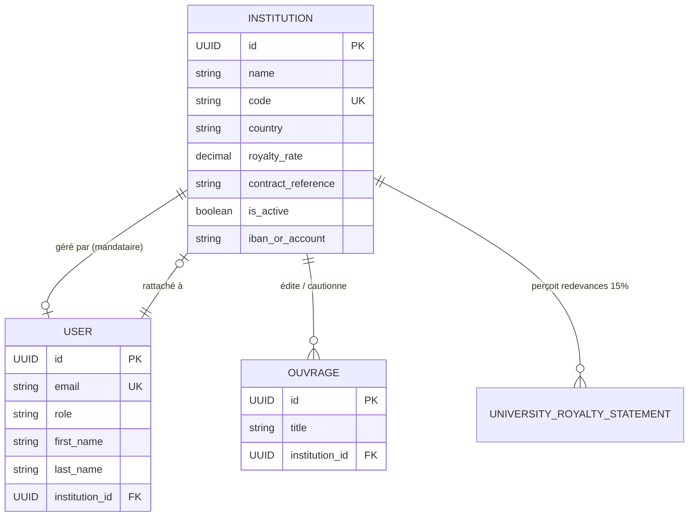

# Data Model: Création et Rattachement des Universités Partenaires

**Feature**: `001-university-institution-creation`
**Date**: 2026-09-08
**Status**: Complete

## 1. Entités Principales

### Entité `Institution` (`apps/partners/models.py`)

Représente l'établissement d'enseignement supérieur (personne morale partenaire officielle).

| Champ | Type | Contraintes | Description |
| :--- | :--- | :--- | :--- |
| `id` | UUID | Primary Key, default=uuid4 | Identifiant unique immuable |
| `name` | String(255) | Required, db_index=True | Nom officiel complet (ex: *Université d'Abomey-Calavi*) |
| `short_name` | String(64) | Blank=True | Nom usuel ou abrégé |
| `code` | String(32) | Unique=True, db_index=True | Sigle normalisé (ex: *UAC*, *UP*, *UNA*, *UNSTIM*) |
| `country` | String(2) | Default='BJ' | Code pays ISO-3166 alpha-2 |
| `royalty_rate` | Decimal(5,2) | Default=15.00 | Taux contractuel standard de redevance (15 %) |
| `contract_reference`| String(64) | Default='CTR-UNIV-...' | Référence unique de la convention cadre |
| `is_active` | Boolean | Default=True | Indicateur d'activité opérationnelle |
| `user` | FK(User) | Null=True, Blank=True | Mandataire principal assigné à l'établissement |
| `bank_name` | String(128) | Blank=True | Banque / Trésor Public pour versements |
| `iban_or_account` | String(64) | Blank=True | Relevé d'identité bancaire institutionnel |
| `momo_number` | String(32) | Blank=True | Mobile Money trésorerie |

### Entité `User` (`apps/accounts/models.py`)

Représente la personne physique déléguée pour administrer l'espace numérique de l'institution.

| Champ | Type | Contraintes | Description |
| :--- | :--- | :--- | :--- |
| `id` | UUID | Primary Key, default=uuid4 | Identifiant utilisateur |
| `email` | Email | Unique=True, Required | Adresse de connexion et de réception des accès |
| `role` | String(32) | Value='university' | Rôle applicatif |
| `first_name` | String(64) | Required | Prénom du mandataire |
| `last_name` | String(64) | Required | Nom du mandataire |
| `phone` | String(32) | Blank=True | Numéro de téléphone professionnel |
| `country` | String(2) | Default='BJ' | Pays de résidence |
| `institution` | FK(Institution)| Null=True, on_delete=SET_NULL | Établissement partenaire rattaché |
| `is_active` | Boolean | Default=True | Compte actif |

---

## 2. Diagramme de Relations (Mermaid)

---

## 3. Règles de Validation & Intégrité

1. **Unicité du Sigle/Code** :
   - Si `code` fourni : vérification d'unicité insensible à la casse (`code__iexact`).
   - Si `code` omis : dérivation automatique à partir du nom puis résolution des collisions avec suffixe numérique (`-2`, `-3`).
2. **Transaction Atomique** :
   - L'appel de création (`AdminUserViewSet.create`) ou de mise à jour (`AdminUserViewSet.partial_update`) encapsule la création de l'institution et la sauvegarde de l'utilisateur dans `@transaction.atomic`. En cas d'erreur sur l'une des entités, l'ensemble est annulé (*rollback*).
3. **Sécurité Financière** :
   - Les redevances sont calculées sur la base de `ouvrage.institution.royalty_rate` et créditées sur le solde de l'institution.
   - La suppression d'un compte mandataire (`on_delete=models.SET_NULL`) ne supprime jamais l'institution partenaire ni ses redevances historiques.
