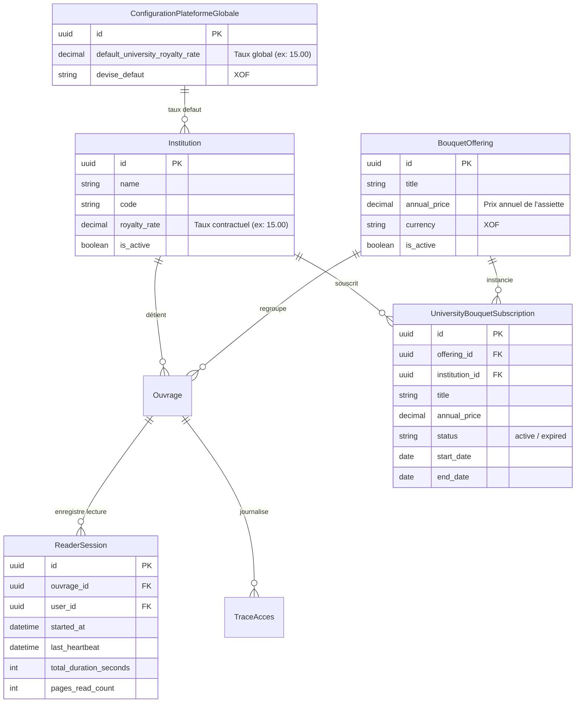

# Data Model: Répartition Dynamique des Redevances sur Bouquets Documentaires

**Feature**: `002-bouquet-royalties-distribution`
**Date**: 2026-09-08

Ce document définit les modèles de données, entités et structures de payload manipulés par le backend Django et le frontend Next.js pour le calcul et la restitution des redevances bouquets.

---

## 1. Entités Existantes et Relations



---

## 2. Structure du Payload de Répartition (`BouquetDistributionResult`)

Cette structure unifiée est renvoyée par les endpoints d'API :
- `GET /api/v1/partners/university/bouquets/<pk>/distribution/`
- `GET /api/v1/admin/bouquet-offerings/<pk>/distribution/`

### Schéma TypeScript

```typescript
export interface UniversityDistributionItem {
  institution_id: string;          // Identifiant UUID de l'université partenaire
  institution_name: string;        // Nom complet (ex: "Université d'Abomey-Calavi")
  institution_code: string;        // Sigle / Code (ex: "UAC", "Univ. Parakou", "UNA")
  short_name: string;              // Libellé court pour les étiquettes de graphique
  books_owned_count: number;       // Nombre d'ouvrages de cette institution inclus dans le bouquet
  reads_count: number;             // Nombre effectif de consultations réelles tracées
  usage_percentage: number;        // Part d'utilisation réelle (%) (ex: 90.91)
  ca_share: number;                // Quote-part d'assiette financière attribuée (XOF)
  royalty_rate: number;            // Taux conventionné applicable (%) (ex: 15.0 ou dérogatoire)
  royalty_amount: number;          // Montant net de redevance dû (XOF)
  color: string;                   // Token couleur vectoriel pour le camembert et la barre
  is_current_institution: boolean; // Flag pour mettre en évidence l'établissement connecté
}

export interface BouquetDistributionResult {
  bouquet_id: string;              // UUID du bouquet
  bouquet_title: string;           // Intitulé officiel
  annual_price: number;            // Assiette globale du bouquet (HT)
  currency: string;                // Devise légale (ex: "XOF")
  total_books_count: number;       // Total des livres dans le bouquet
  total_consultations: number;     // Cumul total de toutes les lectures sur le bouquet
  royalty_rate_applied: number;    // Taux de référence appliqué
  distribution: UniversityDistributionItem[]; // Liste de toutes les universités contributrices
  totals: {
    total_books: number;
    total_usage_percentage: number; // Toujours strictement égal à 100.00%
    total_ca: number;               // Égal à annual_price
    total_royalties: number;        // Somme des redevances reversées aux universités
    platform_revenue: number;       // Marge brute résiduelle conservée par LAHA
  };
}
```

---

## 3. Structure du Relevé Institutionnel (`UniversityBouquetRoyaltyItem`)

Cette structure est renvoyée dans la clé `bouquet_royalties` de `GET /api/v1/partners/university/royalties/` :

```typescript
export interface UniversityBouquetRoyaltyItem {
  id: string;                           // UUID de la souscription
  bouquet_id: string;                   // UUID de l'offre
  bouquet_title: string;                // Titre du bouquet
  period: string;                       // Période de validité (ex: "01/01/2026 - 31/12/2026")
  books_included_count: number;         // Ouvrages de l'université dans ce bouquet
  total_bouquet_consultations: number;  // Consultations globales du bouquet
  university_consultations: number;     // Consultations spécifiques sur les livres de l'université
  consultation_share_percent: number;   // Quote-part d'audience (%)
  bouquet_revenue_allocated: number;    // Assiette CA attribuée
  royalty_rate: number;                 // Taux contractuel appliqué
  applied_rate: number;                 // Taux effectif
  net_royalty_amount: number;           // Redevance nette reversée
  currency: string;                     // Devise
}
```

---

## 4. Règles de Cohérence et Validations

1. **Intégrité de la somme** :
   $$\sum_{i=1}^{n} \text{usage\_percentage}_i = 100.00\% \quad (\pm 0.01\%)$$
2. **Conservation financière** :
   $$\text{total\_ca} = \sum_{i=1}^{n} \text{ca\_share}_i$$
   $$\text{platform\_revenue} = \text{total\_ca} - \text{total\_royalties}$$
3. **Hiérarchie des taux** :
   Le taux `royalty_rate` de chaque université est résolu par la fonction Python `get_institution_royalty_rate(institution_obj)` :
   - Si `institution_obj.royalty_rate` est non null, l'utiliser.
   - Sinon, utiliser `ConfigurationPlateformeGlobale.objects.first().default_university_royalty_rate` (ou repli 15.00%).
