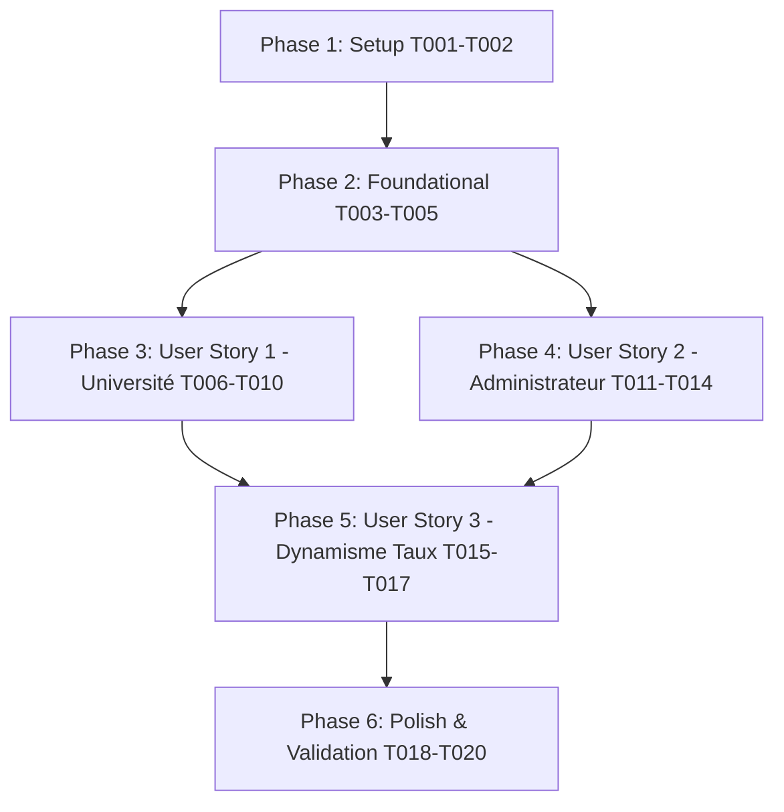

# Tasks: Répartition Dynamique des Redevances sur Bouquets Documentaires

**Feature**: `002-bouquet-royalties-distribution`
**Date**: 2026-09-08
**Spec**: [specs/002-bouquet-royalties-distribution/spec.md](file:///e:/Lahatheque/specs/002-bouquet-royalties-distribution/spec.md)
**Plan**: [specs/002-bouquet-royalties-distribution/plan.md](file:///e:/Lahatheque/specs/002-bouquet-royalties-distribution/plan.md)

---

## Phase 1: Setup (Infrastructure Partagée)

**Purpose**: Initialisation du périmètre technique et vérification des modèles

- [X] T001 Inspecter les modèles d'audience et de bouquets dans `lahatheque-backend/apps/partners/models.py` et `lahatheque-backend/apps/reporting/models.py`
- [X] T002 [P] Définir les interfaces TypeScript unifiées pour la distribution des bouquets dans `lahatheque-frontend/lib/types/university.ts`

---

## Phase 2: Foundational (Prérequis Bloquants)

**Purpose**: Socle de calcul backend et services d'API indispensables avant l'implémentation des vues

**CRITICAL**: Aucun développement d'interface ne peut démarrer avant la finalisation de cette phase

- [X] T003 Implémenter la fonction de résolution dynamique du taux de redevance institutionnel `get_institution_royalty_rate` dans `lahatheque-backend/apps/reporting/pricing_service.py`
- [X] T004 Moderniser `compute_bouquet_distribution_payload` dans `lahatheque-backend/apps/reporting/admin_views.py` avec l'agrégation d'audience réelle (`ReaderSession` & `TraceAcces`), le taux dynamique et la répartition 100%
- [X] T005 [P] Refactoriser `lahatheque-frontend/lib/services/bouquet-distribution.ts` pour supprimer `DEFAULT_UNIVERSITIES_DATA` et `localStorage` au profit des appels API réels

**Checkpoint**: Le moteur de calcul backend et les services clients sont prêts et testables unitairement.

---

## Phase 3: User Story 1 - Consultation des redevances bouquets côté Université (Priority: P1) — MVP

**Goal**: Permettre aux universités partenaires de consulter leurs redevances bouquets réelles sans données mockées, avec le camembert et les barres horizontales activés.

**Independent Test**: Se connecter en tant qu'université (`universite@lahatheque.com`), ouvrir `/university/royalties`, cliquer sur l'onglet "Redevances Bouquets", et vérifier l'affichage des graphiques et données réelles.

- [X] T006 [US1] Nettoyer `UniversityRoyaltiesView` dans `lahatheque-backend/apps/partners/university_views.py` pour retirer toute référence aux facultés et calculer les vraies redevances bouquets
- [X] T007 [P] [US1] Mettre à jour `UniversityBouquetDistributionView` dans `lahatheque-backend/apps/partners/university_views.py` pour renvoyer le payload réel avec mise en exergue de l'université connectée
- [X] T008 [P] [US1] Adapter `getUniversityRoyalties` dans `lahatheque-frontend/lib/services/university.ts` pour consommer les données `bouquet_royalties` réelles de l'API
- [X] T009 [US1] Démasquer l'onglet des bouquets documentaires et supprimer les codes facultés dans `lahatheque-frontend/app/(dashboard)/university/royalties/page.tsx`
- [X] T010 [US1] Connecter `BouquetDistributionModal` dans `lahatheque-frontend/components/features/bouquets/bouquet-distribution-modal.tsx` aux données réelles de l'API

**Checkpoint**: L'Espace Université affiche 100% de données réelles sur ses bouquets avec graphiques interactifs opérationnels.

---

## Phase 4: User Story 2 - Supervision globale et audit financier côté Administrateur (Priority: P1)

**Goal**: Permettre à l'administrateur de superviser la répartition macroscopique de chaque bouquet (Option A : ventilation 100% entre universités contributrices + synthèse part LAHA).

**Independent Test**: Se connecter en administrateur, ouvrir `/admin/royalties/universities`, cliquer sur "Répartition & Statistiques" d'un bouquet et vérifier le camembert complet, les barres de redevances et la marge résiduelle LAHA.

- [X] T011 [US2] Mettre à jour `AdminBouquetDistributionView` dans `lahatheque-backend/apps/reporting/admin_views.py` pour fournir la répartition panoramique multi-universités
- [X] T012 [P] [US2] Ajuster le composant vectoriel SVG `BouquetPieDistribution` dans `lahatheque-frontend/components/features/bouquets/bouquet-pie-distribution.tsx` pour afficher l'Option A et la synthèse financière
- [X] T013 [US2] Connecter le déclencheur de modale de répartition dans `lahatheque-frontend/app/(dashboard)/admin/royalties/universities/page.tsx`
- [X] T014 [P] [US2] Connecter le déclencheur de modale de répartition dans `lahatheque-frontend/app/(dashboard)/admin/catalog/bouquets/page.tsx`

**Checkpoint**: L'Espace Administration dispose d'une vision panoramique d'audit conforme à la Section 11 du Cahier des Charges.

---

## Phase 5: User Story 3 - Application dynamique du barème de redevance (Priority: P2)

**Goal**: Assurer que toute modification du barème global admin ou du taux spécifique de l'institution se répercute instantanément sur les calculs et graphiques.

**Independent Test**: Modifier `default_university_royalty_rate` dans l'administration, rafraîchir l'espace université et constater le recalcul immédiat des barres de redevance et montants nets.

- [ ] T015 [US3] Assurer la synchronisation sans cache rigide des barèmes globaux dans `lahatheque-backend/apps/reporting/admin_views.py`
- [ ] T016 [P] [US3] Synchroniser le badge de taux conventionné et les formules d'affichage dans `lahatheque-frontend/app/(dashboard)/university/royalties/page.tsx`
- [ ] T017 [US3] Ajouter les tests automatisés de non-régression sur la cascade des taux dans `lahatheque-backend/apps/reporting/tests/test_bouquet_revenue_distribution.py`

**Checkpoint**: Les barèmes et calculs sont 100% dynamiques et réactifs aux modifications administratives.

---

## Phase 6: Polish & Validation Finale

**Purpose**: Nettoyage du code, élimination des mocks et validation des scénarios de test

- [ ] T018 [P] Déprécier et purger les données statiques obsolètes dans `lahatheque-frontend/lib/mock/university-royalties.ts`
- [ ] T019 Exécuter la suite de tests backend avec `python manage.py test apps.reporting.tests.test_bouquet_revenue_distribution`
- [ ] T020 Valider les scénarios de bout en bout décrits dans `specs/002-bouquet-royalties-distribution/quickstart.md`

---

## Dependencies & Execution Order

### Opportunities Parallèles

- T002 et T001 peuvent être menés en parallèle.
- T004 et T005 peuvent être menés en parallèle.
- Les tâches US1 (T007, T008) peuvent être menées en parallèle de T006.
- Les tâches US2 (T012, T014) peuvent être menées en parallèle de T011.
- T018 et T019 peuvent être exécutés en parallèle lors de la phase finale.

---

## Implementation Strategy

### MVP First (User Story 1 - Université)
1. Exécuter Phase 1 (Setup) et Phase 2 (Foundational).
2. Réaliser Phase 3 (User Story 1 : Espace Université démasqué et connecté aux données réelles).
3. **Valider le MVP** : Vérifier que l'espace université affiche le camembert et les barres réelles sans aucun mock.
4. Enchaîner sur la User Story 2 (Espace Administrateur) puis la User Story 3 (Dynamisme des taux).
