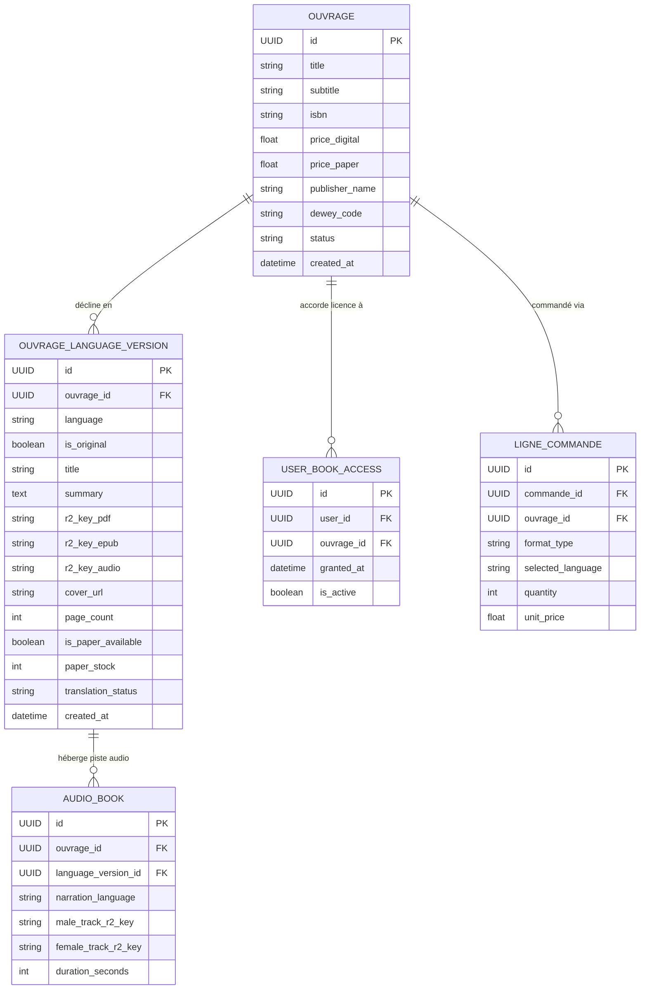

# Phase 1: Data Model & Database Architecture

**Feature**: Gestion et Lecture Multilingue des Livres (Original & Traductions)  
**Spec**: [spec.md](./spec.md)  
**Date**: 2026-09-08  

---

## 1. Schéma Entité-Association (Mermaid)



---

## 2. Dictionnaire des Données

### 2.1 Modèle `OuvrageLanguageVersion` (`catalog_ouvrage_language_version`)

| Champ | Type Django | Nullable | Index | Rôle & Description |
| :--- | :--- | :---: | :---: | :--- |
| `id` | `UUIDField` | Non | PK | Clé primaire unique générée par `uuid.uuid4`. |
| `ouvrage` | `ForeignKey('catalog.Ouvrage')` | Non | Oui | Lien vers l'œuvre maîtresse (`on_delete=models.CASCADE`, `related_name='language_versions'`). |
| `language` | `CharField(max_length=10)` | Non | Oui | Code ISO de langue (`fr`, `en`, `es`, `de`, `pt`, etc.). |
| `is_original` | `BooleanField(default=False)` | Non | Oui | `True` pour la langue source de rédaction, `False` pour les traductions. |
| `title` | `CharField(max_length=255)` | Non | Non | Titre de l'ouvrage spécifique à cette langue (ex: titre traduit). |
| `summary` | `TextField(blank=True)` | Oui | Non | Résumé traduit ou synopsis spécifique. |
| `r2_key_pdf` | `CharField(max_length=512, blank=True)` | Oui | Non | Clé Cloudflare R2 du document PDF (`books/<uuid>/<LANG>/translated.pdf`). |
| `r2_key_epub` | `CharField(max_length=512, blank=True)` | Oui | Non | Clé Cloudflare R2 du document EPUB (`books/<uuid>/<LANG>/translated.epub`). |
| `r2_key_audio` | `CharField(max_length=512, blank=True)` | Oui | Non | Clé Cloudflare R2 du fichier audio principal lié à cette version. |
| `cover_url` | `URLField(max_length=1024, blank=True)` | Oui | Non | Image de couverture dédiée. Si vide, repli automatique sur `ouvrage.cover_url`. |
| `page_count` | `PositiveIntegerField(default=0)` | Non | Non | Nombre de pages propre à cette version linguistique. |
| `is_paper_available` | `BooleanField(default=False)` | Non | Non | Indicateur de disponibilité de tirage physique dans cette langue. |
| `paper_stock` | `PositiveIntegerField(default=0)` | Non | Non | Stock d'exemplaires physiques prêts à l'expédition pour cette langue. |
| `translation_status` | `CharField(max_length=30)` | Non | Oui | Statut : `'ready'`, `'in_progress'`, `'draft'`. |

**Contrainte d'Intégrité :**
```python
models.UniqueConstraint(
    fields=['ouvrage', 'language'],
    name='unique_ouvrage_language_version'
)
```

---

### 2.2 Extension du Modèle `LigneCommande` (`orders_ligne_commande`)

Pour garantir l'absence d'ambiguïté en logistique lors de la préparation des colis :

| Champ | Type Django | Nullable | Rôle & Description |
| :--- | :--- | :---: | :--- |
| `selected_language` | `CharField(max_length=10, default='fr')` | Non | Langue choisie par le client pour les articles de type papier (`fr`, `en`...). |

---

### 2.3 Règle de Droits de Lecture (`UserBookAccess`)

- La licence d'accès numérique est délivrée pour un `Ouvrage` (maître).
- L'algorithme de contrôle d'accès (`UserBookAccess.has_access(user, ouvrage)`) vérifie la possession de l'ouvrage maître.
- Conséquence : Le lecteur dispose automatiquement du droit de streaming sécurisé sur l'ensemble des entrées `OuvrageLanguageVersion` rattachées à cet ouvrage.
