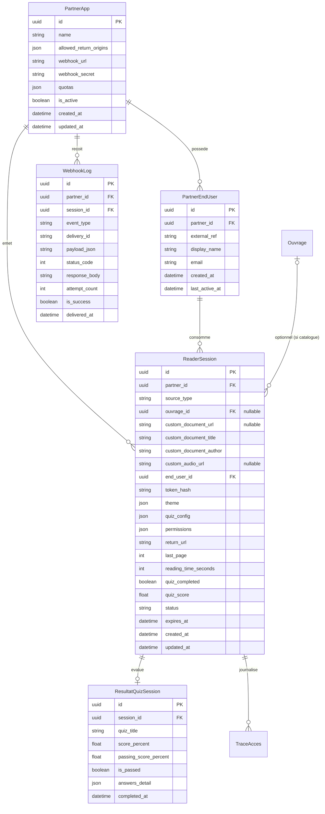

# Data Model: Module 009 - API Lecteur Heberge & Sessions Multi-Sources

**Feature**: Module 009 - API Lecteur Heberge (Support Catalogue & Documents Externes SaaS)  
**Date**: 2026-08-19  
**Database**: PostgreSQL (UUIDv4 Primary Keys, Indexation explicite, Typage strict)

---

## 1. Schema des Entites

---

## 2. Details des Modeles Django

### 1. `PartnerApp` (Application Partenaire / Tenant)
- **Table** : `reader_partnerapp`
- **Champs** :
  - `id`: `UUIDField(primary_key=True, default=uuid.uuid4, editable=False)`
  - `name`: `CharField(max_length=255)` (ex: "Plateforme RH / LMS Sup")
  - `oauth_application`: `OneToOneField('oauth2_provider.Application', on_delete=models.CASCADE)`
  - `allowed_return_origins`: `JSONField(default=list)` (ex: `["https://mon-saas.com"]`)
  - `webhook_url`: `URLField(blank=True, max_length=500)`
  - `webhook_secret`: `CharField(max_length=128)` (Cle HMAC privee generee)
  - `quotas`: `JSONField(default=dict)`
  - `is_active`: `BooleanField(default=True, db_index=True)`
  - `created_at`: `DateTimeField(auto_now_add=True)`
  - `updated_at`: `DateTimeField(auto_now=True)`

### 2. `PartnerEndUser` (Utilisateur Fantome Assurant l'Isolation)
- **Table** : `reader_partnerenduser`
- **Champs** :
  - `id`: `UUIDField(primary_key=True, default=uuid.uuid4, editable=False)`
  - `partner`: `ForeignKey(PartnerApp, on_delete=models.CASCADE, related_name='end_users')`
  - `external_ref`: `CharField(max_length=255, db_index=True)` (ID utilisateur dans le SaaS tiers)
  - `display_name`: `CharField(max_length=255, blank=True)`
  - `email`: `EmailField(blank=True)`
  - `created_at`: `DateTimeField(auto_now_add=True)`
  - `last_active_at`: `DateTimeField(auto_now=True)`
- **Contraintes** :
  - `UniqueConstraint(fields=['partner', 'external_ref'], name='unique_partner_external_user')`

### 3. `ReaderSession` (Session Ephemere de Lecture Hebergee)
- **Table** : `reader_session`
- **Champs** :
  - `id`: `UUIDField(primary_key=True, default=uuid.uuid4, editable=False)`
  - `partner`: `ForeignKey(PartnerApp, on_delete=models.CASCADE, related_name='sessions')`
  - `source_type`: `CharField(max_length=32, choices=[('catalog_book', 'Catalogue LAHATheque'), ('external_url', 'Document Externe Partenaire'), ('direct_upload', 'Upload Binaire Direct')], default='catalog_book')`
  - `ouvrage`: `ForeignKey('catalog.Ouvrage', on_delete=models.SET_NULL, null=True, blank=True, related_name='reader_sessions')`
  - `custom_document_url`: `URLField(max_length=1000, blank=True)` (URL distante du SaaS partenaire)
  - `custom_document_title`: `CharField(max_length=255, blank=True)` (Titre du document externe)
  - `custom_document_author`: `CharField(max_length=255, blank=True)` (Auteur / Formateur du document)
  - `custom_audio_url`: `URLField(max_length=1000, blank=True)` (Fichier audio externe d'accompagnement)
  - `end_user`: `ForeignKey(PartnerEndUser, on_delete=models.CASCADE, related_name='sessions')`
  - `token_hash`: `CharField(max_length=64, db_index=True)` (SHA-256 du token de session)
  - `theme`: `JSONField(default=dict)` (Couleurs, logo, marque)
  - `quiz_config`: `JSONField(default=dict)` (Questions, bareme, seuil)
  - `permissions`: `JSONField(default=dict)` (allow_tts, allow_annotations, etc.)
  - `return_url`: `URLField(max_length=500)`
  - `last_page`: `IntegerField(default=0)`
  - `reading_time_seconds`: `IntegerField(default=0)`
  - `quiz_completed`: `BooleanField(default=False)`
  - `quiz_score`: `FloatField(null=True, blank=True)`
  - `status`: `CharField(max_length=32, choices=[('created', 'Creee'), ('opened', 'Ouverte'), ('in_progress', 'En cours'), ('finished', 'Terminee'), ('expired', 'Expiree'), ('revoked', 'Revoquee')], default='created', db_index=True)`
  - `expires_at`: `DateTimeField(db_index=True)`
  - `created_at`: `DateTimeField(auto_now_add=True)`
  - `updated_at`: `DateTimeField(auto_now=True)`

### 4. `ResultatQuizSession` (Resultats et Detail d'Evaluation)
- **Table** : `reader_resultatquiz`
- **Champs** :
  - `id`: `UUIDField(primary_key=True, default=uuid.uuid4, editable=False)`
  - `session`: `OneToOneField(ReaderSession, on_delete=models.CASCADE, related_name='quiz_result')`
  - `quiz_title`: `CharField(max_length=255)`
  - `score_percent`: `FloatField()`
  - `passing_score_percent`: `FloatField(default=70.0)`
  - `is_passed`: `BooleanField(default=False)`
  - `answers_detail`: `JSONField(default=list)`
  - `completed_at`: `DateTimeField(auto_now_add=True)`

### 5. `WebhookLog` (Audit et Tracabilite des Livraisons)
- **Table** : `reader_webhooklog`
- **Champs** :
  - `id`: `UUIDField(primary_key=True, default=uuid.uuid4, editable=False)`
  - `partner`: `ForeignKey(PartnerApp, on_delete=models.CASCADE, related_name='webhook_logs')`
  - `session`: `ForeignKey(ReaderSession, on_delete=models.SET_NULL, null=True, blank=True)`
  - `event_type`: `CharField(max_length=64, db_index=True)`
  - `delivery_id`: `CharField(max_length=64, unique=True)`
  - `payload_json`: `TextField()`
  - `status_code`: `IntegerField(null=True, blank=True)`
  - `response_body`: `TextField(blank=True)`
  - `attempt_count`: `IntegerField(default=1)`
  - `is_success`: `BooleanField(default=False, db_index=True)`
  - `delivered_at`: `DateTimeField(auto_now_add=True)`
