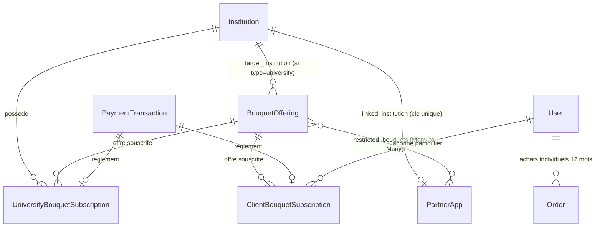

# Phase 1: Data Model & State Transitions

**Feature**: `010-university-bouquet-subscription-api-flow`  
**Date**: 2026-09-17  
**Status**: Completed  

---

## 1. Entités et Schémas Relationnels



---

## 2. Spécification Détaillée des Modèles

### 2.1 Modèle `BouquetOffering` (`apps/partners/models.py`)

| Champ | Type | Contraintes / Propriétés | Description |
|---|---|---|---|
| `id` | UUIDField | Primary Key, default=uuid4 | Identifiant unique de l'offre |
| `title` | CharField(255) | Non nul | Nom public du bouquet |
| `bouquet_type` | CharField(32) | choices=[`general`, `discipline`, `university`, `country`, `custom`] | Typologie documentaire (type `faculty` supprimé) |
| `discipline` | CharField(128) | blank=True | Nom de la discipline (si type=discipline) |
| `target_institution` | ForeignKey(Institution) | null=True, blank=True | **Obligatoire si type=university** |
| `country` | CharField(2) | blank=True | Code ISO pays (si type=country) |
| `custom_books` | ManyToMany(Ouvrage) | blank=True | Sélection manuelle (si type=custom) |
| `monthly_price` | DecimalField(12, 2) | default=50000.00 | Tarif pour un abonnement de 30 jours (XOF) |
| `annual_price` | DecimalField(12, 2) | default=500000.00 | Tarif pour un abonnement de 365 jours (XOF) |
| `currency` | CharField(10) | default="XOF" | Devise officielle |
| `description` | TextField | blank=True | Description commerciale et avantages |
| `is_active` | BooleanField | default=True, db_index=True | Visibilité pour souscription |

#### Règles de Validation Métier (`clean`) :
- Si `bouquet_type == 'university'` : `target_institution` ne doit pas être null. Sinon, lever `ValidationError({'target_institution': "L'université cible est obligatoire pour le type Intégral Université."})`.
- Si `bouquet_type == 'discipline'` : `discipline` doit être renseignée.
- `monthly_price` et `annual_price` doivent être strictement supérieurs à 0.

---

### 2.2 Modèle `UniversityBouquetSubscription` (`apps/partners/models.py`)

| Champ | Type | Contraintes / Propriétés | Description |
|---|---|---|---|
| `id` | UUIDField | Primary Key, default=uuid4 | Identifiant de la souscription |
| `offering_id` | UUIDField | Indexé | Identifiant de l'offre de bouquet souscrite |
| `institution` | ForeignKey(Institution) | on_delete=CASCADE | Université cliente souscriptrice |
| `title` | CharField(255) | Non nul | Titre du bouquet au moment de la souscription |
| `bouquet_type` | CharField(32) | Non nul | Type de bouquet |
| `subscription_period` | CharField(10) | choices=[`monthly`, `annual`], default=`annual` | Formule choisie (30 jours ou 365 jours) |
| `price_paid` | DecimalField(12, 2) | default=0.00 | Montant réglé pour cette période |
| `currency` | CharField(10) | default="XOF" | Devise de règlement |
| `status` | CharField(20) | choices=[`pending`, `active`, `expired`, `cancelled`], default=`pending` | Statut de la souscription |
| `start_date` | DateField | default=now | Date de prise d'effet de l'abonnement |
| `end_date` | DateField | Indexé | Date précise d'échéance / coupure d'accès |
| `payment_transaction` | ForeignKey(PaymentTransaction) | null=True, blank=True | Référence de transaction Moneroo liée |

#### Algorithme de Calcul de `end_date` :
```python
def compute_end_date(existing_end_date, period: str) -> date:
    days = 30 if period == 'monthly' else 365
    today = timezone.now().date()
    # Si réabonnement anticipé avant expiration : prolongation cumulative (décision Q2)
    base_date = existing_end_date if (existing_end_date and existing_end_date > today) else today
    return base_date + timedelta(days=days)
```

---

### 2.3 Modèle `ClientBouquetSubscription` (`apps/commerce/models.py`)

| Champ | Type | Contraintes / Propriétés | Description |
|---|---|---|---|
| `id` | UUIDField | Primary Key, default=uuid4 | Identifiant unique de la souscription |
| `user` | ForeignKey(User) | on_delete=CASCADE | Apprenant / lecteur individuel |
| `offering_id` | UUIDField | Indexé | Bouquet souscrit |
| `title` | CharField(255) | Non nul | Titre du bouquet |
| `subscription_period` | CharField(10) | choices=[`monthly`, `annual`], default=`monthly` | Formule mensuelle (30j) ou annuelle (365j) |
| `price_paid` | DecimalField(12, 2) | default=0.00 | Montant acquitté |
| `currency` | CharField(10) | default="XOF" | Devise |
| `status` | CharField(20) | choices=[`pending`, `active`, `expired`, `cancelled`], default=`pending` | Statut de l'abonnement |
| `start_date` | DateField | default=now | Date de démarrage |
| `end_date` | DateField | Indexé | Date d'expiration |
| `payment_transaction` | ForeignKey(PaymentTransaction) | null=True, blank=True | Transaction de paiement Moneroo |

---

### 2.4 Modèle `PartnerApp` (`apps/reader/models.py`)

| Champ | Type | Contraintes / Propriétés | Description |
|---|---|---|---|
| `id` | UUIDField | Primary Key | Identifiant de l'application |
| `name` | CharField(255) | Non nul | Nom de l'intégration (= Nom Université Cliente) |
| `linked_institution` | ForeignKey(Institution) | Unique per client | Institution académique rattachée |
| `restricted_bouquets` | ManyToManyField(BouquetOffering) | blank=True | **Périmètre cumulé de tous les bouquets souscrits (décision Q1)** |
| `client_id` | CharField(64) | Unique, db_index=True | Identifiant public OAuth2 machine-to-machine |
| `client_secret_hash` | CharField(128) | Hash SHA-256 | Empreinte sécurisée du secret (secret brut jamais stocké) |
| `access_mode` | CharField(32) | default=`catalog_only` | Mode Catalogue Seul |
| `quotas` | JSONField | default=`{"is_unlimited": True}` | Palier VIP Illimité |
| `is_active` | BooleanField | default=True | État d'activation |

---

## 3. Matrice de Droits de Lecture et Souveraineté des Licences (B2C)

| Source d'Accès de l'Ouvrage | Durée de Validité | Statut à l'Expiration du Bouquet | Emplacement Bibliothèque |
|---|---|---|---|
| **Achat individuel à l'unité** | **12 mois (365 jours)** | **Maintenu** jusqu'au terme de ses 12 mois propres | Espace « Livres achetés » (`/student/books`) |
| **Inclus dans Bouquet Mensuel** | 30 jours | **Coupé** à J+30 (sauf si acheté à l'unité entre-temps) | Onglet « Bouquets en cours » avec badge d'expiration |
| **Inclus dans Bouquet Annuel** | 365 jours | **Coupé** à J+365 (sauf si renouvelé) | Onglet « Bouquets en cours » avec badge d'expiration |
| **Achat à l'unité d'un livre d'un bouquet en cours** | **12 mois** à compter du paiement | **Transféré** dans « Livres achetés », indépendant du bouquet | Bascule dans l'espace des livres achetés |
