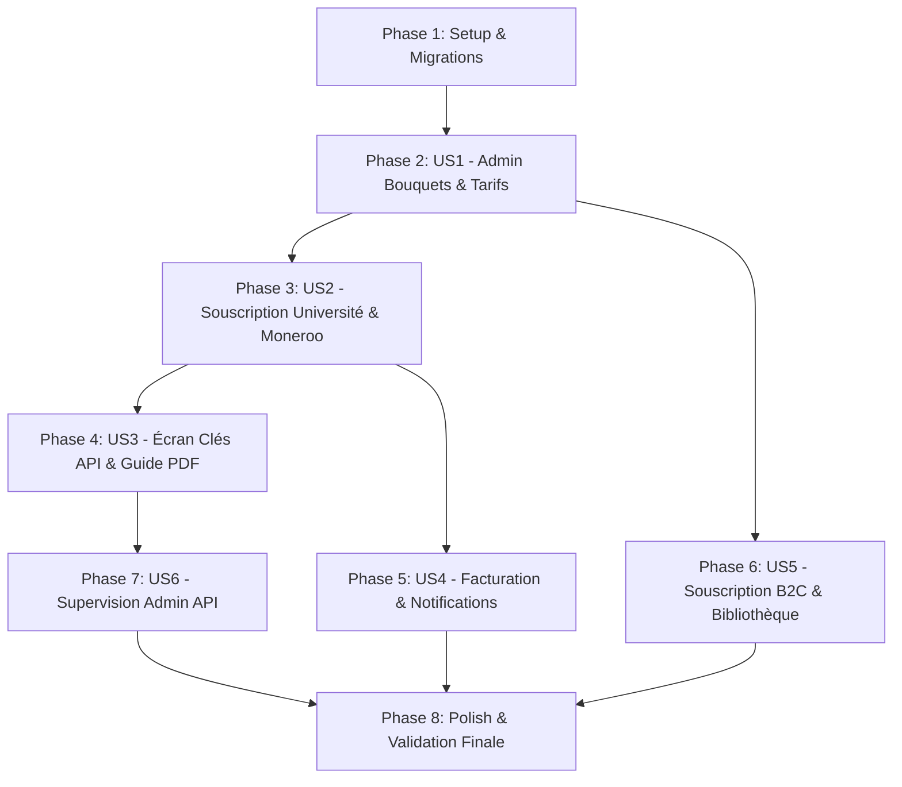

# Tasks: Flux de Souscription Bouquet (Universités & Clients), Tarification Bipériodique et Délivrance de Clés API

**Input**: Spécification et documents de conception de `specs/010-university-bouquet-subscription-api-flow/`  
**Prerequisites**: `spec.md`, `plan.md`, `research.md`, `data-model.md`, `contracts/`, `quickstart.md`  
**Status**: 100% Completed  

---

## Format des Tâches: `- [ ] [ID] [P?] [Story] Description avec chemin de fichier`

- **[P]** : Tâche parallélisable (fichiers distincts, sans blocage sur une tâche précédente)
- **[Story]** : Identifiant de la User Story concernée ([US1] à [US6])
- Chemins de fichiers absolus ou relatifs au dépôt

---

## Phase 1: Setup & Migrations Fondamentales

**Objectif** : Mettre en place le modèle de données, les migrations Django et les types TypeScript partagés.

- [X] T001 [P] Mettre à jour le modèle `BouquetOffering` dans `lahatheque-backend/apps/partners/models.py` : ajouter `monthly_price`, retirer `'faculty'` de `BOUQUET_TYPE_CHOICES`, rendre `target_institution` obligatoire pour `bouquet_type == 'university'` et ajouter la méthode `get_real_monthly_price()`.
- [X] T002 [P] Mettre à jour les modèles de souscription `UniversityBouquetSubscription` dans `lahatheque-backend/apps/partners/models.py` et `ClientBouquetSubscription` dans `lahatheque-backend/apps/commerce/models.py` : ajouter le champ `subscription_period` (`monthly` ou `annual`), `price_paid` et la méthode de calcul de `end_date` avec prolongation cumulative.
- [X] T003 [P] Mettre à jour le modèle `PartnerApp` dans `lahatheque-backend/apps/reader/models.py` : ajouter la relation Many-to-Many `restricted_bouquets` vers `BouquetOffering` pour supporter la clé unique multi-bouquets et la méthode de filtrage des bouquets actifs.
- [X] T004 Générer et appliquer les migrations Django pour `partners`, `commerce` et `reader` via script backend sans terminal bloquant.
- [X] T005 [P] Mettre à jour les types TypeScript dans `lahatheque-frontend/lib/types/admin.ts` (`BouquetOfferingAdmin`, `PartnerApiKey`) et `lahatheque-frontend/lib/types/catalog.ts` pour intégrer `monthly_price`, `subscription_period` et le support multi-bouquets.

---

## Phase 2: User Story 1 - Configuration Administrative des Bouquets & Tarification Bipériodique (Priority: P1) 🎯 MVP

**Objectif** : Permettre à l'administrateur de gérer les bouquets documentaires avec le double tarif (mensuel et annuel), sans le type obsolète « Par Faculté », avec sélection obligatoire de l'université pour « Intégral Université », calcul temps réel des livres et aperçu détaillé avec couvertures.

**Test Indépendant** : Créer un bouquet « Intégral Université » sur `/admin/catalog/bouquets`, constater que la sélection d'établissement est requise, que le décompte réel d'ouvrages s'affiche, que la modale d'inspection des livres s'ouvre avec les couvertures, et que les tarifs mensuel et annuel apparaissent dans la table.

- [X] T006 [P] [US1] Créer l'endpoint Django `InstitutionBooksPreviewView` (`GET /api/v1/partners/institutions/<uuid:pk>/books-preview/`) dans `lahatheque-backend/apps/partners/views.py` et `urls.py` retournant le décompte et la liste détaillée des livres publiés avec couvertures (`cover_url`), titres et disciplines.
- [X] T007 [P] [US1] Mettre à jour `BouquetOfferingSerializer` et le ViewSet d'administration dans `lahatheque-backend/apps/partners/serializers.py` et `views.py` pour valider `monthly_price`, `annual_price` et l'obligation de `target_institution` si type `university`.
- [X] T008 [P] [US1] Ajouter la fonction de service frontend `getInstitutionBooksPreview(institutionId: string)` dans `lahatheque-frontend/lib/services/admin.ts`.
- [X] T009 [US1] Créer le composant UI mobile-first `BouquetBooksPreviewModal` dans `lahatheque-frontend/components/features/bouquets/bouquet-books-preview-modal.tsx` affichant la grille/liste scrollable des livres avec couvertures, titres, auteurs et badges sans aucun code hexadécimal en dur.
- [X] T010 [US1] Mettre à jour la page d'administration `lahatheque-frontend/app/(dashboard)/admin/catalog/bouquets/page.tsx` :
  - Supprimer définitivement le type « Par Faculté » (`faculty`) des menus, filtres et badges.
  - Pour « Intégral Université », rendre le sélecteur d'université obligatoire avec affichage dynamique du nombre de livres en direct et bouton d'ouverture de la modale `BouquetBooksPreviewModal`.
  - Ajouter le champ de saisie « Tarif Mensuel (XOF) » à côté du Tarif Annuel dans la modale de création/édition.
  - Ajouter la colonne « Tarif Mensuel » dans la DataTable principale à côté de « Tarif Annuel ».
- [X] T011 [US1] Créer le composant `BouquetSubscriptionsDrawer` dans `lahatheque-frontend/components/features/bouquets/bouquet-subscriptions-drawer.tsx` permettant à l'administrateur de consulter l'historique et les abonnés d'un bouquet (institutions et particuliers, formule mensuelle/annuelle, date d'échéance et statut).

---

## Phase 3: User Story 2 - Souscription Institutionnelle (Universités Clientes) avec Choix de Période & Paiement Moneroo (Priority: P1)

**Objectif** : Permettre aux universités clientes de souscrire à un bouquet en choisissant la formule Mensuelle (30j) ou Annuelle (365j) et d'effectuer le règlement sécurisé via Moneroo.

**Test Indépendant** : Lancer une souscription sur `/university/bouquets` en sélectionnant la formule mensuelle puis annuelle, vérifier le montant débité par Moneroo et l'activation de la souscription avec calcul de la date d'échéance `end_date`.

- [X] T012 [P] [US2] Mettre à jour `UniversityBouquetSubscribeView` dans `lahatheque-backend/apps/partners/university_views.py` :
  - Accepter le paramètre `period` (`monthly` ou `annual`, défaut `annual`).
  - Déterminer le montant exact (`monthly_price` ou `annual_price`) en Francs CFA (XOF).
  - Calculer la date `end_date` selon la prolongation cumulative (J+30 ou J+365) et enregistrer `subscription_period`.
  - Transmettre les métadonnées de souscription à `MonerooClient.initialize_payment` avec l'URL de retour vers la page de succès.
- [X] T013 [P] [US2] Mettre à jour le service frontend `subscribeToBouquet` dans `lahatheque-frontend/lib/services/university.ts` pour accepter la période `monthly` | `annual`.
- [X] T014 [US2] Mettre à jour la page des bouquets de l'université `lahatheque-frontend/app/(dashboard)/university/bouquets/page.tsx` :
  - Intégrer un sélecteur de formule Mensuelle / Annuelle sur chaque carte de bouquet affichant les deux tarifs.
  - Gérer l'état de souscription en cours et la redirection vers l'URL de paiement sécurisée Moneroo (`checkout_url`).
  - Ajouter les console logs structurés `[UNIV BOUQUET SUBSCRIBE]` avec horodatage ISO et gestion fluide des retours d'erreur.

---

## Phase 4: User Story 3 - Écran de Confirmation Post-Paiement & Délivrance des Clés API Partenaire (Priority: P1)

**Objectif** : Rediriger l'université cliente après le paiement vers une page dédiée affichant la date exacte d'expiration, le `client_id` et le `client_secret` en clair pour la 1ère et unique fois, le téléchargement du fichier `.txt` avec variables `.env`, et le téléchargement du Guide d'Implémentation PDF officiel.

**Test Indépendant** : Simuler un paiement réussi et naviguer vers `/university/bouquets/success` : vérifier l'affichage des identifiants, la copie dans le presse-papier, le téléchargement du fichier `.txt` au format `.env` et le téléchargement du PDF du guide.

- [X] T015 [P] [US3] Mettre à jour le handler de webhook Moneroo `handle_bouquet_payment_success` dans `lahatheque-backend/apps/commerce/services.py` :
  - Activer la souscription `UniversityBouquetSubscription`.
  - Rechercher ou créer l'application partenaire `PartnerApp` rattachée à l'université cliente (clé unique cumulée, décision Q1).
  - Si l'application existe déjà : lui rattacher le nouveau bouquet dans `restricted_bouquets` sans modifier `client_id` ni `client_secret_hash`.
  - Si nouvelle application : générer un `client_id` unique et un `client_secret` brut, hacher en SHA-256 dans `client_secret_hash`, et stocker temporairement le secret brut dans le cache sécurisé Redis (TTL 15 minutes) indexé par l'ID de souscription pour restitution unique.
  - Configurer `access_mode = 'catalog_only'` et `quotas = {'is_unlimited': True}`.
- [X] T016 [P] [US3] Créer l'endpoint `UniversityPostPaymentCredentialsView` (`GET /api/v1/partners/university/subscriptions/<uuid:pk>/credentials/`) dans `lahatheque-backend/apps/partners/university_views.py` restituant une seule fois les identifiants et le contenu formaté du fichier `.env`.
- [X] T017 [P] [US3] Implémenter le générateur PDF backend du Guide d'Implémentation dans `lahatheque-backend/apps/reporting/pdf_service.py` et le template `lahatheque-backend/apps/reporting/templates/reports/partner_integration_guide.html` basé sur `GUIDE_INTEGRATION_CATALOGUE_SEUL.md` avec logo vectoriel LAHAThèque, palette Navy/Or et polices Playfair Display/Poppins.
- [X] T018 [P] [US3] Créer l'endpoint de téléchargement du guide PDF `PartnerGuidePdfDownloadView` (`GET /api/v1/partners/university/guides/catalog-only-pdf/`) dans `lahatheque-backend/apps/partners/university_views.py`.
- [X] T019 [US3] Créer la page de confirmation post-paiement `lahatheque-frontend/app/(dashboard)/university/bouquets/success/page.tsx` :
  - Affichage clair du bouquet souscrit, de la formule (Mensuelle/Annuelle) et de la date d'expiration exacte (ex: « Accès valables jusqu'au JJ/MM/AAAA »).
  - Boîte d'identifiants sécurisée avec `client_id` et `client_secret` en clair et avertissement de sécurité.
  - Bouton de copie en un clic avec feedback instantané.
  - Bouton de téléchargement du fichier texte sécurisé (`lahatheque-api-credentials-[univ].txt`) contenant le bloc de variables `.env`.
  - Bouton de téléchargement direct du Guide d'Implémentation officiel au format PDF.
- [X] T020 [US3] Mettre à jour le filtrage granulaire dans `lahatheque-backend/apps/reader/views.py` (`PartnerCatalogView` et `ReaderSessionCreateView`) : vérifier que seuls les livres des bouquets actuellement non expirés sont retournés et accessibles, et bloquer l'accès avec code HTTP 403 si le bouquet est expiré.

---

## Phase 5: User Story 4 - Notifications Transactionnelles avec Date d'Expiration & Facturation Acquittée (Priority: P2)

**Objectif** : Générer la facture PDF acquittée, envoyer les emails de confirmation avec la facture jointe mentionnant l'échéance exacte, et programmer les relances préventives par email.

**Test Indépendant** : Vérifier la génération de la facture PDF acquittée lors d'un paiement, la réception des emails avec date d'expiration exacte, et le déclenchement de la commande Celery de relance préventive.

- [X] T021 [P] [US4] Créer le générateur et le template de facture acquittée de bouquet `templates/reports/bouquet_invoice.html` dans `lahatheque-backend/apps/reporting/` mentionnant le numéro de facture, l'institution/client, la formule (mensuel/annuel), le montant XOF et la date exacte d'échéance.
- [X] T022 [P] [US4] Implémenter le service d'envoi d'emails transactionnels de bouquet `send_bouquet_subscription_emails` dans `lahatheque-backend/apps/reporting/tasks.py` :
  - Email à l'université avec détails de souscription, date d'échéance et facture PDF acquittée en pièce jointe.
  - Email d'alerte à l'administrateur LAHAThèque avec référence Moneroo, formule et échéance.
- [X] T023 [US4] Implémenter la tâche Celery quotidienne de relance et d'expiration `check_bouquet_subscriptions_and_remind` dans `lahatheque-backend/apps/reporting/tasks.py` :
  - Envoi de préavis automatique par email à J-7 (formule annuelle) et J-3 (formule mensuelle) avec lien direct de renouvellement (décision Q4).
  - Passage au statut `'expired'` des souscriptions arrivées à échéance et coupure granulaire des accès.
- [X] T024 [US4] Enregistrer l'écriture financière dans le journal comptable de la plateforme via `PaymentTransaction` pour mise à jour des métriques dans les dashboards d'administration des finances.

---

## Phase 6: User Story 5 - Souscription B2C des Lecteurs/Clients Individuels & Onglet Dédié dans la Bibliothèque (Priority: P2)

**Objectif** : Permettre aux clients particuliers de souscrire à des bouquets documentaires sans clé API et d'accéder aux livres dans un onglet dédié « Bouquets en cours » de leur bibliothèque, tout en garantissant la souveraineté des 12 mois pour les livres achetés à l'unité.

**Test Indépendant** : Souscrire à un bouquet sur `/student/bouquets`, constater l'absence de clé API, naviguer sur `/student/books`, constater l'apparition de l'onglet « Bouquets en cours » avec les livres et la date d'échéance, et vérifier que les livres achetés individuellement conservent leur validité de 12 mois.

- [X] T025 [P] [US5] Mettre à jour `ClientBouquetSubscribeView` dans `lahatheque-backend/apps/commerce/views.py` :
  - Accepter la période `monthly` (30j) ou `annual` (365j).
  - Initialiser le paiement Moneroo pour le client particulier sans aucune création de clé API.
  - Activer la souscription `ClientBouquetSubscription` lors du webhook avec prolongation cumulative si renouvellement anticipé.
- [X] T026 [P] [US5] Mettre à jour le moteur de contrôle d'accès `access_service.py` dans `lahatheque-backend/apps/protection/` :
  - Vérifier la souveraineté de l'achat individuel : si le livre a été acheté à l'unité (`order.statut_paiement == 'paid'`), la licence est valide pendant 12 mois (365 jours) à compter de l'achat, indépendamment de l'état des bouquets.
  - Vérifier si le livre est inclus dans un bouquet actif du client non expiré (`end_date >= aujourd'hui`).
- [X] T027 [P] [US5] Mettre à jour l'endpoint de la bibliothèque étudiant `StudentBooksView` dans `lahatheque-backend/apps/student/views.py` pour renvoyer la liste des livres achetés (12 mois) et la liste distincte des livres inclus dans les bouquets actifs avec le nom du bouquet et leur date d'expiration.
- [X] T028 [US5] Réactiver et moderniser la page des bouquets client `lahatheque-frontend/app/(dashboard)/student/bouquets/page.tsx` :
  - Présenter les bouquets disponibles avec sélecteur de formule Mensuelle / Annuelle.
  - Déclencher le paiement Moneroo direct sans redirection vers un écran de clés API.
- [X] T029 [US5] Mettre à jour la bibliothèque de l'étudiant `lahatheque-frontend/app/(dashboard)/student/books/page.tsx` :
  - Ajouter le 4ème onglet de filtrage **« Bouquets en cours »** (`filterTab === 'bouquets'`).
  - Dans cet onglet, afficher les cartes des livres du bouquet avec badge doré `[Nom Bouquet]` et mention d'échéance `Expire le JJ/MM/AAAA`.
  - Maintenir dans l'onglet des livres achetés la mention souveraine de validité de 12 mois.

---

## Phase 7: User Story 6 - Supervision Administrative des Clés API et des Abonnements Bouquets (Priority: P3)

**Objectif** : Permettre à l'administrateur de superviser les clés API créées sur `/admin/api` et de visualiser l'état de tous les abonnements bouquets.

**Test Indépendant** : Naviguer sur `/admin/api`, constater la présence de l'application de l'université cliente avec son badge VIP, mode Catalogue Seul et bouquet restreint, et tester la rotation de clé.

- [X] T030 [P] [US6] Mettre à jour le serializer et les vues d'administration des clés API dans `lahatheque-backend/apps/reader/views.py` et `lahatheque-frontend/app/(dashboard)/admin/api/page.tsx` pour afficher correctement la liste des bouquets restreints (Many-to-Many) et l'échéance de l'établissement.
- [X] T031 [US6] Tester et valider les actions administratives sur l'application partenaire : suspension temporaire, révocation définitive et rotation du secret client.

---

## Phase 8: Polish, Responsive Mobile-First & Validation Finale

**Objectif** : Vérifier la conformité stricte avec la charte LAHAThèque, l'absence totale d'émojis et d'hexadécimaux en dur, le comportement mobile-first et la validation par la checklist finale.

- [X] T032 [P] Audit de style et conformité CSS : vérifier l'absence totale de classes hexadécimales en dur (`bg-[#...]`, `text-[#...]`) et l'usage exclusif des tokens sémantiques (`bg-navy`, `bg-gold`, `border-border`) dans tous les composants modifiés.
- [X] T033 [P] Audit typographie et émojis : certifier l'usage exclusif des polices Playfair Display (titres) et Poppins (textes) et l'éradication totale de tout émoji au profit d'icônes Lucide React.
- [X] T034 Validation responsive mobile-first : tester tous les nouveaux écrans et tiroirs modaux dès 375px de large pour garantir zéro défilement horizontal.
- [X] T035 Exécuter les 3 scénarios du guide de validation `quickstart.md` et certifier le fonctionnement de bout en bout.

---

## Dépendances & Ordre d'Exécution des User Stories

### Opportunités de Parallélisation :
- Les tâches **[P]** au sein de chaque phase peuvent être exécutées en parallèle.
- La **Phase 6 (US5 - B2C)** peut être menée en parallèle de la **Phase 4 (US3 - Clés API B2B)** dès que les modèles et la tarification de la Phase 2 sont en place.

### Périmètre MVP Recommandé :
- **MVP Strict** : Phases 1, 2, 3 et 4 (Administration des bouquets, souscription université cliente, Moneroo et délivrance de la clé API + guide PDF).
