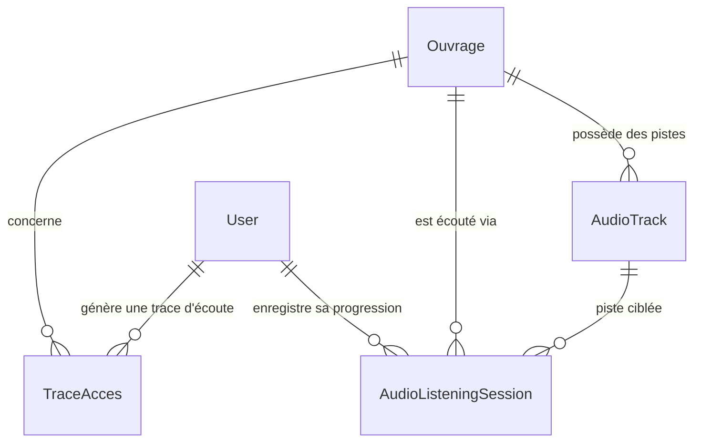

# Data Model: Livres Audio et Lecteur Multi-Rôles

**Feature**: `017-livres-audio-lecteur-multi-roles`
**Date**: 2026-09-07

## 1. Entités Existantes et Champs Associés

### Entité `catalog.Ouvrage`
Modèle représentant un livre dans le catalogue de LAHAThèque.
- `id`: UUIDv4 (Clé primaire)
- `title`: CharField(255)
- `subtitle`: CharField(255)
- `has_audio_version`: BooleanField(default=False) — Indique si l'ouvrage dispose d'au moins une version audio active.
- `price_audio`: DecimalField(max_digits=10, decimal_places=2, null=True, blank=True) — Prix public de la version audio en XOF.
- `format_type`: CharField(20, choices=['pdf', 'epub', 'audio', 'papier'])
- `audio_tracks`: Relation inverse (`AudioTrack.ouvrage`)

### Entité `audio.AudioTrack`
Modèle représentant une piste audio chapitrée stockée et protégée sur Cloudflare Stream.
- `id`: BigAutoField ou UUIDField
- `ouvrage`: ForeignKey('catalog.Ouvrage', on_delete=CASCADE, related_name='audio_tracks')
- `chapter_number`: IntegerField(default=1) — Numéro de chapitre
- `title`: CharField(255) — Titre du chapitre ou de la piste
- `duration_seconds`: IntegerField(default=0) — Durée exacte en secondes
- `stream_id`: CharField(255) — Identifiant unique du master Cloudflare Stream
- `hls_manifest_url`: URLField — URL du manifeste HLS (video.m3u8)
- `captions_vtt_url`: URLField(null=True, blank=True) — Sous-titres VTT optionnels

### Entité `audio.AudioListeningSession`
Modèle de persistance de la progression d'écoute pour chaque utilisateur.
- `id`: UUIDField (Clé primaire)
- `user`: ForeignKey(User, on_delete=CASCADE, related_name='listening_sessions')
- `ouvrage`: ForeignKey('catalog.Ouvrage', on_delete=CASCADE, related_name='listening_sessions')
- `audio_track`: ForeignKey('audio.AudioTrack', null=True, blank=True, on_delete=CASCADE)
- `duration_listened_seconds`: IntegerField(default=0) — Position atteinte en secondes
- `completion_percent`: DecimalField(max_digits=5, decimal_places=2, default=0.00)
- `session_date`: DateField(default=timezone.now)
- `created_at`: DateTimeField(auto_now_add=True)

### Entité `protection.TraceAcces`
Modèle d'audit légal et de sécurité enregistrant chaque accès au flux.
- `access_type`: 'audio_stream'
- `user`: Utilisateur connecté
- `ouvrage`: Ouvrage écouté
- `ip_address`, `country`, `user_agent`: Données de contexte réseau
- `created_at`: Horodatage d'accès

---

## 2. Diagramme de Relations

---

## 3. Règles de Validation et Transitions d'État

1. **Activation de l'audio** : Dès qu'une piste `AudioTrack` est ajoutée ou remplacée avec succès sur un `Ouvrage`, le drapeau `ouvrage.has_audio_version` doit être positionné à `True`.
2. **Prix audio obligatoire** : Si `has_audio_version` est `True`, un `price_audio` par défaut (ex: 2 500 XOF issu de `ConfigurationPlateformeGlobale.prix_defaut_audio_xof`) est attribué si non saisi explicitement.
3. **Plafond d'Extrait** : Si l'utilisateur a le statut `preview_mode=True`, la session d'écoute délivre un jeton HLS avec coupure stricte ou limitation frontend à 180 secondes.
4. **Reprise de position** : La sauvegarde de progression s'effectue toutes les 10 secondes ou lors de la mise en pause / changement de piste. Si la complétion dépasse 95%, `completion_percent` est plafonné à 100%.
5. **Alerte Juriste** : Tout ajout ou remplacement de piste audio sur un livre disposant d'un `ContratLegal` actif sans `taux_audio_tts` notifie automatiquement les juristes.
