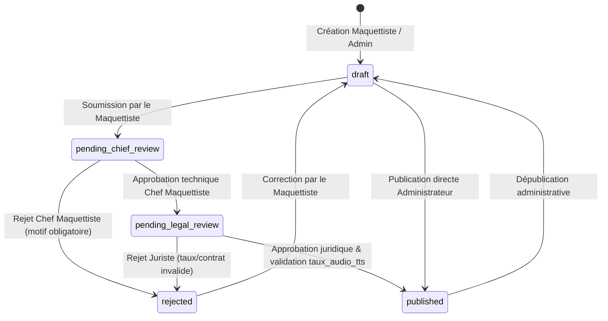

# Phase 1: Data Model — Création et Gestion des Livres Audio Multi-Rôles

**Feature**: `019-creation-gestion-livres-audio`  
**Date**: 2026-09-07  
**Status**: Completed

---

## 1. Entités Principales & Évolutions de Schéma

### 1.1 Modèle `Ouvrage` (Extension de `apps/catalog/models.py`)

| Champ | Type | Contraintes / Choix | Rôle Métier |
| :--- | :--- | :--- | :--- |
| `has_audio_version` | `BooleanField` | default=False, db_index=True | Indique la disponibilité d'une version audio pour cet ouvrage |
| `price_audio` | `DecimalField` | max_digits=10, decimal_places=2, null=True, blank=True | Prix de vente public du format audio en XOF |
| `price_audio_eur` | `DecimalField` | max_digits=10, decimal_places=2, null=True, blank=True | Prix de vente international en EUR (optionnel) |
| `audio_status` | `CharField` | max_length=30, default='none' | Statut du flux audio : `none`, `draft`, `pending_chief_review`, `pending_legal_review`, `published`, `rejected` |
| `audio_rejection_reason` | `TextField` | blank=True, default='' | Motif explicite renseigné par le Chef Maquettiste ou le Juriste en cas de rejet |

---

### 1.2 Modèle `AudioTrack` (Refonte de `apps/audio/models.py`)

Représente une piste audio spécifique rattachée à un ouvrage (soit un livre complet, soit un chapitre précis).

```python
class AudioTrack(models.Model):
    VOICE_GENDER_CHOICES = [
        ('male', 'Voix Homme'),
        ('female', 'Voix Femme'),
    ]

    TRACK_TYPE_CHOICES = [
        ('full', 'Livre complet'),
        ('chapter', 'Chapitre'),
    ]

    id = models.UUIDField(primary_key=True, default=uuid.uuid4, editable=False)
    ouvrage = models.ForeignKey(
        'catalog.Ouvrage', on_delete=models.CASCADE, related_name='audio_tracks'
    )
    voice_gender = models.CharField(
        max_length=10, choices=VOICE_GENDER_CHOICES, default='male', db_index=True
    )
    track_type = models.CharField(
        max_length=20, choices=TRACK_TYPE_CHOICES, default='chapter', db_index=True
    )
    chapter_number = models.IntegerField(default=1)  # 0 pour livre complet, 1..N pour chapitres
    title = models.CharField(max_length=255)         # Libellé du chapitre ou titre de la piste
    duration_seconds = models.IntegerField(default=0)
    stream_id = models.CharField(max_length=512, blank=True, default='')  # Clé R2 ou UID Stream
    hls_manifest_url = models.URLField(max_length=1024, blank=True, default='')
    file_size_bytes = models.BigIntegerField(default=0)
    created_by = models.ForeignKey(
        settings.AUTH_USER_MODEL, null=True, blank=True, on_delete=models.SET_NULL, related_name='audio_tracks_created'
    )
    created_at = models.DateTimeField(auto_now_add=True)
    updated_at = models.DateTimeField(auto_now=True)

    class Meta:
        ordering = ['voice_gender', 'track_type', 'chapter_number']
        constraints = [
            models.UniqueConstraint(
                fields=['ouvrage', 'voice_gender', 'track_type', 'chapter_number'],
                name='unique_track_per_voice_and_chapter'
            )
        ]
```

---

### 1.3 Modèle `AudioListeningSession` (Extension de `apps/audio/models.py`)

Suit l'avancement d'un lecteur sur ses sessions d'écoute pour alimentation du lecteur et de la Vue d'ensemble (Dashboard Étudiant).

| Champ | Type | Description |
| :--- | :--- | :--- |
| `id` | `UUIDField` | Clé primaire unique |
| `user` | `ForeignKey(User)` | Lecteur connecté ayant écouté l'audio |
| `ouvrage` | `ForeignKey(Ouvrage)` | Ouvrage audio concerné |
| `audio_track` | `ForeignKey(AudioTrack)` | Piste en cours (chapitre ou livre complet) |
| `duration_listened_seconds` | `IntegerField` | Seconde exacte atteinte dans la piste |
| `completion_percent` | `DecimalField(5,2)` | Pourcentage global d'écoute (0.00% à 100.00%) |
| `last_listened_at` | `DateTimeField` | Horodatage de la dernière action de lecture |

---

### 1.4 Modèle `LigneCommande` (Extension de `apps/commerce/models.py`)

Permet l'achat combiné multi-formats au sein d'une même commande :

```python
class LigneCommande(models.Model):
    FORMAT_CHOICES = [
        ('digital', 'Livre Numérique (PDF/EPUB)'),
        ('paper', 'Livre Papier Imprimé'),
        ('audio', 'Livre Audio Streaming HD'),
    ]

    id = models.UUIDField(primary_key=True, default=uuid.uuid4, editable=False)
    commande = models.ForeignKey('Commande', on_delete=models.CASCADE, related_name='items')
    ouvrage = models.ForeignKey('catalog.Ouvrage', on_delete=models.PROTECT, related_name='order_items')
    format_type = models.CharField(max_length=20, choices=FORMAT_CHOICES)
    quantity = models.PositiveIntegerField(default=1) # 1 pour numérique/audio, >= 1 pour papier
    unit_price = models.DecimalField(max_digits=10, decimal_places=2)
    total_price = models.DecimalField(max_digits=10, decimal_places=2)
```

---

## 2. Diagramme des Transitions d'États (Workflow Audio)


